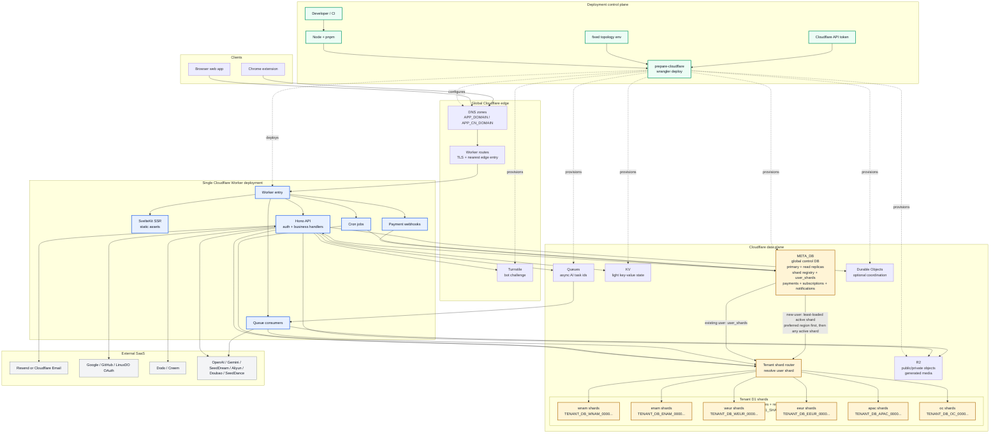

# Agent Development Guide

> Repository context for coding agents. Keep this file short. Source code is the primary truth.

If architecture, core mechanisms, conventions, important dependencies, or workflow rules change during development, update this file in the same change.

---

## Must Follow

- Use progressive disclosure when learning a module: read the relevant `template-docs/` page first, then inspect the related source code before designing or editing.
- Treat `template-docs/` as the map and source code as the final truth. If they disagree, trust code and update docs when the change affects architecture, mechanisms, conventions, dependencies, or workflows.
- Prefer the smallest direct change that fits the existing architecture.
- Do not add abstractions, files, config, queues, Durable Objects, or settings unless they solve a real current need.
- Reuse existing modules, SDKs, UI primitives, and project conventions.
- Do not add defensive fallbacks that hide configuration or data errors.
- Runtime config errors should fail early. Defaults are only for explicit product semantics.
- Do not revert unrelated user changes.
- Use `create` for creation actions and factory-style names.

---

## Architecture



Key rules:

- `META_DB` is global control state. It owns shard registry and the user-to-shard mapping.
- Tenant runtime data lives in regional shard DBs. Supported shard regions are `wnam`, `enam`, `weur`, `eeur`, `apac`, and `oc`.
- New users prefer the current Worker region bucket, then fall back to any active shard. Current bucket mapping is `AS -> apac`, `EU -> weur`, `OC -> oc`, and default `apac`.
- Existing users always follow `user_shards`; moving traffic between edges must not change the user's Tenant DB.

### Directory Responsibilities

```
.
  QUICK_START.md        # Installs and invokes the create-opcstack-app Skill
  CREATE_OPCSTACK_APP.md # Canonical project creation workflow fetched by the Skill
  e2e/                  # E2E tests
  template-docs/        # Template context docs for humans and agents
  public-docs/          # Product docs served at /docs/
  scripts/
    prepare-public.mjs      # Public frontend and extension artifacts
    prepare-cloudflare.mjs  # Cloudflare config, infra, migrations, and seeds
  wrangler.jsonc.tpl    # Worker config template
  .env.dev              # Public local config, safe to commit
  .env.prod             # Public production config, safe to commit

src/
  index.ts              # Worker entrypoint
  api-contract/         # Shared JSON API contracts and typed client
  frontend/
    lib/                # Shared frontend layer for all client entrypoints
    web/                # SvelteKit web entrypoint
    extension/          # WXT Chrome extension entrypoint
  backend/
    affiliate/          # Affiliate referral logic
    ai/                 # AI providers and async task helpers
    api/                # Hono API routes, handlers, auth, and middleware
    consumers/          # Queue consumers
    credits/            # Credit wallet, ledger, grants, expiry
    db/                 # Drizzle schemas and generated migrations
    email/              # Email providers
    jobs/               # Cron handlers
    lib/                # Shared backend utilities
    payment/            # Payment providers and service
    r2/                 # R2 helpers
    testing/            # Shared test helpers
```

Create `src/backend/do/` only when a real Durable Object is added.

---

## Runtime And Config

- `pnpm dev` runs local Worker and web dev servers after `prepare:cloudflare:dev`.
- `pnpm deploy:cloudflare` runs `prepare:cloudflare:prod`, type generation, build, and deploy.
- `pnpm dev:extension` runs `prepare:public:dev` and starts WXT.
- `pnpm build:extension` runs `prepare:public:prod` and packages the extension zip.
- `scripts/prepare-public.mjs` generates `src/frontend/lib/config/client.generated.ts`, web logo, and extension icons.
- `scripts/prepare-cloudflare.mjs` generates `wrangler.jsonc`, `.wrangler/wrangler.types.jsonc`, Cloudflare resources, bindings, migrations, runtime secrets, and public artifacts.
- `wrangler.jsonc` is the runtime config and should include only secrets required by enabled features.
- `.wrangler/wrangler.types.jsonc` is type-generation-only config and includes the three generated system secrets so `Env` stays stable.
- Fixed deployment config lives in `.env.dev` and `.env.prod`. `.env` is a local override.
- Generated local root secret state lives under `.wrangler/`. It is not user configuration and is not part of env loading. Production roots live in Cloudflare Worker Secrets.
- Agents must not read, print, search, edit, create, or copy generated secret state or token caches: `.wrangler/local-system-secrets.env`, `.wrangler/runtime-secrets.env`, `.wrangler/cloudflare-api-token`, `.wrangler/cloudflare-api-token.permissions`, `.wrangler/r2-s3-token.json`.
- Third-party credentials are entered through Admin Configuration or an OAuth-authorized API and encrypted in D1. Never add them to env files.
- Env loading order: `.env.dev` or `.env.prod` -> `.env` -> `process.env`.
- Env files contain fixed deployment and initialization inputs only and are ordered by shared product identity, domains, frontend exposure, and infrastructure.
- The fixed ENV set is `APP_NAME`, `APP_VERSION`, `DESIGN_SYSTEM`, `SYSTEM_EMAIL`, `APP_DOMAIN`, `APP_CN_DOMAIN`, `APP_CN_CNAME_TARGET`, `EXTENSION_HOST_PERMISSIONS`, `D1_SHARDS`, `R2_ENABLED`, `R2_USER_UPLOAD_ALLOWED_CONTENT_TYPES`, `R2_USER_UPLOAD_MAX_BYTES`, `R2_TMP_LIFECYCLE_RULES`, `QUEUE_NAMES`, `QUEUE_MAX_CONCURRENCY`, `CRONS`, and `DO_NAMES`.
- `prepare-cloudflare` owns `BETTER_AUTH_SECRET`, `CONFIG_ENCRYPTION_KEY`, and `R2_ORIGIN_SIGNING_SECRET`. It generates them once, persists local values under `.wrangler/`, and uploads production values as Cloudflare Worker Secrets without overwriting existing values.
- Existing D1 configuration without the matching generated system secrets is unrecoverable and must fail preparation. Never silently generate replacement roots for initialized data.
- Dynamic configuration storage lives in `src/backend/config/` and the Meta DB `system_settings` row. Each business domain owns one JSON document, version, and update timestamp.
- Configuration documents use code-side camelCase and are fully validated on every read and write. Admin API contracts remain snake_case.
- General, Authentication, Email, Credits, Affiliate, Payment, and AI runtime configuration is read from the nearest Meta D1 replica. Admin writes return a D1 bookmark that subsequent browser and API reads use for immediate consistency.
- Signup rewards, daily check-in, affiliate rewards, and credit transaction retention read one domain snapshot per operation and never use ENV fallbacks.
- Better Auth, beta gate, Turnstile, social OAuth, and email delivery share one request-scoped Authentication and Email snapshot. Registration uses `registrationEnabled`; Email availability is derived only from `emailConfig.provider`. Without a Provider, password login and unverified registration remain available, while email verification, password reset, and other email actions are unavailable.
- Migrate one business domain atomically: after its runtime reads D1, delete the same ENV keys and parsers in that change. Never keep ENV fallback for a migrated setting.
- Runtime business configuration lives in `META_DB`. Do not add an Env fallback for a D1-owned setting.
- AI providers, routing weights, and task retention are D1-owned. Each Provider stores its Base URL; the admin form prefills the official address and allows custom endpoints. Provider credentials are encrypted with `CONFIG_ENCRYPTION_KEY`.
- `APP_CN_DOMAIN` is optional. When set without `APP_CN_CNAME_TARGET`, `prepare-cloudflare.mjs` adds it as a second Worker custom domain. It always adds it as an R2 CORS origin and Turnstile domain.
- `APP_CN_CNAME_TARGET` is optional. When set with `APP_CN_DOMAIN` in prod mode, `prepare-cloudflare.mjs` creates or updates one unproxied DNS CNAME for `APP_CN_DOMAIN`, skips the Worker custom domain for that hostname, and adds a normal Worker zone route. It does not choose acceleration targets.
- Add public runtime config keys to `wrangler.jsonc.tpl` `vars` first.
- Do not add user-configured Worker Secrets. Only internal roots that must exist before D1 can be read belong in `scripts/prepare-cloudflare.mjs`.
- When adding an env key, document it directly above the assignment with comments covering purpose, runtime usage, valid values, default semantics, external source, and operational best practices when they exist.
- After changing config keys, run `pnpm prepare:cloudflare:dev` and `pnpm exec wrangler types --config .wrangler/wrangler.types.jsonc --env-file .wrangler/runtime-secrets.env --strict-vars false`.
- Use generated `Env`; do not create feature-specific env interfaces.
- Use `clientConfig` from `$frontend/config/client` only for fixed public deployment config. Runtime business configuration comes from D1.

---

## Database

- D1 with Drizzle ORM.
- Meta DB uses `META_DB`. In requests, get it with `ctx.get('metaDb')`.
- Tenant Shard DB uses generated bindings such as `TENANT_DB_WNAM_0000`. In requests, get the current user's DB with `ctx.get('tenantDb')`.
- Tenant shard registry lives in Meta DB tables `d1_shards` and `user_shards`.
- Meta-owned runtime data includes shard registry, system configuration, OAuth API access, auth-adjacent global state, redemption codes, affiliate referrals, payment rows and products, AI Providers, subscriptions, webhook events, and notifications.
- Tenant-owned runtime data includes credit balances, credit entries, credit transactions, feedbacks, notification reads, AI async task tables, and 1-minute AI Provider metric buckets.
- AI Provider metrics are local to each Tenant Shard. Do not aggregate them in Meta DB or store per-call metric rows.
- Modify Meta schema in `src/backend/db/schema.meta.ts`.
- Modify Tenant Shard schema in `src/backend/db/schema.shard.ts`.
- Restart `pnpm dev` to generate and apply Meta and Shard migrations.

### D1 Rules

- D1 does not support full transactions. Use batch operations for atomic single-DB flows.
- For conditional writes, prefer `INSERT ... SELECT ... WHERE`.
- Do not split conditional flows into `SELECT` then independent `UPDATE` or `INSERT`.
- Update credit balances with SQL arithmetic, not read-modify-write service code.
- There is no cross-DB transaction between Meta DB and Tenant Shard DB.
- Treat every Meta + Tenant flow as a resumable saga.
- Meta DB is the durable state source for cross-DB flows.
- Tenant writes must be idempotent side effects keyed by `source_type + source_id`.
- If a request writes the current user's Tenant Shard DB, use `ctx.get('tenantDb')` so the response tenant bookmark covers the write.
- Writes for other users may use `openUserDb`.

For more database detail, inspect `src/backend/db/` and the related tests.

---

## API Contracts

- Shared JSON API contracts, request types, response types, error responses, and typed client live in `src/api-contract/`.
- Organize API contracts and handlers by business domain. Public, user, and admin are route access levels, not file or directory boundaries.
- Do not add `admin/` or `user/` handler directories or actor-prefixed filenames. Keep an actor prefix on an operation only when the same domain has distinct user and administrator variants.
- API handlers must import the API contract object from `src/api-contract/`, for example `CreateR2UploadUrlApi`.
- Do not define route request or response contracts inside `src/backend/api/handler/`.
- Keep one contract file per business area, for example `credits.ts`, `payment.ts`, or `notifications.ts`.
- Each JSON API contract object must contain `request`, `response`, and `errors`.
- `request` and `response` use Zod schemas. Export named `XxxRequest`, `XxxResponse`, and schema symbols when frontend or tests need them.
- `errors` contains functions that return `{ status, body: { code, message } }`.
- Dynamic error messages, such as request validation errors, must be passed into the matching API error function.
- Request validation failures should return `INVALID_REQUEST` with the concrete validation message, for example `content_type: Required`.
- Do not hand-write JSON API errors in handlers when the error belongs to an API contract. Use `XxxApi.errors.CODE(...)`.
- Response payloads use explicit named `type` exports derived from the response schema.
- Handlers should cast `ctx.json(...)` payloads to the matching response type so contract drift is visible during type checking.
- Frontend API callers should import request and response types from `src/api-contract/`, not from backend handler files.
- Non-JSON streaming routes, webhook provider payloads, Better Auth routes, and raw file reads do not need a JSON API contract unless application code consumes typed JSON.

### List APIs

- List request uses `page` and `page_size`.
- `page` starts from 1 and defaults to 1.
- `page_size` defaults to 20 and maxes at 100.
- List response uses top-level `items` and `total`.
- Do not return `page` or `page_size`.
- Business filters stay flat in request JSON.

---

## Auth, Credits, Storage, Payment, AI

- Better Auth lives in `src/backend/api/auth/index.ts`.
- Administrator lookup and OAuth API access authentication logic live beside Better Auth in `src/backend/api/auth/`. Do not create separate top-level backend auth domains for them.
- `authMiddleware` injects `userId` into `ctx.variables`.
- Protected JSON API routes accept Better Auth browser sessions or OAuth Bearer tokens. Every route is registered in `src/backend/api/scopes.ts`; OAuth access must pass `requireApiScope(scope)`, while protocol and byte-stream routes reject OAuth tokens.
- The generic credential client is `opc auth connect` plus `opc api request`; it injects tokens and must not contain business API types or route-specific methods.
- `administratorMiddleware` verifies the authenticated user's current D1 `admin` role for browser sessions and OAuth access. Admin and configuration scopes never bypass the role check.
- `SYSTEM_EMAIL` is required only when an empty Meta D1 creates the unique administrator. The created D1 account becomes the runtime identity, public support contact, and outbound sender; later prepares ignore `SYSTEM_EMAIL`, and the settings page does not allow changing the email.
- Credits use integer units where `1 credit = 1_000_000 units`; API credit amounts use decimal strings.
- Payment `price_amount` is provider minor currency units and must not be mixed with credit units.
- R2 paths are `public/*`, `private/<userId>/*`, `tmp/public/*`, and `tmp/private/<userId>/*`.
- R2 upload MIME types and maximum upload bytes come only from `R2_USER_UPLOAD_ALLOWED_CONTENT_TYPES` and `R2_USER_UPLOAD_MAX_BYTES`. They require a new deployment and have no D1 or admin UI copy.
- R2 lifecycle rules may only target `tmp/public/` and `tmp/private/`.
- User upload URLs may only write `private/<userId>/*` or `tmp/private/<userId>/*`; the request uses `is_tmp` to choose lifecycle.
- Admin public upload URLs may only write `public/*`; do not use the admin public upload API for user-owned private files.
- Use a single R2 bucket by default.
- Payment settings, provider credentials, country routing, and products are read from Meta D1. Enabled providers are Dodo and Creem via `src/backend/payment/`.
- AI providers live under `src/backend/ai/`; async AI queue payloads carry only task id and user id.
- Official AI Provider types store a null Base URL and resolve their fixed endpoint in code. Only OpenAI-compatible types persist an administrator-provided Base URL.
- Every AI execution targets one Provider Type and model. The configuration module filters enabled `ai_providers` by `type + model`; Provider Router only ranks that candidate list using Tenant Shard metrics and D1 routing weights.
- Image and TTS may try ranked Providers within one queue attempt. Video selects a Provider only when creating a remote task and polls that task through the persisted Provider ID until the provider reports a terminal failure.
- Provider implementations receive an explicit endpoint and never perform routing or retry another Provider themselves.
- Generated video output must be downloaded from provider and streamed into R2. Do not use `arrayBuffer` or base64 for video output upload.

Before changing these areas, inspect the source directory and related tests.

---

## Queues, Cron, Durable Objects

- Configure queue names with `QUEUE_NAMES`, separated by semicolon.
- Queue binding convention: `Q_<QUEUE_NAME_UPPER>`, for example `task-check` -> `Q_TASK_CHECK`.
- Queue bindings are required runtime dependencies. Access fixed bindings directly.
- A queue payload must not include a redundant `type` field when the queue has a single purpose.
- Queue handlers live in `src/backend/consumers/index.ts`.
- Configure cron triggers with `CRONS`, separated by semicolon.
- Cron handlers live in `src/backend/jobs/index.ts`.
- The existing `*/10 * * * *` job deletes AI provider metric buckets older than 24 hours and terminal AI tasks older than the D1-configured retention period from every active or draining Tenant Shard. It reads one AI configuration snapshot per trigger and must not delete processing tasks or access R2.
- Configure Durable Object names with `DO_NAMES`, separated by semicolon.
- Durable Object binding convention: `DO_<NAME_UPPER>`, for example `rate-limiter` -> `DO_RATE_LIMITER`.
- Durable Object class convention: PascalCase name plus `DO` suffix, for example `RateLimiterDO`.
- Create Durable Object classes in `src/backend/do/` and export them from `src/index.ts`.
- Use Durable Objects only for per-object serial coordination, WebSocket rooms, alarms, and small per-object state.
- Do not use Durable Objects as a replacement for D1 list queries or global reporting.

For more detail, inspect `src/backend/consumers/`, `src/backend/jobs/`, and `scripts/prepare-cloudflare.mjs`.

---

## Frontend

- Frontend is multi-entrypoint by design.
- Shared frontend code lives in `src/frontend/lib/`.
- Web entrypoint lives in `src/frontend/web/`.
- Chrome extension entrypoint lives in `src/frontend/extension/`.
- `src/frontend/lib/` must not depend on `src/frontend/web/`, SvelteKit server-only APIs, or extension-only APIs.
- UI primitives live under `src/frontend/lib/ui/` and use alias `$frontend/ui/*`.
- App-specific composed UI lives under `src/frontend/lib/app-ui/` and uses domain paths such as `$frontend/app-ui/auth/*`.
- Pages live under `src/frontend/web/routes/`.
- Pages compose existing primitives. Do not rebuild `Button`, `Card`, `Dialog`, `Alert`, `Empty`, form fields, table primitives, or toast manually.
- Put i18n messages in `src/frontend/lib/i18n/messages/`.
- Set page title, description, and canonical in `<svelte:head>`.
- Canonical URLs use `APP_DOMAIN` and must not point business pages to the OPCStack website.
- Active style is controlled only by fixed public env config `DESIGN_SYSTEM`. Valid values are `apple-saas` and `brutalism`; changing it requires a new build and deployment.
- Concrete colors, radii, typography sizes, and animations live in `src/frontend/lib/styles/app.css`.
- Use semantic tokens such as `bg-primary`, `text-muted-foreground`, and `border-input`.
- The product landing page uses warm paper, graphite, solid orange, and muted green surfaces. Treat the real runtime architecture as a branded visual object, keep pricing to verified cost facts and official sources, and avoid pricing matrices, decorative gradients, or glass effects.
- Icons come from `lucide-svelte`. Do not introduce other icon libraries.
- Titles, headings, descriptions, button labels, and placeholders must not end with punctuation.
- Admin page headers contain only the title and relevant actions. Do not add explanatory subtitles that restate the page purpose or data source.
- Admin pages use the shared `admin-page`, `admin-page-header`, `admin-filter-bar`, `admin-table-panel`, and `admin-pagination` layout classes from `app.css`; do not create page-specific workspace widths or duplicate table scroll containers.
- Admin sidebar is one flat ordered list. Payment Products and AI Providers are standalone workspaces; System Settings contains only singleton domain forms, including payment platform credentials and AI routing weights.
- Payment Products store one `provider`, one `provider_product_id`, and a creation-time `test_mode` snapshot. The environment is derived from the current API key. Provider and environment are immutable after creation; administrators select remote products from configured Provider catalogs and never enter internal IDs, remote IDs, type, price, or currency manually.
- Admin dashboard metrics use one divided metric strip. Keep actionable work queues visually primary and avoid identical metric card grids.
- Admin user filters and actions must select users by name or email. Never require operators to type a user ID; pass it internally after selection.
- Turnstile credentials are initialized during Cloudflare preparation and preserved in D1. The Authentication workspace exposes only the dynamic enabled switch.
- Known admin enum filters must use select, segmented control, toggle, or checkbox controls instead of free-text inputs.
- Keep common admin filters visible and place low-frequency technical or date filters behind progressive disclosure.
- Keep row actions reachable while horizontally scrolling wide admin tables. Show internal IDs as secondary, compact technical references.
- Put Cloudflare links beside the related admin resource and deep-link to the exact Worker, D1 database, Queue dashboard, or R2 bucket when identifiers are available.
- Every form field needs a visible label, correct `autocomplete`, `aria-invalid` on error, and a visible actionable error message.
- Every list, table, or feed that can be empty must use the `Empty` family.
- Browser extension entrypoints live in `src/frontend/extension/entrypoints/`.
- Extension-specific packaging stays in `src/frontend/extension/wxt.config.ts`.
- Extension host permissions come from `EXTENSION_HOST_PERMISSIONS` via `clientConfig.extension.hostPermissions`.

### Prerender Static Pages

Use `export const prerender = true` in `+page.ts` only when the page:

- Has no per-request server data.
- Has no auth or dynamic DB query.
- Has identical content for all visitors.

Dynamic params require an `entries()` function. Include parent params such as `[locale=locale]` in each entry.

---

## SEO And Docs

- `src/frontend/web/routes/+layout.server.ts` exposes `siteName` from `APP_NAME` and canonical URLs using `APP_DOMAIN`.
- Business pages should set `<title>`, `<meta name="description">`, and `<link rel="canonical">`.
- Product docs rendered by the app live in `public-docs/en/` and `public-docs/zh/`.
- Template explanation docs live in `template-docs/` and are not rendered by the app.
- Admin console operator usage lives in `template-docs/guides/admin-console.md` and the localized public copies. Keep them synchronized when admin routes or workflows change.
- Docs route is `/docs/[...slug]` when the General domain `docs_enabled` setting is true.
- Docs use Markdown frontmatter with `title`, `description`, `group`, `group_order`, and `order`.
- Docs syntax highlighting uses Shiki's JavaScript regex engine because Workers cannot instantiate Oniguruma WASM during a request.
- In docs frontmatter, `group_order` sorts groups and `order` sorts docs inside the same group.
- Docs images live in `src/frontend/web/static/images/` and are referenced as `/images/...`.

---

## Testing

- Base test library is `vitest`.
- Unit tests live in `src/**/*.test.ts`.
- E2E tests live in `e2e/**/*.test.ts`.
- Shared BDD helper lives in `src/backend/testing/bdd.ts`.
- Use `TestCase<TGiven, TWhen, TThen>` and `runCases(cases, fn)` when matching existing BDD-style tests.
- Test names describe behavior, not implementation.
- One test should verify one behavior.
- Unit-under-test output should be wrapped to a structured object before assertion, for example `{ result: add(...) }`.
- Bug fixes should start with a failing test that reproduces the bug.
- Remote E2E must only call HTTP APIs against an already deployed environment.
- Remote E2E must not run deploy, migrations, resource creation, shard count changes, direct remote DB writes, or `d1_shards` writes.
- Use Vitest for repeatable E2E and In App Browser for real browser acceptance. Do not add a separate browser automation framework.

### Commands

```
pnpm dev
pnpm deploy:cloudflare
pnpm test
pnpm dev:extension
pnpm build:extension
pnpm prepare:public:dev
pnpm prepare:public:prod
pnpm prepare:cloudflare:dev
pnpm prepare:cloudflare:prod
pnpm test:e2e
pnpm test:e2e:remote
pnpm exec wrangler types
```

---

## Development Workflows

- Add API: define contract in `src/api-contract/`, write handler in `src/backend/api/handler/`, register route in `src/backend/api/index.ts`.
- Add page: create route under `src/frontend/web/routes/`, reuse `$frontend/ui/*` and `$frontend/app-ui/*`, add i18n messages, set SEO tags.
- Modify database: edit `src/backend/db/schema.meta.ts` or `src/backend/db/schema.shard.ts`, restart `pnpm dev`, check generated migrations.
- Add queue: configure `QUEUE_NAMES`, add handler in `src/backend/consumers/index.ts`, send with `env.Q_<NAME>.send(payload)`.
- Add cron: configure `CRONS`, add handler in `src/backend/jobs/index.ts`.
- Add Durable Object: configure `DO_NAMES`, create class in `src/backend/do/`, export it from `src/index.ts`, run `pnpm dev`.

---

## Error Handling

- Use return unions for expected business states the caller should branch on, such as `not_found`, `forbidden`, or `unavailable`.
- Use exceptions for invalid calls, missing config, provider failures, and other non-normal failures.
- Domain modules that throw handled errors should expose a typed error class with a typed `code` and a human-readable `message`, for example `R2Error`, `CreditsError`, or `PaymentServiceError`.
- API handlers should map handled domain errors with `instanceof XxxError` and `switch (error.code)`, then return the matching `XxxApi.errors.CODE(...)`.
- `code` is for machines. `message` is for humans. Do not set `message` to the same uppercase error code.
- Do not branch on `error.message` for expected domain errors.
- Do not add a global `AppError` hierarchy unless multiple domains genuinely need shared behavior.

---

## Logging

- Logs must be structured JSON and should go through `src/backend/lib/log.ts`.
- Do not log expected user-caused 4xx results such as invalid request, unauthorized, beta gate, or rate limit.
- Do not duplicate platform-level observability for request latency, cron trigger, or queue retry state.
- Do not log an error and then rethrow it.
- Log only internal business state transitions and internal failures that Cloudflare cannot infer.
- Never log tokens, cookies, authorization headers, raw webhook bodies, full email addresses, or user content.
