# D1 动态配置系统技术设计

> 状态：数据模型与接口待确认

## 1. 技术决策

### 1.1 配置权威来源与 ENV 边界

状态：已确认

决策：`META_DB` 成为运行时产品配置的唯一权威来源。人类通过后台管理页面修改配置，AI 通过 Admin API 修改同一份配置。运行时不从 ENV 读取业务配置，也不在 D1 缺失或错误时回退到 ENV。

Source of Truth 必须严格单一：任何一项配置要么属于 ENV，要么属于 D1，不允许同时定义、覆盖、回退或同步。能在 Worker 连接 `META_DB` 后读取的运行时配置优先存入 D1。

ENV 只保留在连接 `META_DB` 前必须确定的输入：

- Cloudflare 资源和 Worker 绑定的部署拓扑，例如应用标识、域名、D1 Shard、Queue、Cron、R2 和 Durable Object
- 系统根身份与根密钥：`SYSTEM_EMAIL`、`SUPER_ADMIN_PASSWORD`、`BETTER_AUTH_SECRET`、`CONFIG_ENCRYPTION_KEY` 和 `R2_ORIGIN_SIGNING_SECRET`
- Chrome 扩展 Manifest 必须在构建时固化的字段，例如版本和 host permissions

这些根配置长期以 ENV 为唯一权威来源，不使用 `BOOTSTRAP_*` 临时命名，也不允许在后台或 D1 中修改。`SUPER_ADMIN_PASSWORD` 在 D1 中对应的密码 Hash 是认证运行数据，不是第二个配置来源。

以下信息全部迁入 `META_DB`：

- 功能开关、业务规则、奖励额度和保留期
- 邮件提供商、外部 OAuth、Turnstile、支付和 AI 的运行时配置与凭据
- AI 渠道、模型、路由权重和价格系数
- Web 端需要的动态公开配置

理由：

- 业务配置可在不重新部署 Worker 的情况下生效
- 后台和 Admin API 共用一个写入入口和一套校验规则
- 彻底删除 ENV 与 D1 双重来源，避免实际生效值无法判断
- 部署拓扑仍由 `prepare-cloudflare` 管理，因为 Worker 必须先拿到绑定才能访问 D1

迁移约束：

- 不保留旧 ENV 读取、兼容字段、回退逻辑或双写
- 删除已迁移配置在 `.env.dev`、`.env.prod`、`.env.secret.example`、`wrangler.jsonc.tpl` 和生成类型中的定义
- 配置缺失或非法时直接暴露配置错误，不使用隐式默认值

### 1.2 配置数据结构

状态：已确认

决策：使用按业务域分列的 JSON 文档模型，不使用通用 KV 表，也不把所有领域放进同一个 JSON。

- `system_settings` 只保留一行，每个单例业务域使用一个完整 JSON 文档列
- 每个业务域的 `version` 和 `updated_at` 使用独立标量列
- AI 渠道、支付商品等可重复实体使用独立类型表
- JSON 文档由 TypeScript 类型和 Zod Schema 定义，D1 负责保证其为有效 JSON Object
- 写入按业务域提供明确的 Admin API，不提供 `set_config(key, value)` 这类无类型接口

理由：

- 产品交互本来就是读取、校验并完整保存一个业务域，JSON 文档与写入边界一致
- 单例配置不按内部字段进行搜索、排序或关联，拆成大量关系型列没有查询收益
- 增加领域内部字段不需要修改 D1 Schema，也不会再次触及 D1 列数限制
- Zod 和 TypeScript 保持字段结构显式，非法 D1 文档在读取时直接失败
- 集合实体拆表后可以独立新增、停用和排序，不需要重写整份配置
- 避免通用 KV 把类型校验、关联约束和界面元数据推给业务代码
- 独立文档、版本和更新时间确保不同业务域不是同一个更新单元

### 1.3 敏感配置存储

状态：已确认

决策：第三方 API Key、外部 OAuth Secret 与 Webhook Secret 使用 AES-GCM 加密后保存在 `META_DB`。`BETTER_AUTH_SECRET` 是系统根密钥，长期只存在 ENV，不迁入 D1。Worker Secret 另保留 `CONFIG_ENCRYPTION_KEY` 作为 D1 敏感配置的解密根密钥。

约束：

- 每次写入敏感值都生成新的 12 字节 IV
- D1 保存密文和 IV，不保存根密钥
- Admin API 只返回 `*_configured` 状态，不返回明文、密文或 IV
- 明文只在 Worker 调用外部服务前存在于内存，不记录日志或写入其他存储
- 密文缺失、根密钥错误或完整性校验失败时直接暴露配置错误

#### AES-GCM 方案示例

以 AI 渠道 `openai-official` 的 API Key 为例。

ENV 只保存一个根密钥：

```env
CONFIG_ENCRYPTION_KEY=<32-byte-base64-key>
```

D1 只保存该渠道凭据的密文：

```text
ai_channels
  id                  = "openai-official"
  api_key_ciphertext  = <AES-GCM ciphertext and authentication tag>
  api_key_iv          = <random 12-byte IV>
```

管理员在后台填入 `sk-live-abc` 并保存时：

```text
Browser
  -> POST /api/admin/update_ai_channel
  -> Admin API 校验请求
  -> 使用 CONFIG_ENCRYPTION_KEY 和新生成的 IV 执行 AES-GCM 加密
  -> D1 仅写入 api_key_ciphertext 和 api_key_iv
  -> 返回 { api_key_configured: true }
```

Consumer 调用该渠道时：

```text
Consumer
  -> 从 D1 读取 api_key_ciphertext 和 api_key_iv
  -> 使用 CONFIG_ENCRYPTION_KEY 在内存中解密
  -> 将明文 API Key 传给供应商 SDK
  -> 不写日志、不写回 D1、不返回客户端
```

Source of Truth 边界：

- `openai-official` 的 API Key 只存在 D1 密文中，ENV 中不存在同名或备用 API Key
- `CONFIG_ENCRYPTION_KEY` 只是解密根密钥，不是 AI、支付或 OAuth 的业务配置
- 根密钥不能与密文一起存入 D1，否则数据库读取权限可同时获得密文和解密能力
- 替换根密钥前必须重新加密所有敏感值，不允许用旧 ENV 凭据作回退

### 1.4 OAuth API Access

状态：已确认

保留固定 secret ENV `ADMIN_API_TOKEN`，供受信任的管理员脚本和运维调用使用，但不把它交给 Agent。Agent、CLI 和其他委托客户端统一通过 OAuth API Access 获得有限、可撤销的业务权限。

- OAuth Client 通过 `opc auth connect` 发起授权，请求当前操作需要的业务 scope
- 管理员使用 `SYSTEM_EMAIL` 对应的浏览器 Session 显式批准
- 只有系统管理员可批准 `admin:*` scope，普通用户即使发起同名 scope 也必须被拒绝
- 配置 Admin API 同时校验 scope、OAuth Grant 状态与 Grant 所属用户的管理员身份
- Access Token 保持短有效期，Refresh Token 与 OAuth Grant 可撤销

首次配置不依赖 OAuth。`prepare-cloudflare` 先根据长期固定的 ENV 建立管理员和基础认证，人类可直接登录后台。如果希望 AI 完成首轮业务配置，管理员登录后批准该 Agent 的 OAuth API Access 即可。

### 1.5 配置生效语义

状态：已确认

决策：配置按业务域保存后立即生效，不增加草稿、发布或全局配置版本。

约束：

- 每个写入接口接收一个完整业务域或一个完整集合实体
- Admin API 先完成类型、字段间关系和关联配置校验，再执行一次 D1 原子写入
- 校验失败时不写入任何字段，不允许运行时观察到半配置状态
- 写入成功后，后续新建的请求或任务执行读取新配置
- 已经开始的业务操作不在中途重新加载配置

理由：

- 后台的用户心智模型只有“保存”，不需要理解第二套发布状态
- AI 通过 Admin API 提交完整配置后可直接验证结果
- 按业务域原子更新已经阻止中间态，不需要为此增加草稿表

### 1.6 运行时配置读取

状态：已确认

决策：运行时从 Meta D1 就近副本读取配置。每个 HTTP 请求、Queue 消息执行或 Cron 执行按需读取一次相关业务域配置，并在该次操作内复用同一份快照。不增加 Worker 内存、KV 或 Cache API 缓存。

一致性语义：

- “保存后立即生效”表示新配置已在 D1 主库提交
- Admin 写入请求返回 D1 bookmark，同一客户端后续读取必须带上 bookmark，以保证读到自己的写入
- 其他边缘节点、Queue Consumer 和 Cron 允许在 D1 副本同步完成前短暂读到旧配置
- 不声称全球强一致或所有边缘节点同时生效
- 已开始的业务操作继续使用其操作内快照，不在中途二次读取配置

代价：停用注册、支付或 AI 渠道后，其他边缘节点可能在副本传播期内继续接受少量新操作。这是选择就近副本读取时明确接受的一致性代价。

### 1.7 首次初始化与 Agent 授权用户旅程

状态：已确认

用户视角下，项目初始化与 Agent 授权是两个独立阶段。

#### 阶段一：创建并运行项目壳子

1. 用户复制安装提示词，安装创建项目的 Skill，并要求 Agent 初始化项目
2. Skill 只引导用户提供部署前无法绕过的固定 ENV 与 Cloudflare 资源信息
3. Agent 完成代码生成、资源准备、数据库迁移和本地或 Cloudflare 部署
4. 系统根据固定 ENV 建立管理员认证，用户可以打开应用并登录后台
5. 此时项目壳子已经可运行，不要求用户先为 Agent 授权，也不要求业务配置已经完整

#### 阶段二：继续开发或配置业务

1. 用户继续要求 Agent 开发功能，或者修改 AI 渠道、支付、邮件等运行时业务配置
2. Agent 先区分本次操作是代码修改还是受保护的运行时配置写入
3. 代码修改继续走开发和部署流程，不需要应用内 OAuth 授权
4. 当 Agent 首次需要调用配置 Admin API 时，Agent 发起设备授权并向用户展示一次性授权 URL
5. 用户打开 URL，在当前应用中登录，并查看 Agent 请求的具体 scope
6. 用户确认授权后，Agent 自动轮询授权结果并取得 Access Token，不要求用户复制 Token
7. Agent 使用该 Token 调用 Admin API，完成用户要求的配置并读取结果进行验证
8. 后续请求在已有 Grant 的 scope 范围内复用授权；需要新增 scope 时再次要求用户确认
9. 用户可以在后台查看和撤销 OAuth Grant，撤销后 Agent 无法继续换取或使用 Token

```text
创建项目 Skill
  -> 必要固定 ENV
  -> 本地或 Cloudflare 部署成功
  -> 用户继续提出开发或配置需求
  -> Agent 需要 Admin API 权限
  -> 展示授权 URL
  -> 用户登录并确认 scope
  -> Agent 自动取得 Token
  -> 执行配置并验证结果
```

首次配置不依赖 OAuth API Access。固定 ENV 只负责让系统和管理员认证先运行起来，OAuth 负责系统运行后把有限、可撤销的管理权限授予 Agent。

本地环境中的 Agent 也在项目启动后使用同一套设备授权流程，授权 URL 指向本地应用。设备授权不依赖浏览器回调到 Agent，用户确认后由 Agent 轮询取 Token，因此本地与 Cloudflare 可以保持同一用户流程。固定 `ADMIN_API_TOKEN` 仍可供管理员直接调用 API，但不进入 Agent 的安装和授权流程。

### 1.8 初始业务配置状态

状态：已确认

项目初始化时向 `META_DB` 写入各业务域明确的禁用状态。AI、支付、邮件和外部 OAuth 等业务能力默认禁用，而不是依赖配置缺失、代码默认值或 ENV 回退来推断状态。

用户体验：

- 项目壳子在业务配置未完成时仍可正常启动和登录后台
- 前台隐藏或禁用尚未启用的业务入口
- 后台配置页展示该业务域的实际配置字段；存在业务开关时直接展示该开关，不计算额外的汇总状态
- 用户或 Agent 必须提交该业务域的完整有效配置，才能将其启用
- 启用操作与该业务域配置在同一次 D1 原子写入中完成，避免出现已启用但不可用的中间状态

这些初始状态由初始化流程实际写入 D1。运行时代码不为缺失记录提供隐式默认值；记录缺失属于初始化错误，必须直接暴露。

### 1.9 OAuth API Access 与多项目隔离

状态：已确认

目标 API Access 不是独立的第二套身份系统，而是 Better Auth OAuth Provider 前面的设备授权适配层：

- CLI 或自动化工具无法可靠接收浏览器回调，因此设备授权端点提供创建授权请求与轮询结果的能力
- 用户仍通过项目自己的 Better Auth Session 登录并确认授权
- `/api/auth/oauth2/token` 仍负责签发和刷新 OAuth Token
- OAuth Grant 将业务 scope、用户和 Token 关联起来，并支持独立撤销
- PKCE 保证即使授权码被截获，也不能脱离发起授权的客户端换取 Token

每个 OPCStack 项目都是独立的 OAuth Issuer 和 Resource Server，拥有自己的域名、`META_DB`、`BETTER_AUTH_SECRET`、用户和 OAuth Grant。相同的公开 OAuth Client ID 不会导致服务端项目间授权冲突，因为 Token 只对签发它的项目 Origin 和密钥有效。

当前 `scripts/opc.mjs` 只使用一个全局 `~/.config/opcstack/credentials.json`，登录第二个项目会覆盖第一个项目的凭据。目标实现必须改为按用户可识别的项目连接名保存多套凭据，Server Origin 是连接属性，不是凭据主键：

```text
~/.config/opcstack/credentials.json
  project-a-local
    server = http://localhost:5173
    token  = Project A Local Token
  project-b-local
    server = http://localhost:5174
    token  = Project B Local Token
  project-a-production
    server = https://project-a.example.com
    token  = Project A Production Token
```

项目连接名在本机凭据库中必须唯一，并代表一个具体部署实例。`opc auth connect` 创建或更新指定连接；`opc api request` 按连接名选择凭据，并继续只允许将 Token 发送到该连接记录的相同 Origin。本地多个项目或同一项目的本地、测试和生产实例互不覆盖。

三个概念必须分开：

- OAuth Client ID 表示调用软件，例如内置公开客户端 `opc-cli`
- 项目连接名表示本机凭据选择项，例如 `shop-local` 或 `shop-production`
- OAuth Grant ID 表示服务端的一次独立授权，由服务端生成

不增加客户端生成的 `connection_id`。每次新连接完成授权后，服务端创建独立 OAuth Grant；本地连接保存该项目的 Server Origin 和 Token。连接名可以随用户调整，不参与 Token 验证。

例如用户同时维护三个连接：

```text
shop-local
  server = http://localhost:5173
  scopes = config:ai:read config:ai:write

shop-production
  server = https://shop.example.com
  scopes = config:ai:read

blog-local
  server = http://localhost:5174
  scopes = config:email:read config:email:write
```

三个连接使用同一个公开 OAuth Client ID，但对应三个项目实例中的独立 Grant 和 Token。撤销 `shop-local` 的 Grant 不影响 `shop-production` 或 `blog-local`。同一项目从另一台电脑授权时也创建新的 Grant，可以单独撤销。

### 1.10 业务 API 与 OAuth scope 的关系

状态：业务域级 read/write scope 已确认

业务 API 不放入 OAuth 专属路径，也不为 OAuth Client 创建第二套路由或 Handler。后台页面和 OAuth Client 调用相同的业务路径、API 契约、校验逻辑与写入逻辑。

OAuth 专属路径只保留创建授权请求、查询授权结果、OAuth 回调和 Grant 管理等协议端点。它们解决的是客户端如何取得 Token，不承载 AI、支付、邮件等业务操作。

每个允许 OAuth 客户端调用的业务路由在注册时显式声明所需的命名 scope：

```text
POST /api/admin/get_ai_settings
  browser administrator OR OAuth scope config:ai:read

POST /api/admin/update_ai_settings
  browser administrator OR OAuth scope config:ai:write
```

授权时用户批准 scope，Token 携带已批准的 scope。OAuth Client 随后直接调用普通业务 API；认证中间件验证 Token，授权中间件验证该路由声明的 scope。

不为每个 API 分配数字授权码。多个同类 API 共享一个具有明确业务含义的命名 scope，避免授权项随接口数量膨胀。

### 1.11 通用 OAuth API 访问

状态：已确认

目标模型使用标准 OAuth 术语：OAuth Client、OAuth Grant、OAuth Scope 和 API Access。Agent、CLI、自动化脚本或未来的第三方应用都可以作为 OAuth Client。

对受保护的业务 API，浏览器 Session 与 OAuth Bearer Token 是两种并列的身份来源：

```text
Browser Session ----+
                    +-> user identity -> role check -> handler
OAuth Bearer Token -+                    +-> scope check for OAuth
```

目标规则：

- 所有受保护的 JSON 业务 API 都必须声明一个命名 scope，并允许具备该 scope 的 OAuth Client 调用
- scope 按业务域和动作分组，例如 `config:ai:read`、`config:ai:write` 和 `credits:read`
- 浏览器 Session 继续按用户身份和角色授权，不要求用户持有 OAuth scope
- OAuth Token 除了 scope 校验，仍执行与浏览器相同的用户身份、资源归属和管理员角色校验
- 新增受保护业务 API 时遗漏 scope 属于路由定义错误，不允许静默退化为仅浏览器可用

以下端点不属于可委托的业务 API：

- 无需身份的公开 API
- Better Auth 和 OAuth 协议端点，包括签发 Token 的端点
- 创建、批准和管理 OAuth Grant 的端点，避免 OAuth Token 扩大或重写自身权限
- 支付 Webhook 等由第三方签名认证的入口
- Worker 内部回调和仅供基础设施调用的端点

这些例外使用各自协议要求的认证方式，不声明业务 scope。

清理约束：

- 删除以 Agent 命名的 OAuth 路由、表、类型、Context 字段、中间件、页面和文档，统一改成 API Access 语义
- 删除固定 `client_id = opcstack-agent` 和传输 scope `agent`，使用新的通用命名
- 删除旧的单凭据文件结构，CLI 只读取新的多项目连接结构
- 删除旧 Agent Grant 数据，不迁移、不兼容；升级后由用户按新流程重新授权
- 不保留旧路径重定向、类型别名、双写或兼容读取

### 1.12 OAuth Public Client 与 PKCE

状态：已确认，沿用现有安全机制

`opc-cli` 属于 OAuth Public Client。安装在用户机器上的 CLI 无法安全保存所有安装实例共享的 `client_secret`；将 Secret 编译进脚本或二进制只会制造虚假的身份校验。因此 Token Endpoint 不验证 Client Secret，强制使用 Authorization Code + PKCE。

首版只内置并预注册 `opc-cli` 这一个 Public Client，不增加第三方 OAuth Client 注册 API 或后台。API Access 是通用授权模型，不代表首版必须开放动态 Client 注册。

三个凭据的作用不同：

- `client_id` 是公开的软件标识，不是密钥，也不证明调用者是官方 CLI
- `code_verifier` 是每次授权由 CLI 临时生成的随机秘密，只保存在发起授权的 CLI 进程中
- Access Token 和 Refresh Token 是用户批准后签发的 API 凭据，必须保存在本机凭据库中

授权流程：

```text
opc-cli
  -> 生成随机 code_verifier
  -> 计算 code_challenge = BASE64URL(SHA256(code_verifier))
  -> 提交 client_id、业务 scopes 和 code_challenge

OPCStack
  -> 返回用户授权 URL 和 device_code

User Browser
  -> 登录项目
  -> 查看并批准 scopes

OPCStack
  -> 生成一次性 Authorization Code
  -> Authorization Code 绑定 client_id、redirect_uri 和 code_challenge

opc-cli
  -> 使用 device_code 轮询取得 Authorization Code
  -> 向 Token Endpoint 提交 Authorization Code、client_id 和 code_verifier

Token Endpoint
  -> 校验 Authorization Code 未过期且未使用
  -> 校验 SHA256(code_verifier) 与原 code_challenge 一致
  -> 签发 Access Token 和 Refresh Token
```

PKCE 防止截获 Authorization Code 的其他进程换取 Token，但不认证公开客户端软件本身。安全边界还依赖用户只在目标项目域名上确认授权、授权页明确展示 scope、Authorization Code 单次短效、Token 绑定项目 Audience，以及 Refresh Token 可撤销。

Access Token 到期后，CLI 使用 Refresh Token 换取新 Token。此时 Refresh Token 本身就是长期凭据，不再需要 `code_verifier`；刷新失败或 Grant 被撤销后必须重新走用户授权流程。

### 1.13 管理后台配置的信息架构

状态：已确认

后台主侧栏只增加一个 `Configuration` 入口，不把 AI、支付、邮件、认证等配置域分别铺到主侧栏。配置模块内部使用独立业务域路由：

```text
/admin/configuration
  重定向到默认业务域

/admin/configuration/general
/admin/configuration/authentication
/admin/configuration/email
/admin/configuration/storage
/admin/configuration/credits
/admin/configuration/affiliate
/admin/configuration/payment
/admin/configuration/ai
```

进入配置模块后，页面顶部使用水平 Tab 按业务域切换，Tab 保持固定顺序，下面的编辑区按当前业务域的真实数据模型组织表单或实体列表。每个 Tab 对应独立 URL，因此后台页面、安装引导和 OAuth Client 都能直接把用户带到准确位置。

配置模块不增加总览仪表盘，也不汇总所谓配置健康状态。用户进入 `Configuration` 后直接落到默认业务域；安装引导可以把用户直接带到需要填写的业务域。窄屏下 Tab 单行水平滚动，不折行改变编辑区位置。

```text
Configuration
┌───────────────────────────────────────────────────────┐
│ General  Authentication  Email  Storage  Credits ...  │
├───────────────────────────────────────────────────────┤
│ AI                                                    │
│                                                       │
│ Routing settings                                      │
│ ───────────────────────────────────────────────────── │
│ Channels                                              │
│ provider             models                   actions │
│                                                       │
│                                      Save changes     │
└───────────────────────────────────────────────────────┘
```

不采用以下结构：

- 一个包含所有配置的超长 `Settings` 表单，因为它破坏按业务域原子保存的边界
- 每个配置域都占用后台主侧栏，因为它会让配置淹没日常运营入口
- 配置卡片网格，因为配置是重复操作的工作台，不是营销展示面板

### 1.14 配置编辑与保存

状态：已确认

业务域配置采用显式保存，不使用字段级自动保存。用户修改字段后，变更只存在于当前页面草稿；点击 `Save changes` 后，前端一次提交当前业务域的完整配置，服务端完成完整校验并以一次 D1 原子写入保存。写入成功即生效，不增加 `Publish`、`Apply` 或审核草稿层。

```text
读取当前业务域配置
        |
        v
页面本地编辑 ---- Cancel changes ----> 恢复服务端值
        |
        | Save changes
        v
服务端完整校验
   |              |
   | 失败         | 成功
   v              v
保留页面输入      D1 原子写入
显示字段错误           |
                       v
                  立即成为运行时配置
```

交互规则：

- 页面没有修改时禁用 `Save changes`
- 修改后离开当前业务域时提示丢弃未保存变更
- 保存期间禁用重复提交，不隐藏当前表单
- 校验失败时不写入任何字段，保留用户输入并在对应字段显示错误
- 保存成功后清除脏状态并显示简短成功提示
- 功能开关也是普通配置字段，切换后必须点击 `Save changes` 才会生效
- 不增加全局保存按钮；不同业务域互不积累未保存草稿

### 1.15 密钥配置交互

状态：已确认

已保存的 API Key、Webhook Secret、OAuth Client Secret 等密钥不返回浏览器，也不在输入框中显示伪造的掩码值。读取接口只返回该字段是否已经配置；页面使用状态文本和显式操作呈现：

```text
API Key    Configured    [Replace] [Remove]
```

点击 `Replace` 后才显示新的密钥输入框。用户输入的新值只存在于当前页面草稿，随业务域的 `Save changes` 一次提交；服务端加密保存成功后立即从前端状态中清除明文。

点击 `Remove` 不立即请求服务端，而是在页面中标记 `Will be removed when saved` 并提供 `Undo`。最终删除与该业务域的其他修改一起原子保存。如果删除后不满足当前启用配置的必填约束，服务端拒绝整个保存；用户必须同时关闭相关功能或提供替代密钥。

未点击 `Replace` 或 `Remove` 表示保留原密钥。空字符串不表示删除，避免表单序列化或用户误操作清除凭据。

读取接口和页面永远不能获得：

- 密钥明文
- D1 中的 AES-GCM 密文、IV 或认证标签
- 可以被提交回服务端冒充“保持不变”的密钥占位符

### 1.16 集合实体的编辑边界

状态：已确认

AI Channels、Payment Products 等重复实体不能按普通单例字段平铺。业务域页面使用表格展示实体；`Add` 或行编辑操作打开右侧编辑抽屉，抽屉中的 `Save` 只保存当前完整实体。删除使用该行自己的明确操作。

例如 AI 配置页包含两个独立保存边界：

```text
AI

Routing
  Error weight   [1.0]
  Latency weight [0.8]                 [Save changes]

Channels                                      [Add channel]
  openai-official   Image   2 models          [Edit]
  gemini-official   Image   1 model           [Edit]

                                             Edit channel ->
                                             Name
                                             Provider
                                             Base URL
                                             Models
                                             API Key
                                             Enabled
                                             [Cancel] [Save]
```

路由设置仍按 AI 业务域显式保存；每个 Channel 是独立的结构化配置实体，单独完整校验并保存。页面不维护多行未提交草稿，也不使用 JSON 编辑器。

### 1.17 配置 Tab 的业务边界

状态：已确认

根据现有运行时配置，顶部 Tab 建议固定为：

```text
General | Authentication | Email | Storage | Credits | Affiliate | Payment | AI
```

| Tab | 配置内容 |
| --- | --- |
| `General` | 设计系统、公开文档等全局产品行为 |
| `Authentication` | 注册策略、邮箱验证、域名白名单、Turnstile、Beta Gate 和外部登录方式 |
| `Email` | 邮件提供商及其运行凭据 |
| `Storage` | R2 业务开关、用户上传类型和大小限制 |
| `Credits` | 注册奖励、每日签到和流水保留规则 |
| `Affiliate` | 邀请奖励规则 |
| `Payment` | 支付开关、提供商路由、测试模式、凭据和商品 |
| `AI` | 默认模型、同步调用端点、路由权重、任务保留期和 Channels |

这些 Tab 只呈现 D1 权威的运行时业务配置。应用域名、D1 Shards、Queue、Cron、R2 Bucket 与生命周期规则等部署拓扑继续只属于 ENV 和部署流程，不在后台以只读或可编辑字段重复展示。

### 1.18 完整配置归属清单

状态：已确认

以下清单以当前 `.env.dev`、`.env.secret.example`、`wrangler.jsonc.tpl`、部署脚本和运行时代码为基准。迁移后 D1 字段使用结构化类型，不继续保存分号字符串或 JSON 字符串；表中同时列出现有 ENV 名称，方便检查是否遗漏。

#### General

| 目标配置 | 现有 ENV | UI 控件 |
| --- | --- | --- |
| Design system | `DESIGN_SYSTEM` | Segmented control：`apple-saas` / `brutalism` |
| Product docs | `DOCS_ENABLED` | Toggle |

`APP_NAME` 和 `APP_VERSION` 不在此处。前者决定 Cloudflare 资源身份，后者进入发布产物，均不能在运行时完整生效。

#### Authentication

| 目标配置 | 现有 ENV | UI 控件 |
| --- | --- | --- |
| Beta code gate | `BETA_CODE_ENABLED` | Toggle |
| Public email signup | `EMAIL_SIGNUP_ENABLED` | Toggle |
| Signup domain allowlist | `EMAIL_SIGNUP_DOMAIN_ALLOWLIST` | 可增删的域名列表，不使用分号文本框 |
| Require email verification | `EMAIL_REQUIRE_VERIFICATION` | Toggle |
| Email action cooldown seconds | `EMAIL_USER_ACTION_COOLDOWN_SECONDS` | Number input |
| Turnstile | `TURNSTILE_ENABLED` | Toggle |
| Turnstile site key | 当前由部署脚本生成 `TURNSTILE_SITE_KEY` | Text input |
| Turnstile secret key | 当前由部署脚本生成 `TURNSTILE_SECRET_KEY` | 密钥替换控件 |
| Google login enabled | `GOOGLE_AUTH_ENABLED` | Toggle |
| Google client ID | `GOOGLE_CLIENT_ID` | Text input |
| Google client secret | `GOOGLE_CLIENT_SECRET` | 密钥替换控件 |
| GitHub login enabled | `GITHUB_AUTH_ENABLED` | Toggle |
| GitHub client ID | `GITHUB_CLIENT_ID` | Text input |
| GitHub client secret | `GITHUB_CLIENT_SECRET` | 密钥替换控件 |
| LinuxDO login enabled | `LINUXDO_AUTH_ENABLED` | Toggle |
| LinuxDO client ID | `LINUXDO_CLIENT_ID` | Text input |
| LinuxDO client secret | `LINUXDO_CLIENT_SECRET` | 密钥替换控件 |

为了让 `TURNSTILE_ENABLED` 真正成为 D1 动态配置，Cloudflare 部署时必须始终准备 Turnstile Widget，并把远程凭据写入 D1；本地初始化写入 Cloudflare 测试凭据。后台仍允许替换自有 Widget 凭据。不能继续由 ENV 开关决定是否创建 Widget，否则同一个功能会重新出现 ENV 与 D1 两个控制点。

#### Email

| 目标配置 | 现有 ENV | UI 控件 |
| --- | --- | --- |
| Email delivery enabled | 无，新增显式状态 | Toggle |
| Delivery provider | `EMAIL_PROVIDER` | Select：`cloudflare` / `resend` |
| Resend API key | `EMAIL_RESEND_API_KEY` | 密钥替换控件 |

`SYSTEM_EMAIL` 不在此处编辑。它继续作为固定 ENV，同时承担系统管理员邮箱、公开支持邮箱和发件人地址。

#### Storage

| 目标配置 | 现有 ENV | UI 控件 |
| --- | --- | --- |
| Allowed user upload MIME types | `R2_USER_UPLOAD_ALLOWED_CONTENT_TYPES` | 可增删的 MIME type 列表 |
| Maximum user upload bytes | `R2_USER_UPLOAD_MAX_BYTES` | Number input，UI 同时显示换算后的 MB |

`R2_ENABLED` 决定是否创建 Bucket 和 Worker Binding，`R2_TMP_LIFECYCLE_RULES` 修改 Cloudflare Bucket 生命周期，两者都属于固定部署拓扑。`R2_ORIGIN_SIGNING_SECRET` 是 Worker 内部图片 Origin 的签名根密钥，不是业务配置，也继续保留在固定 secret ENV。Storage Tab 不重复展示这三个值。

#### Credits

| 目标配置 | 现有 ENV | UI 控件 |
| --- | --- | --- |
| Signup grant enabled | `CREDITS_SIGNUP_ENABLED` | Toggle |
| Signup grant amount | `CREDITS_SIGNUP_AMOUNT` | Decimal input，单位 credits |
| Daily check-in enabled | `CREDITS_DAILY_CHECKIN_ENABLED` | Toggle |
| Daily check-in amount | `CREDITS_DAILY_CHECKIN_AMOUNT` | Decimal input，单位 credits |
| Transaction retention days | `CREDITS_HISTORY_RETENTION_DAYS` | Number input，单位 days |

#### Affiliate

| 目标配置 | 现有 ENV | UI 控件 |
| --- | --- | --- |
| Affiliate enabled | `AFF_ENABLED` | Toggle |
| Inviter reward | `AFF_INVITER_CREDIT_AMOUNT` | Decimal input，单位 credits |
| Invitee reward | `AFF_INVITEE_CREDIT_AMOUNT` | Decimal input，单位 credits |

#### Payment

| 目标配置 | 现有 ENV | UI 控件 |
| --- | --- | --- |
| Payment enabled | `PAYMENT_ENABLED` | Toggle |
| Default provider | `PAYMENT_PROVIDER` | Select：`dodo` / `creem` |
| Country provider overrides | `PAYMENT_PROVIDER_COUNTRY_OVERRIDES` | Country + provider 可编辑表格，不使用 JSON 文本框 |
| Dodo test mode | `PAYMENT_DODO_TEST_MODE` | Toggle |
| Dodo API key | `PAYMENT_DODO_API_KEY` | 密钥替换控件 |
| Dodo webhook secret | `PAYMENT_DODO_WEBHOOK_SECRET` | 密钥替换控件 |
| Creem test mode | `PAYMENT_CREEM_TEST_MODE` | Toggle |
| Creem API key | `PAYMENT_CREEM_API_KEY` | 密钥替换控件 |
| Creem webhook secret | `PAYMENT_CREEM_WEBHOOK_SECRET` | 密钥替换控件 |
| Payment products | `PAYMENT_PRODUCTS` | Product 表格 + 右侧编辑抽屉，不使用 JSON 文本框 |

Payment Product 编辑字段：

- Internal product ID
- Type：`one_time` / `subscription`
- One-time credits amount，或 subscription plan、upgrade rank、period credits amount
- Dodo remote product ID
- Creem remote product ID

当前 `inline_product` 能被配置解析器接受，但 Dodo 和 Creem 执行时都会拒绝。新配置模型和后台不保留这个不可执行选项，只支持 `remote_product`。

#### AI

同步调用配置按能力和提供商分组：

| 能力 | 提供商 | 现有 ENV |
| --- | --- | --- |
| Chat | OpenAI compatible | `CHAT_OPENAI_BASE_URL`, `CHAT_OPENAI_MODEL`, `CHAT_OPENAI_API_KEY` |
| Image | Gemini | `IMAGE_GEMINI_BASE_URL`, `IMAGE_GEMINI_MODEL`, `IMAGE_GEMINI_API_KEY` |
| Image | OpenAI | `IMAGE_OPENAI_BASE_URL`, `IMAGE_OPENAI_MODEL`, `IMAGE_OPENAI_API_KEY` |
| Image | SeedDream | `IMAGE_SEEDDREAM_BASE_URL`, `IMAGE_SEEDDREAM_MODEL`, `IMAGE_SEEDDREAM_API_KEY` |
| Image | Aliyun | `IMAGE_ALIYUN_BASE_URL`, `IMAGE_ALIYUN_MODEL`, `IMAGE_ALIYUN_API_KEY` |
| TTS | Gemini | `TTS_GEMINI_BASE_URL`, `TTS_GEMINI_MODEL`, `TTS_GEMINI_API_KEY` |
| TTS | Seed | `TTS_SEED_BASE_URL`, `TTS_SEED_MODEL`, `TTS_SEED_API_KEY` |
| Realtime | Doubao | `REALTIME_DOUBAO_BASE_URL`, `REALTIME_DOUBAO_MODEL`, `REALTIME_DOUBAO_API_KEY` |
| Video | SeedDance | `VIDEO_SEEDDANCE_BASE_URL`, `VIDEO_SEEDDANCE_MODEL`, `VIDEO_SEEDDANCE_API_KEY` |

每个同步提供商编辑区包含 `Enabled`、Base URL、Default model 和 API key。`Enabled` 是新结构字段，用于实现已经确认的“初始化默认关闭”，不再以密钥是否缺失推断启用状态。

AI 通用设置：

| 目标配置 | 现有 ENV | UI 控件 |
| --- | --- | --- |
| Routing error weight | `AI_ROUTING_ERROR_WEIGHT` | Number input |
| Routing latency weight | `AI_ROUTING_LATENCY_WEIGHT` | Number input |
| Routing price weight | `AI_ROUTING_PRICE_WEIGHT` | Number input |
| Terminal task retention days | `AI_TASK_RETENTION_DAYS` | Number input |

异步 AI Channels 不再从 `<AREA>_<PROVIDER>_<CHANNEL>_*` ENV 组发现，统一存入 `ai_channels`。表格和编辑抽屉包含：

- Stable channel ID
- Area：`image` / `tts` / `video`
- Provider
- Channel name
- Base URL
- Model allowlist
- Price multiplier
- API key
- Enabled

当前 7 组 `*_OFFICIAL_{BASE_URL,MODELS,PRICE_MULTIPLIER,API_KEY}` 全部删除，不作为初始化默认 Channel 偷偷写入 D1。项目初始化只创建空的 Channel 集合；需要哪些 Channel，由用户或 OAuth Client 明确新增。

#### 长期固定 ENV

公开或非敏感配置：

| ENV | 保留原因 |
| --- | --- |
| `APP_NAME` | Worker、D1、R2、KV 等资源稳定标识和命名前缀 |
| `APP_VERSION` | Worker 与 Chrome 扩展发布产物版本 |
| `SYSTEM_EMAIL` | 根管理员身份、支持邮箱和发件人地址 |
| `APP_DOMAIN` | Worker route、OAuth callback、Webhook、CORS 和 canonical URL |
| `APP_CN_DOMAIN` | 可选第二入口、Worker route、CORS 和 Turnstile domain |
| `APP_CN_CNAME_TARGET` | 部署时 DNS CNAME 目标 |
| `EXTENSION_HOST_PERMISSIONS` | Chrome Extension Manifest 构建输入 |
| `D1_SHARDS` | Tenant D1 资源和 Binding 拓扑 |
| `R2_ENABLED` | R2 Bucket 与 Worker Binding 是否存在 |
| `R2_TMP_LIFECYCLE_RULES` | Cloudflare R2 Bucket 生命周期规则 |
| `QUEUE_NAMES` | Queue 资源、Binding 和 Consumer 拓扑 |
| `QUEUE_MAX_CONCURRENCY` | Cloudflare Queue Consumer 部署配置 |
| `CRONS` | Worker Cron Trigger 部署配置 |
| `DO_NAMES` | Durable Object Binding 和 Migration 拓扑 |

固定 secret ENV：

| ENV | 保留原因 |
| --- | --- |
| `BETTER_AUTH_SECRET` | Session、Token 和 OAuth Provider 的根签名密钥 |
| `SUPER_ADMIN_PASSWORD` | 初始化及同步根管理员账号所需凭据 |
| `ADMIN_API_TOKEN` | 受信任管理员脚本的固定 API 凭据，不提供给 Agent |
| `CONFIG_ENCRYPTION_KEY` | D1 敏感配置的 AES-GCM 根密钥 |
| `R2_ORIGIN_SIGNING_SECRET` | Worker 内部图片 Origin URL 签名根密钥 |

部署工具还接受 `CLOUDFLARE_API_TOKEN` 或本地 Token Cache。它是部署凭据，不注入 Worker，也不属于产品配置。

#### 派生值与 Cloudflare Bindings

以下值由固定 ENV 或 Cloudflare 资源准备流程派生，不要求用户作为另一份配置填写：

- `APP_BASE_URL`、`APP_BASE_HOST`
- `META_DB`、Tenant D1 Bindings 和数据库 UUID
- `R2`、`KV`、`SEND_EMAIL`
- Queue Bindings
- Durable Object Bindings
- Turnstile Widget 初始 site key 和 secret key；准备完成后写入 D1 Authentication 配置

#### 前端公开配置的读取变化

当前 `scripts/prepare-public.mjs` 会把 `DESIGN_SYSTEM`、`DOCS_ENABLED`、认证开关、Turnstile site key 和 `PAYMENT_ENABLED` 编译进 `client.generated.ts`。这些字段迁入 D1 后必须删除该生成路径，否则浏览器仍读取构建时旧值。

迁移后的 `client.generated.ts` 只保留必须进入 Web 或 Extension 构建产物的固定值：

- App identity 和 version
- Web/API base URL
- Support email
- Extension host permissions

Web 端的 D1 公开配置由服务端 Layout 读取并随页面数据下发；保存后的下一次导航或刷新使用 Meta D1 bookmark 读取新值。需要在不导航的当前页面立即反映时，配置保存响应直接更新前端公开配置状态。Chrome Extension 的业务请求以服务端配置为准，不在扩展包内复制 D1 配置。

#### 删除项

- 删除所有已迁入 D1 的业务 ENV 与 Worker vars/secrets
- 删除异步 AI Channel ENV 自动发现和默认 Channel 注入逻辑
- 删除 `PAYMENT_PRODUCTS`、`PAYMENT_PROVIDER_COUNTRY_OVERRIDES` 等 JSON 字符串解析路径，改为结构化 D1 数据

### 1.19 外部集成的回调信息

状态：已确认

外部 OAuth 和支付配置不能只有可编辑字段。用户在 Google、GitHub、LinuxDO、Dodo 或 Creem 后台创建应用时，需要当前项目的精确 Callback 或 Webhook URL。对应 Provider 编辑区在配置字段上方展示由固定 `APP_DOMAIN` 派生的只读 URL，并提供 Copy 操作：

```text
Google

Callback URL
https://shop.example.com/api/auth/callback/google       [Copy]

Client ID
[.....................................................]

Client secret
Configured                                            [Replace]

Enabled                                               [Toggle]
                                                     [Save changes]
```

支付 Provider 同样展示：

```text
Dodo webhook URL
https://shop.example.com/api/webhook/dodo              [Copy]
```

这些 URL 不是第二份配置，不写入 D1。服务端根据固定 `APP_DOMAIN` 和协议路径生成，后台只负责展示，避免用户手工拼接或去文档中寻找当前项目地址。可用时在同一区域提供 Provider 官方控制台或设置文档的外部链接。

OAuth 登录中存在两个不同的重定向目标：

```text
1. OAuth redirect_uri
   Google -> /api/auth/callback/google?code=...&state=...
   固定协议入口，必须预先登记在 Google Cloud Console

2. Application return path
   OPCStack callback handler -> /dashboard 或用户原来的页面
   OPCStack 完成换 Token、创建 Session 后自行决定
```

浏览器发往 Google 的授权请求确实通过 query 携带 `redirect_uri`，但 Google 不接受任意值。它必须与该 `client_id` 在 Google Cloud Console 预先登记的 Authorized redirect URI 精确匹配。这个约束防止攻击者把同一个公开 Client ID 的授权码重定向到攻击者控制的地址。

`state` 用于绑定发起登录的浏览器流程并防止 CSRF，不能替代 redirect URI 白名单。最终业务页面的 return path 也不能登记成 Google redirect URI；Google 只返回固定 Better Auth callback，由 Better Auth 完成服务端协议处理后再进行第二次跳转。

### 1.20 功能开关与配置编辑

状态：已确认

`Enabled` 只控制运行时是否使用该功能。已关闭的功能区默认收起；用户在页面中打开开关后，配置区立即展开，但开关和字段此时都只是本地草稿，直到点击 `Save changes` 才一起提交并生效。

```text
Google login                                      Disabled

Callback URL
https://shop.example.com/api/auth/callback/google [Copy]

Client ID
[.....................................................]

Client secret
Not configured                                      [Set]

Enabled                                           [Toggle]
                                             [Save changes]
```

校验分两层：

- 功能关闭时允许相关配置保持为空；一旦开始配置某个 Provider，该 Provider 的字段必须组成完整有效配置，不保存只有 Client ID、没有 Client Secret 的半条 Provider 配置
- 功能开启时除了字段完整性，还校验运行时依赖，例如支付必须存在可用 Provider 和 Product，AI Provider 必须有 Base URL、Model 和 Credential

保存时服务端完整校验展开区域的必填配置。缺少 Client ID、Client Secret、Base URL、Model、Product 或其他关联配置时拒绝整个保存，前端保持展开并在具体字段显示错误。

关闭已经配置的功能时，配置区收起但不删除已保存字段。保存关闭状态后，运行时停止使用该功能；重新打开开关时恢复原配置和密钥的 `Configured` 状态。配置区标题提供独立展开操作，用户需要时可以在保持 `Enabled = false` 的情况下查看或修改已有配置。

展开或收起只是页面状态，不写入 D1。删除 Provider 配置或密钥必须使用单独的明确操作，不能把关闭开关解释为删除。

### 1.21 长表单的保存入口

状态：已确认

Authentication、Payment 和 AI 页面可能超过一屏。页面出现未保存修改后，在视口底部显示固定操作条；用户滚动时仍能看到当前存在草稿并随时保存：

```text
┌──────────────────────────────────────────────────────┐
│ Unsaved changes                 [Discard] [Save changes] │
└──────────────────────────────────────────────────────┘
```

没有修改时不显示操作条，避免长期占用配置工作区。保存失败时操作条保留，页面滚动并聚焦第一个错误字段；保存成功后操作条消失。移动端操作条保持在安全区域上方，按钮不随表单内容滚出视口。

集合实体抽屉继续使用抽屉底部自己的 `Cancel` 和 `Save`，不触发页面级操作条。页面草稿和当前抽屉实体是两个明确的保存边界。

### 1.22 人类与 OAuth Client 的并发修改

状态：已确认

人类后台和 OAuth Client 写入同一份 D1 配置。如果更新接口不检查读取版本，旧页面会静默覆盖更新：

```text
Admin 读取 Payment version 7
                            OAuth Client 保存 version 8
Admin 基于旧页面保存
                            version 8 被静默覆盖
```

每个业务域和集合实体增加整数 `version`。读取接口返回版本，更新请求提交 `expected_version`；D1 使用条件更新：

```sql
UPDATE system_settings
SET payment_config = ?,
    payment_version = payment_version + 1,
    payment_updated_at = ?
WHERE id = 1
  AND payment_version = ?;
```

受影响行数为 0 时返回 `409 CONFIG_CONFLICT`，不写入任何配置。不同业务域使用各自版本，修改 Email 不会阻止正在保存 Authentication。AI Channel 和 Payment Product 等集合实体各自维护版本。

后台收到冲突后保留当前页面输入，显示 `Configuration changed elsewhere` 和 `Reload latest`。不自动合并，不自动覆盖最新值，也不把 `updated_at` 当成可靠的并发令牌。用户重新加载最新配置后再决定是否重新应用本地修改。

## 2. 系统架构

### 2.1 架构结论

动态配置继续运行在现有单个 Cloudflare Worker 内，不拆分配置服务，不增加 KV、Cache API、Durable Object、消息广播或配置同步任务。

新增的配置组件只承担四项职责：

1. 从 `META_DB` 按业务域读取结构化配置
2. 校验并原子更新一个业务域或一个集合实体
3. 使用 `CONFIG_ENCRYPTION_KEY` 加密和解密敏感字段
4. 将 D1 记录转换为支付、AI、邮件、认证等业务模块需要的显式配置对象

配置组件不调用第三方 Provider，不处理 HTTP 身份认证，不保存页面草稿，也不缓存配置。业务模块不再读取对应 ENV，而是接收配置组件返回的配置对象。

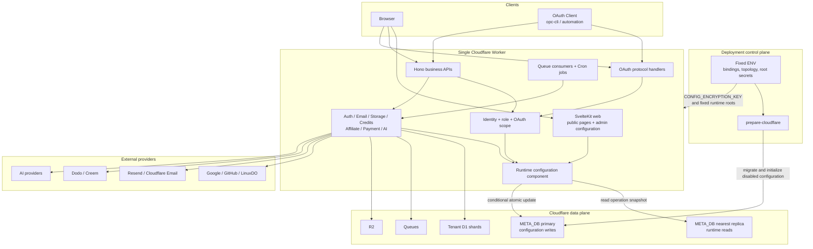

### 2.2 请求内配置快照

每个入口只在自己的操作边界内复用配置，不形成跨请求缓存：

| 入口 | 读取方式 | 快照边界 |
| --- | --- | --- |
| Web 页面 | `hooks.server.ts` 创建 Meta D1 Session，读取公开配置并写入 `event.locals` | 一次页面请求 |
| JSON API | `metaDbSessionMiddleware` 创建 Session，Handler 按需读取相关业务域 | 一次 API 请求 |
| Better Auth | 每次认证请求先读取 Authentication、Email 配置，再创建本次请求使用的 Auth 实例 | 一次认证请求 |
| Queue Consumer | 每条消息执行时创建 Session，只读取该任务需要的 AI 配置和 Channel | 一条 Queue 消息 |
| Cron | 每次触发创建 Session，只读取 Credits 和 AI 保留期 | 一次 Cron 执行 |

没有 bookmark 的读取使用 `META_DB.withSession('first-unconstrained')`，允许命中就近副本。浏览器和 CLI 将配置写入响应中的 `x-d1-meta-bookmark` 延续到下一次请求；Web SSR 同样从 Cookie 读取该 bookmark，因此保存后刷新或导航能读到自己的写入。

写入接口直接返回已保存的新配置和新 `version`。当前配置页面不需要为了确认结果再发起一次读取，也不依赖副本同步速度。

公共 Web 配置通过 Server Layout 下发，不新增 `/api/get_public_config`。这样登录方式、Turnstile、Payment 入口、Docs 入口和 Design System 在首屏就使用同一配置快照，不产生加载后闪烁。依赖动态配置的页面不再 Prerender；不依赖 D1 配置的纯静态资源继续静态提供。

### 2.3 配置 API 边界

后台页面和 OAuth Client 调用完全相同的配置 API。请求依次经过：

```text
Browser Session or OAuth Bearer Token
  -> resolve identity
  -> verify SYSTEM_EMAIL administrator
  -> OAuth request verifies route scope
  -> configuration handler
  -> configuration component validation
  -> conditional D1 update by expected_version
```

浏览器 Session 和 `ADMIN_API_TOKEN` 不检查 OAuth scope。OAuth Token 必须同时满足管理员身份和当前路由声明的 scope。Agent 不读取或保存 `ADMIN_API_TOKEN`。

单例业务域使用一组读取和更新接口：

| Domain | Read | Update | OAuth scopes |
| --- | --- | --- | --- |
| General | `POST /api/admin/get_general_config` | `POST /api/admin/update_general_config` | `config:general:read` / `config:general:write` |
| Authentication | `POST /api/admin/get_authentication_config` | `POST /api/admin/update_authentication_config` | `config:authentication:read` / `config:authentication:write` |
| Email | `POST /api/admin/get_email_config` | `POST /api/admin/update_email_config` | `config:email:read` / `config:email:write` |
| Storage | `POST /api/admin/get_storage_config` | `POST /api/admin/update_storage_config` | `config:storage:read` / `config:storage:write` |
| Credits | `POST /api/admin/get_credits_config` | `POST /api/admin/update_credits_config` | `config:credits:read` / `config:credits:write` |
| Affiliate | `POST /api/admin/get_affiliate_config` | `POST /api/admin/update_affiliate_config` | `config:affiliate:read` / `config:affiliate:write` |
| Payment | `POST /api/admin/get_payment_config` | `POST /api/admin/update_payment_config` | `config:payment:read` / `config:payment:write` |
| AI | `POST /api/admin/get_ai_config` | `POST /api/admin/update_ai_config` | `config:ai:read` / `config:ai:write` |

`get_payment_config` 在同一响应中返回 Payment 单例配置和 Product 列表；`get_ai_config` 同样返回 AI 单例配置和 Channel 列表。读取页面不拆成额外 List API。集合实体保持独立写入边界：

| Entity | Create | Update | Delete | OAuth scopes |
| --- | --- | --- | --- | --- |
| Payment Product | `POST /api/admin/create_payment_product` | `POST /api/admin/update_payment_product` | `POST /api/admin/delete_payment_product` | `config:payment:write` |
| AI Channel | `POST /api/admin/create_ai_channel` | `POST /api/admin/update_ai_channel` | `POST /api/admin/delete_ai_channel` | `config:ai:write` |

所有更新和删除请求携带 `expected_version`。`system_settings` 的每个业务域有独立版本；Payment Product 和 AI Channel 每行有独立版本。版本不匹配统一返回 `409 CONFIG_CONFLICT`。

### 2.4 OAuth API Access 边界

现有 Agent 命名全部移除，协议端点改为通用 OAuth API Access：

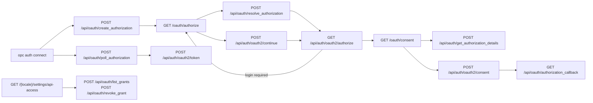

`/api/oauth/create_authorization`、`resolve_authorization` 和 `poll_authorization` 是设备授权协议入口，不要求已有 Token。授权详情、批准和 Grant 管理只接受浏览器 Session，OAuth Token 不能修改自身权限。

Better Auth OAuth Provider 继续签发 Access Token 和 Refresh Token。目标实现把传输 scope 从 `agent` 改为 `api_access`，业务 scope 作为 Token Claim 写入并在普通业务路由校验。内置 Public Client ID 固定为 `opc-cli`，不增加 Client Secret 或动态 Client 注册。

受保护 JSON API 的路由注册必须显式传入 scope。浏览器 Session 直接通过 scope 中间件，OAuth Token 缺少 scope 时返回 `403 FORBIDDEN`。公开 API、OAuth 协议端点、Better Auth、Webhook 和 Worker 内部入口不声明业务 scope。

### 2.5 管理后台边界

后台继续沿用现有客户端读取模式，不为配置页增加不必要的 Page SSR。Admin Layout 负责浏览器管理员 Session 校验；各配置页面挂载后通过 Typed API Client 读取配置。

页面路由固定为：

```text
/{locale}/admin/configuration/general
/{locale}/admin/configuration/authentication
/{locale}/admin/configuration/email
/{locale}/admin/configuration/storage
/{locale}/admin/configuration/credits
/{locale}/admin/configuration/affiliate
/{locale}/admin/configuration/payment
/{locale}/admin/configuration/ai
```

`/{locale}/admin/configuration` 只重定向到 `general`。Configuration Layout 只负责顶部 Tab、未保存离开拦截和共享页面布局，不持有跨 Tab 草稿。每个页面只管理自己的业务域草稿；Payment Product 和 AI Channel 抽屉各自管理一个实体草稿。

保存响应直接替换页面基线和动态公开配置状态。用户看到成功提示时，当前页面已经反映服务端实际写入值。其他前台页面在下一次导航或刷新时读取新配置。

### 2.6 初始化与运行时边界

`prepare-cloudflare` 的职责缩减为两类输入：

- 用固定 ENV 创建 Worker 运行前必须存在的 Cloudflare 资源和 Bindings
- 执行 Meta D1 Migration，并写入唯一一行 `system_settings` 的明确禁用状态和内置 `opc-cli` Client

Turnstile 是唯一需要部署工具与动态配置衔接的外部资源。部署工具始终准备 Widget，然后将 site key 和加密后的 secret key 写入 Authentication 配置；运行时是否启用只由 D1 中的 `turnstile_enabled` 决定。

初始化不创建 AI Channel、Payment Product 或第三方 OAuth Provider 配置。空集合和关闭开关是合法初始状态。缺失 `system_settings` 记录不是关闭状态，而是初始化失败。

本地和 Cloudflare 使用相同 D1 Schema、同一配置 API 和同一 OAuth 设备授权路径。本地只在 Cloudflare 资源准备方式上不同，不增加本地 Token 或 ENV 业务配置旁路。

### 2.7 运行时业务组件迁移

业务组件改为显式接收所需配置，不把整个配置对象或 `Env` 继续向下传递：

| Consumer | Target input |
| --- | --- |
| Better Auth | Authentication config、Email config、固定 `BETTER_AUTH_SECRET` 和 `SYSTEM_EMAIL` |
| Email clients | Provider、Provider credential、固定 sender `SYSTEM_EMAIL` |
| R2 upload validation | Allowed MIME types、maximum bytes；Bucket Binding 仍来自 ENV |
| Credits and Affiliate | 当前业务域规则和整数 credit units |
| Payment service | Payment routing、Provider credential、Products；`APP_DOMAIN` 仍作为固定回跳根地址 |
| Sync AI providers | Enabled、base URL、model、decrypted API key |
| AI Channel Router | Enabled Channels、routing weights；指标仍从当前 Tenant Shard 读取 |
| Cron | Credits retention days、AI task retention days |

这次迁移直接删除 `parsePaymentConfig(env)`、AI Channel ENV 扫描、Provider 内部 ENV 读取和各种 `env.FLAG || default`。配置缺失或非法由配置组件在业务调用前抛错，业务组件不提供 ENV 或代码默认值兜底。

### 2.8 文件改动视图

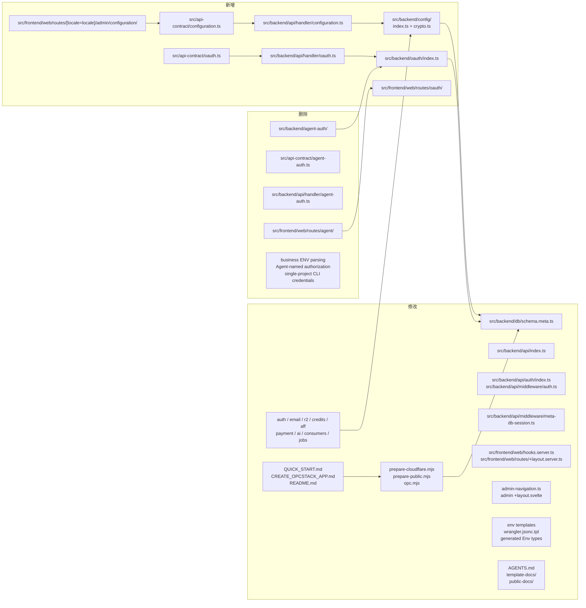

目录只按真实职责增加两个组件：`config` 和 `oauth`。不新增 Repository 层、Provider Registry、配置事件总线或前后端共享表单元数据。Zod API 契约负责输入输出类型，Drizzle Schema 负责持久化约束，配置组件负责跨字段业务校验，三者不互相替代。

`QUICK_START.md` 和 `CREATE_OPCSTACK_APP.md` 是产品初始化流程，不是普通说明文档，必须与代码在同一次迁移中修改。`README.md`、`template-docs/` 和 `public-docs/` 同步删除动态配置写入 ENV 和旧 Agent OAuth 路径的示例，并明确 `ADMIN_API_TOKEN` 只用于受信任管理员脚本。迁移完成后，任何用户入口都不能继续把同一配置引导到 ENV 和 D1 两个来源。

### 2.9 用户流程影响

从用户视角，架构变化后的路径是：

```text
创建项目
  -> 填写固定 ENV
  -> 启动本地或部署 Cloudflare
  -> 登录后台
  -> Configuration 按业务域填写并保存
  -> 下一次导航或业务操作使用新配置

需要 Agent 修改运行时配置
  -> Agent 执行 opc auth connect --name <project> --scopes <required scopes>
  -> 用户打开当前项目授权 URL
  -> 用户确认具体权限
  -> Agent 自动取得 Token
  -> 调用与后台相同的配置 API
  -> 返回写入结果并验证
```

用户只在初始化固定 secret ENV 时设置一次 `ADMIN_API_TOKEN`，日常业务配置不再接触它，也不需要重新部署。Agent 通过 OAuth 获得有限权限。代价是首次运行只有可登录的项目壳子，AI、支付、外部登录等能力必须在后台或授权后由 OAuth Client 明确配置并启用。

## 3. 关键流程

### 3.1 创建可登录的项目壳子

初始化只建立运行系统和管理员认证需要的最小状态，不要求用户先配置 AI、支付或外部登录。

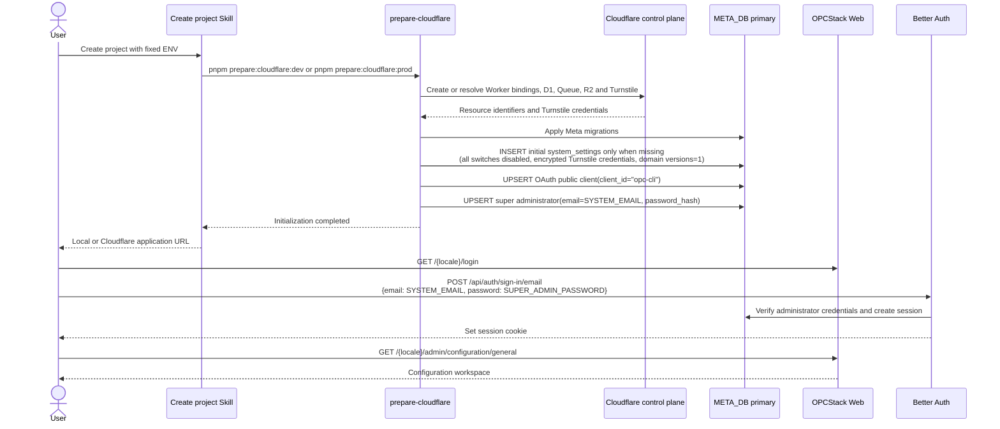

本地流程跳过远程 Cloudflare 资源创建，使用本地 D1 和测试 Turnstile 凭据，其余 Schema、初始化记录、登录路径和后续配置流程完全一致。

异常规则：

- 固定 ENV 缺失、Migration 失败或初始化记录写入失败时，准备流程直接失败，不启动一个半初始化应用
- `system_settings` 缺失时，运行时返回配置初始化错误，不推断默认关闭状态
- 再次执行准备流程只校准固定资源、内置 OAuth Client 和根管理员，不覆盖用户已经保存在 D1 的业务配置

#### 创建引导文档职责

| 文档 | 唯一职责 | 本次迁移要求 |
| --- | --- | --- |
| `QUICK_START.md` | 安装并调用最新的创建项目 Skill | 保持轻量，只传递项目名并启动 Skill，不复制配置步骤，不列动态配置项 |
| `CREATE_OPCSTACK_APP.md` | 定义从创建代码到得到可登录项目壳子的标准流程 | 只收集固定 ENV 和初始化绕不过的根密钥；删除把认证、邮件、支付、AI、存储规则等写入 `.env*` 的步骤 |
| `README.md` | 给已创建项目的开发者提供最短启动入口 | 启动后引导进入 Configuration；不再把 ENV 文件描述为业务配置入口 |

`CREATE_OPCSTACK_APP.md` 的目标用户流程固定为：

```text
创建项目代码
  -> 收集固定公开 ENV、资源拓扑和根密钥
  -> 启动本地实例或部署 Cloudflare 实例
  -> Migration 写入明确禁用的 D1 初始配置
  -> 用户使用 SYSTEM_EMAIL 和 SUPER_ADMIN_PASSWORD 登录
  -> 选择下一步
       - Build a feature
       - Configure application
       - Deploy to Cloudflare
       - Understand a module
```

选择 `Configure application` 后，人类进入后台 Configuration 按业务域保存。需要 Agent 配置时，Agent 才执行 `opc auth connect`，向当前项目地址发起 OAuth 设备授权；项目壳子启动前不引导 OAuth，因为此时没有可用的授权端点。

本地实例和 Cloudflare 实例各自拥有独立的 `META_DB`，因此动态配置不会自动从本地复制到生产。生产部署完成后，Skill 必须明确引导用户配置生产实例，不能静默复制密钥或继续读取 `.env.prod` 作为业务配置。再次部署只同步固定资源和初始化身份，不覆盖该生产实例已经保存的 D1 配置。

### 3.2 管理员保存一个业务域

以下用 Email Tab 替换 Resend API Key 为例。读取响应永远不包含密钥值；密钥操作是请求中的显式动作。

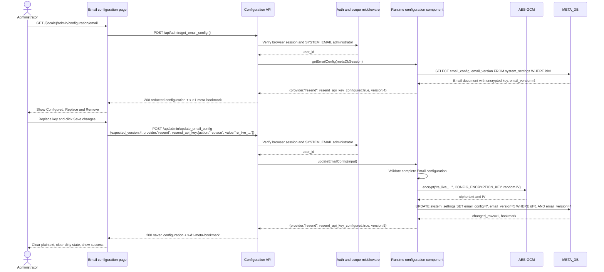

密钥字段统一使用三种动作：`keep`、`replace`、`remove`。`replace` 必须携带非空 `value`；`keep` 和 `remove` 不接受 `value`。具体 Schema 在第四章定义。

异常规则：

- 字段或关联校验失败返回 `400 INVALID_REQUEST`，D1 不写入，页面保留草稿并聚焦第一个错误字段
- 条件更新影响行数为 0 时返回 `409 CONFIG_CONFLICT`，页面保留草稿并提供 `Reload latest`
- 删除当前启用功能必需的密钥时，除非同一请求同时关闭功能，否则拒绝整个保存
- AES-GCM 加密失败直接返回内部配置错误，不保存明文或半条配置

### 3.3 OAuth Client 取得 API Access

Happy path 假设管理员浏览器已有登录 Session。CLI 是 Public Client，不提交 `client_secret`，使用 PKCE 证明换取 Token 的进程就是发起授权的进程。

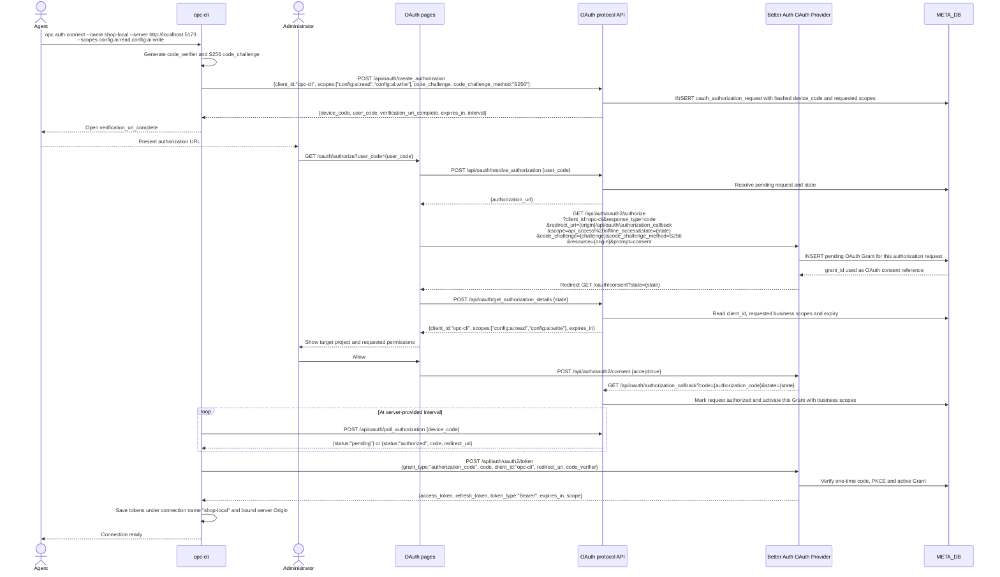

管理员没有登录时，`/oauth/authorize` 先完成登录，再调用 `POST /api/auth/oauth2/continue {postLogin:true}` 回到同一授权流程。它不是第二套授权协议。

异常规则：

- 未注册的 `client_id`、非法 scope、非 S256 PKCE 或非法 Origin 在创建或 authorize 阶段直接拒绝
- 只有 `SYSTEM_EMAIL` 管理员可以批准 `config:*` 等管理员 scope
- 用户拒绝、请求过期、授权码过期或重复消费时，CLI 停止轮询并报告需要重新授权
- 轮询过快返回 `slow_down` 和新 interval，CLI 必须按服务端节奏继续
- Refresh Token 失效或 Grant 被撤销后不降级为固定 Token，重新走授权流程

### 3.4 OAuth Client 修改集合实体

Agent 取得 Token 后直接调用普通配置 API。以下用新增 AI Channel 为例，展示 scope、管理员身份和 D1 密钥加密如何串联。

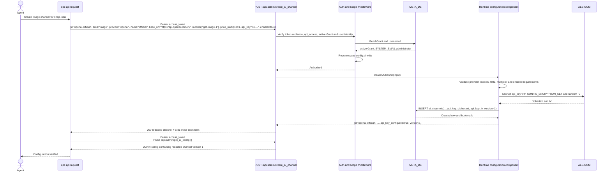

CLI 只能把 Token 发送到 `shop-local` 记录的同一 Origin。更新和删除 Channel 时必须提交该行的 `expected_version`；创建时由稳定 `id` 唯一约束阻止重复实体。

### 3.5 Web 首屏读取公开配置

公开配置必须在渲染 HTML 前确定，避免登录按钮、功能入口或 Design System 在页面加载后跳变。

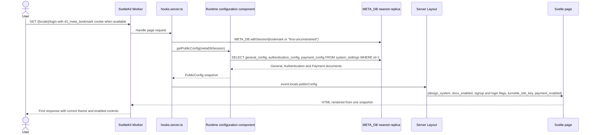

一次页面请求只读取一次公开配置并在 Layout 层复用。浏览器刚保存过配置时使用 Cookie bookmark 保证读到自己的写入；其他用户允许在副本传播期内短暂看到旧配置。

### 3.6 业务请求使用动态配置

以下用创建支付 Checkout 为例。配置在请求开始后只读取一次，Provider 调用过程中不重新加载。

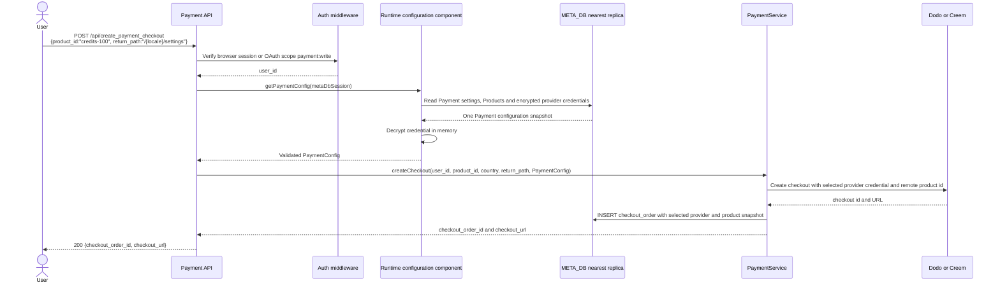

异常规则：

- `payment_enabled=false` 返回 `PAYMENT_DISABLED`，不会尝试从 ENV 或密钥是否存在推断启用
- Provider、Product、Credential 或关联配置非法时直接暴露配置错误，不自动换用 ENV Provider
- AES-GCM 完整性校验失败时不调用外部 Provider
- 请求开始后管理员关闭 Payment，不影响这个已经取得配置快照的请求；后续新请求读取关闭状态

### 3.7 Queue Consumer 使用就近配置

异步 AI Channel 在任务执行时选择，而不是创建任务时固化。每条 Queue 消息读取一次最新可见的 AI 配置快照。

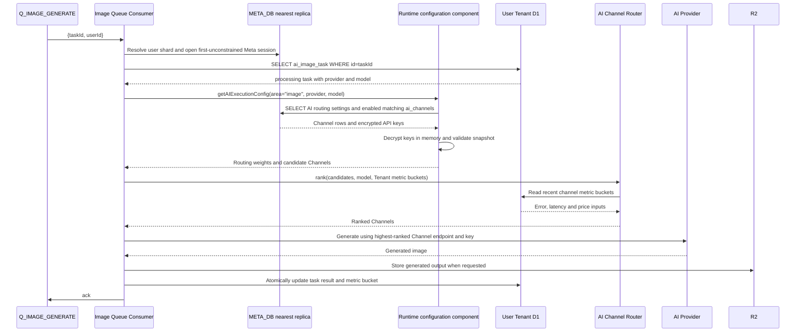

同一条消息内失败切换 Channel 时继续使用同一候选快照，不在每次重试 Provider 前重新读 D1。Queue 平台重新投递该消息时属于新的执行操作，会重新读取配置，因此管理员停用故障 Channel 后可以影响下一次消息尝试。

### 3.8 跨流程一致性规则

- 配置保存成功以 Meta D1 主库提交为准；写入响应返回新值、`version` 和 bookmark
- 浏览器与 CLI 延续 bookmark，保证后续读取自己的写入
- 无 bookmark 的 Web、API、Queue 和 Cron 优先读取就近副本，接受短暂传播延迟
- 一个 HTTP 请求、一条 Queue 消息或一次 Cron 执行只使用自己的配置快照
- 人类后台和 OAuth Client 没有不同的写入通道，均经过相同 Contract、校验、加密和条件更新
- 配置错误不读取 ENV、不使用代码默认值、不回退到另一 Provider

## 4. 数据模型与接口

### 4.1 数据建模原则

- 新增配置与 OAuth API Access 状态全部属于 `META_DB`
- `system_settings` 每个单例业务域使用独立 JSON 文档、版本和更新时间；Payment Product 和 AI Channel 使用独立表
- 业务域文档使用 Drizzle JSON 类型，不保存分号字符串，也不提供 JSON 文本编辑接口
- 业务域文档使用 JSON Boolean；类型表使用 SQLite Integer Boolean；时间统一为 Unix epoch milliseconds
- Credits 在 D1 中继续使用整数 units，API 继续使用最多 6 位小数的 decimal string
- AES-GCM 密文在文档内保存为 `{ciphertext, iv}`；二者均为 Base64 文本，Authentication Tag 包含在密文中
- 每个单例业务域和集合实体使用独立整数 `version`；每个领域的 `updated_at` 只用于展示，不承担并发控制
- 每次读写完整执行对应 Zod Schema；非法文档直接返回配置错误，不补默认值
- 不建立 Meta D1 到 Tenant D1 的外键。Tenant 中保存的 Channel ID 和 Meta 中的 Product ID 都按现有跨库快照语义处理

### 4.2 实体关系

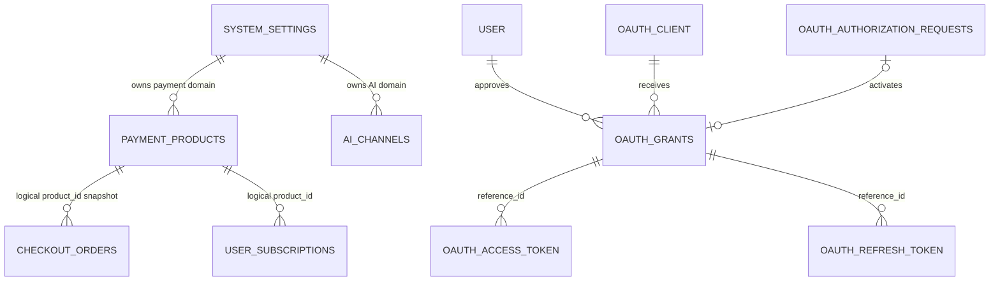

`checkout_orders` 和 `payment_transactions` 已经保存商品、价格和 credits 快照，因此不增加对 `payment_products` 的数据库外键。历史订单不能因删除配置商品而被级联删除。`oauth_access_token`、`oauth_refresh_token` 和 `oauth_consent` 继续由 Better Auth 管理；`oauth_grants` 是业务 scope、授权状态和撤销操作的唯一权威来源。

### 4.3 `system_settings`

表只允许一行，`id = 1`。D1 将 JSON 保存为 TEXT，所有配置列必须满足 `json_valid(config)` 且 `json_type(config) = 'object'`。`prepare-cloudflare` 在 Migration 后执行完整初始化插入；发生 `id` 冲突时不更新已有配置。

#### 物理字段

| Field | D1 type | Constraints |
| --- | --- | --- |
| `id` | INTEGER | PK，CHECK `id = 1` |
| `<domain>_config` | TEXT JSON | NOT NULL，有效 JSON Object |
| `<domain>_version` | INTEGER | NOT NULL，`>= 1` |
| `<domain>_updated_at` | INTEGER | NOT NULL |
| `created_at` | INTEGER | NOT NULL |

`<domain>` 固定为 `general`、`authentication`、`email`、`storage`、`credits`、`affiliate`、`payment`、`ai`。整表共 26 列，不增加全局 `updated_at`，因为它会制造与业务域更新时间重复的状态源。

#### 领域文档

| Domain | JSON paths | Rules |
| --- | --- | --- |
| General | `designSystem`、`docsEnabled` | Design System 为 `apple-saas` / `brutalism` |
| Authentication | `betaCodeEnabled`、`emailSignupEnabled`、`emailSignupDomainAllowlist`、`emailRequireVerification`、`emailUserActionCooldownSeconds` | allowlist 为小写唯一域名；cooldown `> 0` |
| Authentication | `turnstile.{enabled,siteKey,secretKey}` | 启用时 site key 和加密 secret 完整存在 |
| Authentication | `providers.{google,github,linuxdo}.{enabled,clientId,clientSecret}` | 启用时 client id 和加密 secret 完整存在 |
| Email | `enabled`、`provider`、`resendApiKey` | Provider 为 `cloudflare` / `resend`；Resend 启用时密钥完整存在 |
| Storage | `allowedContentTypes`、`maxUploadBytes` | 类型非空唯一；字节数为正整数 |
| Credits | `signupEnabled`、`signupAmount`、`dailyCheckinEnabled`、`dailyCheckinAmount`、`historyRetentionDays` | 金额为非负整数 units；保留天数 `> 0` |
| Affiliate | `enabled`、`inviterCreditAmount`、`inviteeCreditAmount` | 金额为非负整数 units |
| Payment | `enabled`、`defaultProvider`、`providerCountryOverrides` | Provider 为 `dodo` / `creem`；country 唯一 ISO alpha-2 |
| Payment | `providers.{dodo,creem}.{testMode,apiKey,webhookSecret}` | 被路由引用的 Provider 必须具有完整凭据和 Product 映射 |
| AI | `routing.{errorWeight,latencyWeight,priceWeight}`、`taskRetentionDays` | 权重非负且总和 `> 0`；保留天数 `> 0` |
| AI | `providers.<provider>.{enabled,baseUrl,defaultModel,apiKey}` | 启用时 URL、Model 和加密密钥完整存在 |

JSON 文档内部使用代码侧 camelCase，Admin JSON API 继续使用 snake_case。Handler 负责显式映射，不把持久化文档直接作为公共 API Contract。

`emailConfig.enabled` 是新增的显式状态。没有它，初始化时“邮件关闭”只能由 Provider 或密钥缺失推断，重新制造第二套隐式状态。密码登录不依赖邮件发送；邮件关闭时验证邮件、密码重置和其他发信操作明确返回 `EMAIL_DISABLED`。

Payment Provider 不增加第二个 `enabled` 字段。Provider 是否可用由完整凭据、至少一个 Product 映射以及 Payment 路由引用共同校验；`payment_enabled` 是整个支付业务唯一运行时开关。

九个固定同步 Provider 使用完全相同的五字段结构：

| Prefix | Area / Provider |
| --- | --- |
| `chat_openai` | Chat / OpenAI compatible |
| `image_gemini` | Image / Gemini |
| `image_openai` | Image / OpenAI |
| `image_seedream` | Image / SeedDream |
| `image_aliyun` | Image / Aliyun |
| `tts_gemini` | TTS / Gemini |
| `tts_seed` | TTS / Seed |
| `realtime_doubao` | Realtime / Doubao |
| `video_seedance` | Video / SeedDance |

每个 Provider 保存在 `ai_config.providers.<provider>`，统一包含 `enabled`、`baseUrl`、`defaultModel` 和 `apiKey`。`apiKey` 为空或为完整 `{ciphertext, iv}`。

Provider 关闭时允许整组配置为空，也允许保留一组完整配置；不允许只保存 Base URL、Model 或 API Key 中的一部分。Provider 启用时三项必须全部存在。

#### 初始化值

Migration 写入可见、可编辑的明确值，而不是运行时代码默认值：

- 所有业务功能和 AI Provider 开关为 `false`
- `design_system = apple-saas`，`docs_enabled = true`
- 上传类型为当前三种图片 MIME，最大 5 MiB
- Credits 和 Affiliate 金额保留当前模板值，但对应开关关闭
- Payment Provider 为空，Country overrides 为空，测试模式为 `true`
- AI 路由权重为 `1 / 0.8 / 0.2`，任务保留 30 天，Provider 配置为空
- 本地写入 Cloudflare Turnstile 测试凭据；生产写入准备流程创建的 Widget 凭据；`turnstile_enabled = false`
- 八个业务域版本均为 `1`

### 4.4 `payment_products`

| Field | D1 type | Constraints |
| --- | --- | --- |
| `id` | TEXT | PK，稳定内部 Product ID，创建后不可修改 |
| `type` | TEXT | `one_time` / `subscription` |
| `credits_amount` | INTEGER nullable | one-time credit units，`> 0` |
| `subscription_plan` | TEXT nullable | subscription 时非空 |
| `upgrade_rank` | INTEGER nullable | subscription 时 `>= 0` |
| `period_credits_amount` | INTEGER nullable | subscription credit units，`> 0` |
| `dodo_product_id` | TEXT nullable | UNIQUE |
| `creem_product_id` | TEXT nullable | UNIQUE |
| `version` | INTEGER | NOT NULL，初始 `1` |
| `created_at` | INTEGER | NOT NULL |
| `updated_at` | INTEGER | NOT NULL |

完整性规则：

- Product 至少配置一个远程 Provider Product ID
- `one_time` 只允许 `credits_amount`，三个 subscription 字段必须为空
- `subscription` 必须同时具有 `subscription_plan`、`upgrade_rank` 和 `period_credits_amount`，`credits_amount` 必须为空
- 不保存远程商品名称、描述、价格和币种；Checkout 创建时继续从 Provider 读取并写入 Order 快照
- 删除 Product 不删除历史订单。若仍存在 active subscription 引用该 Product，删除返回 `409 CONFIG_CONFLICT`

### 4.5 `ai_channels`

| Field | D1 type | Constraints |
| --- | --- | --- |
| `id` | TEXT | PK，lowercase slug，创建后不可修改 |
| `area` | TEXT | `image` / `tts` / `video` |
| `provider` | TEXT | 必须属于该 area 支持的 Provider |
| `name` | TEXT | NOT NULL，非空 |
| `base_url` | TEXT | NOT NULL，合法 URL |
| `models` | TEXT JSON | 非空唯一 `string[]` |
| `price_multiplier` | REAL | `> 0` |
| `api_key_ciphertext` | TEXT | NOT NULL |
| `api_key_iv` | TEXT | NOT NULL，Base64 12-byte IV |
| `enabled` | INTEGER boolean | NOT NULL |
| `version` | INTEGER | NOT NULL，初始 `1` |
| `created_at` | INTEGER | NOT NULL |
| `updated_at` | INTEGER | NOT NULL |

索引为 `(enabled, area, provider)`。Channel 是一个完整执行端点，不能保存无密钥的半条记录；替换密钥使用 `keep` 或 `replace`，删除密钥等价于删除 Channel，不提供 `remove` 动作。

Tenant Shard 的 `ai_channel_metric_buckets.channel` 继续保存 Channel ID，不建立跨 D1 外键。删除 Channel 后旧指标自然停止参与候选查询，并由现有保留任务清理。

### 4.6 OAuth API Access 数据

#### `oauth_authorization_requests`

此表替换并直接删除 `agent_authorization_requests`。

| Field | D1 type | Constraints |
| --- | --- | --- |
| `id` | TEXT | PK |
| `client_id` | TEXT | FK -> `oauth_client.client_id` |
| `device_code_hash` | TEXT | UNIQUE，SHA-256 |
| `user_code_hash` | TEXT | UNIQUE，SHA-256 |
| `state_hash` | TEXT | UNIQUE，SHA-256 |
| `code_challenge` | TEXT | PKCE S256 challenge |
| `code_challenge_method` | TEXT | CHECK `S256` |
| `requested_scopes` | TEXT JSON | 排序去重后的业务 `string[]` |
| `status` | TEXT | `pending` / `authorized` / `denied` / `expired` / `consumed` |
| `grant_id` | TEXT nullable | UNIQUE FK -> `oauth_grants.id` |
| `authorization_code` | TEXT nullable | Better Auth 短效一次性 Code |
| `expires_at` | INTEGER | NOT NULL |
| `code_expires_at` | INTEGER nullable | authorized 后必填 |
| `last_polled_at` | INTEGER nullable | 轮询节流 |
| `created_at` | INTEGER | NOT NULL |
| `consumed_at` | INTEGER nullable | consumed 后写入 |

终态或过期超过 24 小时的请求由现有定时清理流程删除，不增加新的 Cron Trigger。

#### `oauth_grants`

此表替换并直接删除 `agent_grants`。

| Field | D1 type | Constraints |
| --- | --- | --- |
| `id` | TEXT | PK |
| `user_id` | TEXT | FK -> `user.id`，ON DELETE CASCADE |
| `client_id` | TEXT | FK -> `oauth_client.client_id` |
| `scopes` | TEXT JSON | 排序去重后的业务 `string[]` |
| `status` | TEXT | `pending` / `active` / `revoked` |
| `created_at` | INTEGER | NOT NULL |
| `approved_at` | INTEGER nullable | active 后写入 |
| `revoked_at` | INTEGER nullable | revoked 后写入 |

索引为 `(user_id, status)` 和 `(client_id, status)`。Better Auth 开始 Consent 前创建 `pending` Grant 并将其 ID 作为 `reference_id`；用户批准后原子改为 `active`，拒绝或过期则删除 pending Grant。Grant 列表不展示 pending 行。每次 `opc auth connect` 都创建一个新 Grant，不按 `user_id + client_id` 复用，因此同一用户的多台电脑可以单独撤销。

Better Auth 表的约束：

- `oauth_client` 初始化一行 `client_id = opc-cli`、`public = true`、`require_pkce = true`、无 Client Secret
- Transport scopes 固定为 `api_access offline_access`，业务 scopes 只保存在 Authorization Request、Grant 和 Token Claim
- `oauth_access_token.reference_id` 与 `oauth_refresh_token.reference_id` 保存 Grant ID，并增加索引
- 撤销 Grant 时同一 D1 Batch 将 `oauth_grants.status` 改为 `revoked`，并撤销该 Grant 的所有 Refresh Token
- API 中间件每次校验 Grant 状态，因此撤销后未过期 Access Token 也立即失效
- `oauth_consent` 只是 Better Auth 的协议记录，不作为业务授权状态来源

### 4.7 配置 API 公共契约

所有配置 API 使用 `POST` 和 JSON，字段使用 `snake_case`。读取请求统一为 `{}`。更新请求提交完整业务域和 `expected_version`；成功响应返回脱敏后的完整业务域及新 `version`。读取和写入响应都返回 `x-d1-meta-bookmark`。

密钥更新统一使用：

```ts
type SecretMutation =
	| { action: 'keep' }
	| { action: 'replace'; value: string }
	| { action: 'remove' }
```

`keep` 不重新加密、不修改密文；`replace` 使用新 IV；`remove` 同时清空密文和 IV。具体业务域仍要校验删除后的完整性。AI Channel 不接受 `remove`。

通用错误：

| HTTP | Code | Meaning |
| --- | --- | --- |
| 400 | `INVALID_REQUEST` | Zod 或跨字段校验失败，message 包含具体字段路径 |
| 401 | `UNAUTHORIZED` | 没有有效 Session 或 Bearer Token |
| 403 | `FORBIDDEN` | 非管理员、缺少 scope 或无资源权限 |
| 404 | `CONFIG_NOT_FOUND` | Product 或 Channel 不存在 |
| 409 | `CONFIG_CONFLICT` | `expected_version` 过期、ID 重复或被业务引用 |
| 500 | `CONFIG_UNAVAILABLE` | 初始化记录缺失、根密钥错误或密文完整性校验失败 |

`CONFIG_UNAVAILABLE` 不把密文、Provider 凭据或具体解密异常返回客户端，内部日志只记录业务域和字段名。

### 4.8 单例配置接口

每个接口的认证、scope 和版本边界如下：

| Domain | Read endpoint | Update endpoint | OAuth scope |
| --- | --- | --- | --- |
| General | `POST /api/admin/get_general_config` | `POST /api/admin/update_general_config` | `config:general:read` / `config:general:write` |
| Authentication | `POST /api/admin/get_authentication_config` | `POST /api/admin/update_authentication_config` | `config:authentication:read` / `config:authentication:write` |
| Email | `POST /api/admin/get_email_config` | `POST /api/admin/update_email_config` | `config:email:read` / `config:email:write` |
| Storage | `POST /api/admin/get_storage_config` | `POST /api/admin/update_storage_config` | `config:storage:read` / `config:storage:write` |
| Credits | `POST /api/admin/get_credits_config` | `POST /api/admin/update_credits_config` | `config:credits:read` / `config:credits:write` |
| Affiliate | `POST /api/admin/get_affiliate_config` | `POST /api/admin/update_affiliate_config` | `config:affiliate:read` / `config:affiliate:write` |
| Payment | `POST /api/admin/get_payment_config` | `POST /api/admin/update_payment_config` | `config:payment:read` / `config:payment:write` |
| AI | `POST /api/admin/get_ai_config` | `POST /api/admin/update_ai_config` | `config:ai:read` / `config:ai:write` |

简单业务域的请求与响应字段：

| Domain | Read / update response | Update request |
| --- | --- | --- |
| General | `{design_system, docs_enabled, version}` | `{design_system, docs_enabled, expected_version}` |
| Storage | `{allowed_content_types: string[], max_upload_bytes: integer, version}` | 同字段加 `expected_version` |
| Credits | `{signup_enabled, signup_amount: decimal string, daily_checkin_enabled, daily_checkin_amount: decimal string, history_retention_days, version}` | 同字段加 `expected_version` |
| Affiliate | `{enabled, inviter_credit_amount: decimal string, invitee_credit_amount: decimal string, version}` | 同字段加 `expected_version` |

Authentication Read Response：

```ts
type AuthenticationConfigView = {
	beta_code_enabled: boolean
	email_signup_enabled: boolean
	email_signup_domain_allowlist: string[]
	email_require_verification: boolean
	email_user_action_cooldown_seconds: number
	turnstile_enabled: boolean
	turnstile_site_key: string | null
	turnstile_secret_key_configured: boolean
	google_auth_enabled: boolean
	google_client_id: string | null
	google_client_secret_configured: boolean
	google_callback_url: string
	github_auth_enabled: boolean
	github_client_id: string | null
	github_client_secret_configured: boolean
	github_callback_url: string
	linuxdo_auth_enabled: boolean
	linuxdo_client_id: string | null
	linuxdo_client_secret_configured: boolean
	linuxdo_callback_url: string
	version: number
}
```

Update Request 使用相同非派生字段，将四个 `*_configured` 替换成对应 `SecretMutation`，删除三个 `*_callback_url`，并将 `version` 替换成 `expected_version`。Response 返回新的 `AuthenticationConfigView`。

Email 契约：

```ts
type EmailConfigView = {
	enabled: boolean
	provider: 'cloudflare' | 'resend' | null
	resend_api_key_configured: boolean
	version: number
}

type UpdateEmailConfigRequest = {
	enabled: boolean
	provider: 'cloudflare' | 'resend' | null
	resend_api_key: SecretMutation
	expected_version: number
}
```

`enabled = true` 时 Provider 必填；Provider 为 `resend` 时必须已有或同时提交 API Key。`cloudflare` 依赖固定 `SEND_EMAIL` Binding，不增加另一个 D1 凭据。

Payment 契约：

```ts
type PaymentProviderName = 'dodo' | 'creem'

type PaymentProviderConfigView = {
	test_mode: boolean
	api_key_configured: boolean
	webhook_secret_configured: boolean
	webhook_url: string
}

type PaymentConfigView = {
	enabled: boolean
	default_provider: PaymentProviderName | null
	country_provider_overrides: Array<{
		country: string
		provider: PaymentProviderName
	}>
	dodo: PaymentProviderConfigView
	creem: PaymentProviderConfigView
	products: PaymentProductView[]
	version: number
}
```

`UpdatePaymentConfigRequest` 使用相同的开关、路由和 Provider test mode，将每个 Provider 的两个 `*_configured` 替换成 `SecretMutation`，不提交 `webhook_url` 和 `products`，并提交 `expected_version`。启用时 Default Provider、Country override 指向的 Provider、凭据和至少一个对应 Product 必须完整。

AI 契约：

```ts
type AIArea = 'chat' | 'image' | 'tts' | 'realtime' | 'video'

type AIProviderConfigView = {
	area: AIArea
	provider: string
	enabled: boolean
	base_url: string | null
	default_model: string | null
	api_key_configured: boolean
}

type AIConfigView = {
	routing_error_weight: number
	routing_latency_weight: number
	routing_price_weight: number
	task_retention_days: number
	providers: AIProviderConfigView[]
	channels: AIChannelView[]
	version: number
}
```

`UpdateAIConfigRequest` 提交四个通用字段、九个固定且唯一的 Provider 项、每项的 `api_key: SecretMutation` 和 `expected_version`，不提交 `channels`。Provider 身份必须来自固定组合，不能用该接口创建新 Provider。Response 返回新的 `AIConfigView`。

### 4.9 集合配置接口

```ts
type PaymentProductView = {
	product_id: string
	type: 'one_time' | 'subscription'
	credits_amount: string | null
	subscription_plan: string | null
	upgrade_rank: number | null
	period_credits_amount: string | null
	dodo_product_id: string | null
	creem_product_id: string | null
	version: number
}

type AIChannelView = {
	id: string
	area: 'image' | 'tts' | 'video'
	provider: string
	name: string
	base_url: string
	models: string[]
	price_multiplier: number
	api_key_configured: true
	enabled: boolean
	version: number
}
```

| Endpoint | Request | 200 Response | Scope |
| --- | --- | --- | --- |
| `POST /api/admin/create_payment_product` | `PaymentProductView` 去掉 `version` | `PaymentProductView` | `config:payment:write` |
| `POST /api/admin/update_payment_product` | 全部可编辑字段 + `product_id` + `expected_version` | `PaymentProductView` | `config:payment:write` |
| `POST /api/admin/delete_payment_product` | `{product_id, expected_version}` | `{product_id}` | `config:payment:write` |
| `POST /api/admin/create_ai_channel` | `AIChannelView` 去掉 `api_key_configured/version`，增加明文 `api_key` | `AIChannelView` | `config:ai:write` |
| `POST /api/admin/update_ai_channel` | 全部可编辑字段 + `id` + `expected_version` + `api_key: keep | replace` | `AIChannelView` | `config:ai:write` |
| `POST /api/admin/delete_ai_channel` | `{id, expected_version}` | `{id}` | `config:ai:write` |

Product ID 和 Channel ID 只在 Create 接口提交一次，Update 不允许改名。所有成功写入返回 bookmark；前端用返回实体替换对应行，不重新读取整个业务域。

### 4.10 OAuth 协议接口

| Endpoint | Auth | Request | Success response |
| --- | --- | --- | --- |
| `POST /api/oauth/create_authorization` | Public | `{client_id, scopes: string[], code_challenge, code_challenge_method:'S256'}` | `{device_code, user_code, verification_uri, verification_uri_complete, expires_in, interval}` |
| `POST /api/oauth/resolve_authorization` | Public | `{user_code}` | `{authorization_url}` |
| `POST /api/oauth/get_authorization_details` | Browser Session | `{state}` | `{client_id, client_name, scopes, target_origin, expires_in}` |
| `GET /api/oauth/authorization_callback` | Better Auth callback + Session | Query `{code?, error?, state}` | `302` 到授权完成或拒绝页面 |
| `POST /api/oauth/poll_authorization` | device code | `{device_code}` | `{status:'pending'|'slow_down', interval}` 或 `{status:'authorized', code, redirect_uri}` 或终态 |
| `POST /api/oauth/list_grants` | Browser Session | `{}` | `{items:[{id, client_id, client_name, scopes, status, approved_at, revoked_at}], total}` |
| `POST /api/oauth/revoke_grant` | Browser Session | `{grant_id}` | `{grant_id, status:'revoked'}` |

协议约束：

- Create 只接受已注册 Client 和代码中声明的 scope；Admin-only scope 在用户批准阶段校验，非管理员 Session 必须拒绝
- `verification_uri_complete` 指向当前项目的 `/oauth/authorize?user_code=...`
- Resolve 不批准权限，只把一次性 user code 转成 Better Auth authorize URL
- Details、批准、拒绝、List 和 Revoke 只接受浏览器 Session，OAuth Token 不能管理自身 Grant
- Poll 返回 Authorization Code 后原子标记请求 `consumed`；Code 单次使用且短效
- Revoke 只能操作当前 Session 用户自己的 Grant

Better Auth 保持标准接口，不在 `src/api-contract/` 复制 SDK 内部 Schema：

| Endpoint | Contract |
| --- | --- |
| `GET /api/auth/oauth2/authorize` | 标准 Authorization Code + PKCE Query；transport scope 固定为 `api_access offline_access` |
| `POST /api/auth/oauth2/continue` | Better Auth 登录继续流程 |
| `POST /api/auth/oauth2/consent` | Browser Session 提交批准或拒绝 |
| `POST /api/auth/oauth2/token` | `application/x-www-form-urlencoded`；支持 `authorization_code + code_verifier` 和 `refresh_token` |

Token Response 为标准 `{access_token, refresh_token, token_type:'Bearer', expires_in, scope}`。Access Token Claim 额外包含 `grant_id`、`api_scopes` 和 `aud`；不再包含任何 `agent_*` 字段。

### 4.11 业务 Scope Registry

所有受保护 JSON 业务路由必须在注册时声明下列 scope。Browser Session 走原有身份和角色检查；OAuth Token 额外检查 scope。`config:*` 和 `admin:*` 标记为 Admin-only scope，只允许 `SYSTEM_EMAIL` 管理员批准。

| Scope | Routes |
| --- | --- |
| `account:write` | `POST /api/bind_beta_code` |
| `credits:read` | `POST /api/get_credit_summary`、`POST /api/list_credit_transactions` |
| `credits:write` | `POST /api/daily_checkin`、`POST /api/redeem_credit_code` |
| `affiliate:read` | `POST /api/get_aff_summary` |
| `affiliate:write` | `POST /api/bind_aff` |
| `feedback:write` | `POST /api/submit_feedback` |
| `notifications:read` | `POST /api/list_notifications` |
| `notifications:write` | `POST /api/read_notification` |
| `payment:read` | `POST /api/get_subscription`、`POST /api/list_payment_transactions` |
| `payment:write` | `POST /api/create_payment_checkout`、`POST /api/cancel_subscription`、`POST /api/upgrade_subscription` |
| `admin:overview:read` | `POST /api/admin/get_overview` |
| `admin:users:read` | `POST /api/admin/list_users` |
| `admin:beta:read` | `POST /api/admin/list_beta_codes` |
| `admin:beta:write` | `POST /api/admin/generate_beta_codes` |
| `admin:credits:read` | `POST /api/admin/list_credit_codes` |
| `admin:credits:write` | `POST /api/admin/generate_credit_codes`、`POST /api/admin/grant_credits` |
| `admin:feedback:read` | `POST /api/admin/list_feedbacks` |
| `admin:notifications:read` | `POST /api/admin/list_notifications` |
| `admin:notifications:write` | `POST /api/admin/create_notification` |
| `admin:payment:read` | `POST /api/admin/list_payment_transactions` |
| `admin:ai:read` | `POST /api/admin/list_ai_tasks`、`POST /api/admin/get_ai_task` |
| `config:<domain>:read/write` | 第 4.8、4.9 节配置接口 |

公开 API、Better Auth、OAuth 协议、Grant 管理、Webhook、R2 字节流和 Realtime 连接不进入 Scope Registry。它们分别使用公开访问、浏览器 Session、Provider 签名、对象权限或专用握手。新增受保护 JSON 路由若没有 scope，路由测试必须失败，不能自动退化为 Browser-only。

### 4.12 CLI 接口与本机数据

目标 CLI 命令：

```text
opc auth connect --name <connection> --server <origin> --scopes <comma-separated>
opc auth status --name <connection>
opc auth disconnect --name <connection>
opc api request --name <connection> --method <method> --url <path> [--query JSON] [--body JSON]
```

`credentials.json` 使用一次性切换后的新结构，不读取旧单项目格式：

```json
{
  "connections": {
    "shop-local": {
      "server": "http://localhost:5173",
      "access_token": "<secret>",
      "refresh_token": "<secret>",
      "expires_at": 1780000000000,
      "scopes": ["config:ai:read", "config:ai:write"]
    }
  }
}
```

- Connection name 是本机唯一键；Server Origin 是该连接不可绕过的发送边界
- `api request` 只接受相对 Path，并拒绝调用者提供 `Authorization` Header
- Access Token 临近过期时最多自动刷新一次；刷新失败要求重新 `connect`
- `status` 不输出 Token；`disconnect` 只删除本机连接，不代替服务端 Revoke
- 文件权限固定为 `0600`，临时写入后原子替换
- CLI stdout 只输出授权 URL、连接状态和业务 API 响应，不打印 Access Token 或 Refresh Token

### 4.13 Web 首屏公开配置契约

不新增 `/api/get_public_config`。`hooks.server.ts` 每次页面请求读取一次 D1，并通过 Server Layout 下发：

```ts
type PublicRuntimeConfig = {
	design_system: 'apple-saas' | 'brutalism'
	docs_enabled: boolean
	email_enabled: boolean
	email_signup_enabled: boolean
	email_require_verification: boolean
	email_user_action_cooldown_seconds: number
	google_auth_enabled: boolean
	github_auth_enabled: boolean
	linuxdo_auth_enabled: boolean
	turnstile_enabled: boolean
	turnstile_site_key: string | null
	payment_enabled: boolean
}
```

`client.generated.ts` 只保留固定构建输入：`app_name`、`app_version`、`api_base_url`、`web_base_url`、`support_email` 和 Extension host permissions。页面不得再从生成文件读取上述 D1 字段。

Server Layout 使用一个 `PublicRuntimeConfig` 快照渲染首屏。`turnstile_enabled = true` 时 site key 必须非空；任何公开配置记录缺失都返回 `CONFIG_UNAVAILABLE`，不使用构建时值补齐。配置保存响应可以更新当前后台页面状态，其他页面在下次导航或刷新时读取新快照。
