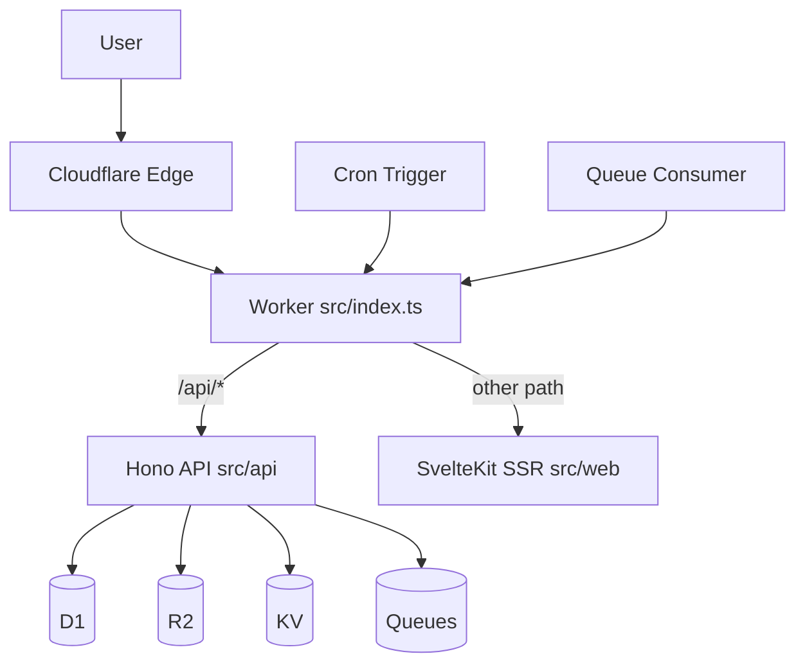

# Architecture

## Design principles

### Convention over configuration

You do not need to hand write config files. Configure environment variables and `scripts/prepare-cloudflare.mjs` generates config automatically.

### One Worker as the runtime container

API, SSR, Cron, and Queue run in one Worker so development and deployment follow the same path.

### Cloudflare stack first

Workers, D1, R2, KV, Queues, and Cron are integrated as one path. The free tier can run the full loop.

### Automation first

If it can be automated, automate it. Avoid manual steps.

## Overview



The diagram shows the full request flow:
1. User sends HTTP request to Cloudflare edge
2. Edge network routes request to Worker
3. Worker dispatches by path: `/api/*` -> Hono, otherwise -> SvelteKit
4. Hono middleware chain handles auth, session, and permission
5. Worker calls Cloudflare services like D1, R2, KV, and Queue
6. Response is returned with D1 consistency guaranteed by bookmark

### Request routing

```
HTTP Request
  ├── /api/*      -> Hono API      (src/api/)
  └── other path  -> SvelteKit SSR (src/web/)

Cron Trigger       -> src/jobs/index.ts
Queue Consumer     -> src/consumers/index.ts
```

All requests enter from `src/index.ts` and are dispatched by path.

### Why this design

One Worker as the runtime container:
- API, SSR, Cron, and Queue are all in one Worker
- Development and deployment follow the same path with lower debug cost
- No service splitting and no extra glue layer

Convention over configuration:
- `pnpm dev` auto generates `wrangler.jsonc`
- Auto creates D1, R2, KV, and Queues
- Auto applies migrations
- No hand written config files

## Directory structure

```
src/
  index.ts              # Worker entry, dispatch fetch/cron/queue
  api/
    index.ts            # API route registration
    auth/               # Better Auth config
    handler/            # API handlers
    middleware/         # Middleware
      auth.ts           # Auth middleware
      beta-gate.ts      # Beta code middleware
      d1-session.ts     # D1 session middleware
      email-auth.ts     # Email auth middleware
  web/
    routes/             # SvelteKit pages
    lib/
      ui/               # UI components
      i18n/             # I18n
  db/
    schema.ts           # Drizzle schema
    schema.auth.ts      # Better Auth schema
    migrations/         # Auto generated migrations
  jobs/
    index.ts            # Cron handlers
  consumers/
    index.ts            # Queue handlers
  ai/
    chat/openai/        # Chat client
    image/gemini/       # Image client
    tts/gemini/         # TTS client
  r2/
    index.ts            # R2 helpers
  testing/
    bdd.ts              # BDD style test helper
```

### Directory responsibilities

`src/index.ts`:
- Worker entry
- Dispatch `fetch`, `cron`, and `queue`
- No business logic

`src/api/`:
- Backend API layer
- `handler/` contains API business logic
- `middleware/` contains middlewares like auth and beta code
- `index.ts` registers routes

`src/web/`:
- Frontend page layer
- `routes/` for pages
- `lib/ui/` for components
- `lib/i18n/` for i18n messages

`src/db/`:
- Data layer
- `schema.ts` defines table schema
- `migrations/` stores auto generated migration files

`src/jobs/`:
- Scheduled jobs
- Dispatch by cron expression

`src/consumers/`:
- Queue consumers
- Dispatch by queue name

## scripts/prepare-cloudflare.mjs automation

### Workflow

```
pnpm dev / pnpm deploy:cloudflare
  ↓
scripts/prepare-cloudflare.mjs
  ↓
1. Load env vars (.env.dev or .env.prod)
2. Parse APP_DOMAIN and generate APP_BASE_URL
3. Validate email config
4. In remote mode:
   - Get Wrangler token
   - Get Cloudflare account ID
   - Create or check D1 database
   - Enable D1 read replication
   - Create or check Queues, R2, KV
5. Render wrangler.jsonc
6. Generate Drizzle migration
7. Apply D1 migration
  ↓
wrangler dev / wrangler deploy
```

### Local vs remote mode

Local mode (`node scripts/prepare-cloudflare.mjs --mode dev`):
- Uses placeholder UUID
- Does not create remote resources
- Runs `migration apply --local`

Remote mode (`node scripts/prepare-cloudflare.mjs --mode prod`):
- Auto creates all resources
- Enables D1 read replication
- Runs `migration apply --remote`

### Why prepare-cloudflare is needed

Problem: creating and configuring Cloudflare resources manually is tedious.

Solution: `scripts/prepare-cloudflare.mjs` automates everything:
- No manual `wrangler.jsonc`
- No manual D1, R2, KV, Queue creation
- No manual migration apply
- Only environment variables are required

## Middleware mechanism

### Execution order

```
Request
  ↓
d1SessionMiddleware      # Create D1 session
  ↓
authMiddleware           # Inject userId
  ↓
betaGateMiddleware       # Block by beta code
  ↓
emailAuthMiddleware      # Block by email auth
  ↓
handler                  # Business logic
```

### Middleware responsibilities

`d1SessionMiddleware`:
- Read `x-d1-bookmark` header or `d1_bookmark` cookie
- Create D1 session
- Inject `db` into `ctx.variables`
- Write bookmark back on response

`authMiddleware`:
- Parse Bearer token
- Inject `userId` into `ctx.variables`
- Does not block requests even when user is not logged in

`betaGateMiddleware`:
- If `BETA_CODE_ENABLED=true`, check whether user is bound to beta code
- Block request when not bound

`emailAuthMiddleware`:
- If `EMAIL_ENABLED=true`, check email auth related config
- Block requests that do not match rules

## D1 read replication

### Mechanism

Remote mode enables D1 read replication automatically with D1 Sessions API.

Bookmark flow:
```
Request
  ↓
Read x-d1-bookmark header or d1_bookmark cookie
  ↓
Create D1 session: env.DB.withSession(bookmark)
  ↓
Execute SQL query
  ↓
Get new bookmark: session.getBookmark()
  ↓
Write x-d1-bookmark header and d1_bookmark cookie
  ↓
Response
```

Default bookmark: `first-primary` for correctness.

### Why read replication is needed

Problem: D1 has one primary node. Both reads and writes hit primary so latency and throughput are limited.

Solution: after read replication is enabled, reads are distributed to global replicas to reduce latency.

Consistency: bookmark guarantees monotonic reads, read your own writes, and writes follow reads.

## Environment variable system

### Load order

```
.env.dev / .env.prod  (default)
  ↓
.env  (override)
  ↓
process.env  (highest priority)
```

### Why this design

Problem: different environments need different config, but manual switching is error prone.

Solution:
- `.env.dev` for local development
- `.env.prod` for production
- `.env` for local override that should not be committed
- `process.env` for CI/CD variables

## Conventions

### Queue binding

Queue name `task-check` -> binding `Q_TASK_CHECK`

Rule: `Q_<QUEUE_NAME_UPPER>`

### R2 file path

- Public file: `public/*`
- Private file: `private/<userId>/*`

### Test files

- Unit tests: `src/**/*.test.ts`
- E2E tests: `e2e/**/*.test.ts`
