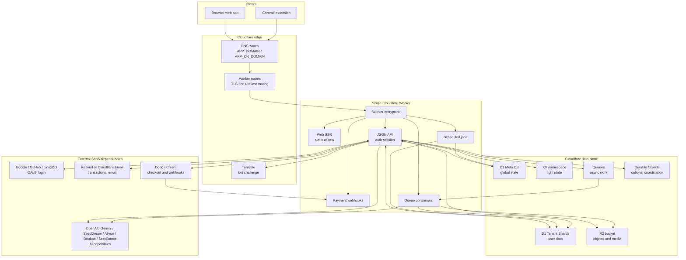
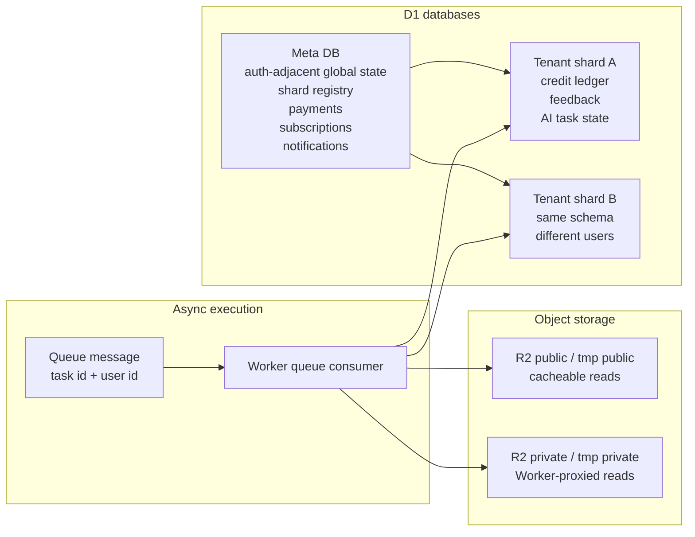
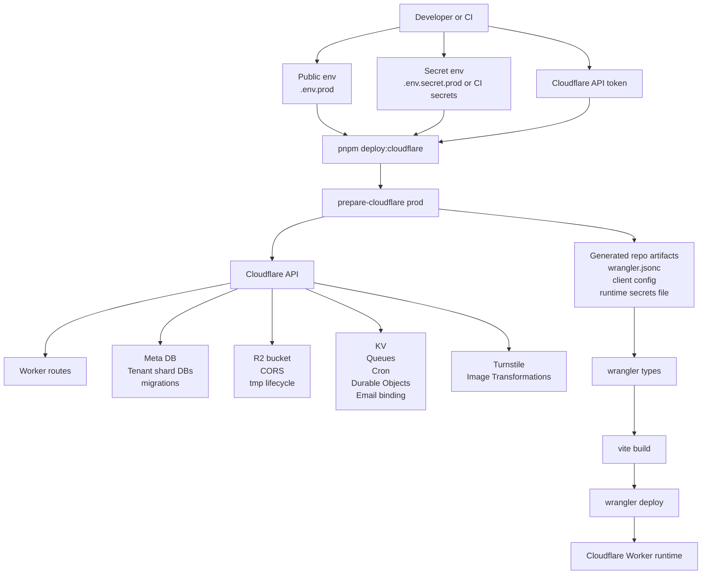
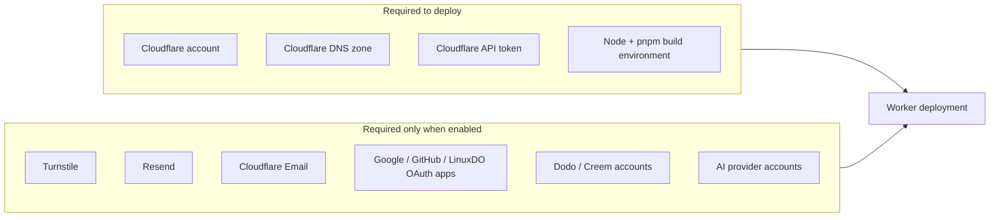

# Deployment

OPC Stack has one runtime deployment unit: a Cloudflare Worker. The Worker owns web SSR, JSON APIs, auth, payment webhooks, scheduled jobs, queue consumers, static assets, and Cloudflare bindings. The Chrome extension is a separate artifact that talks to the same deployed origin.

## Runtime Overview

The important boundary is simple: user traffic enters through Cloudflare routes, then one Worker decides whether the request is web, API, webhook, cron, or queue work. Durable product state is in D1. Binary state is in R2. External SaaS providers are integrations, not deployment units.

## Data Ownership

Meta DB is the source of truth for cross-database flows. Tenant shard writes are idempotent side effects. There is no cross-D1 transaction, so the architecture uses resumable state instead of pretending atomicity exists.

## Provisioning Overview

Provisioning is intentionally centralized in `prepare-cloudflare`. Do not treat manually created Cloudflare resources as the architecture. If a resource is part of the product runtime, it should be expressible from config and generated into the Worker deployment.

## External Dependency Map

Callback URLs and DNS records belong to the external systems: OAuth callbacks use the deployed API origin, payment webhooks point back to the Worker, and email providers need their sender domain records verified. `APP_CN_DOMAIN` adds a second Worker custom domain. `APP_CN_CNAME_TARGET` optionally creates or updates one unproxied CNAME for that domain, but the preferred target must come from your own network decision.
