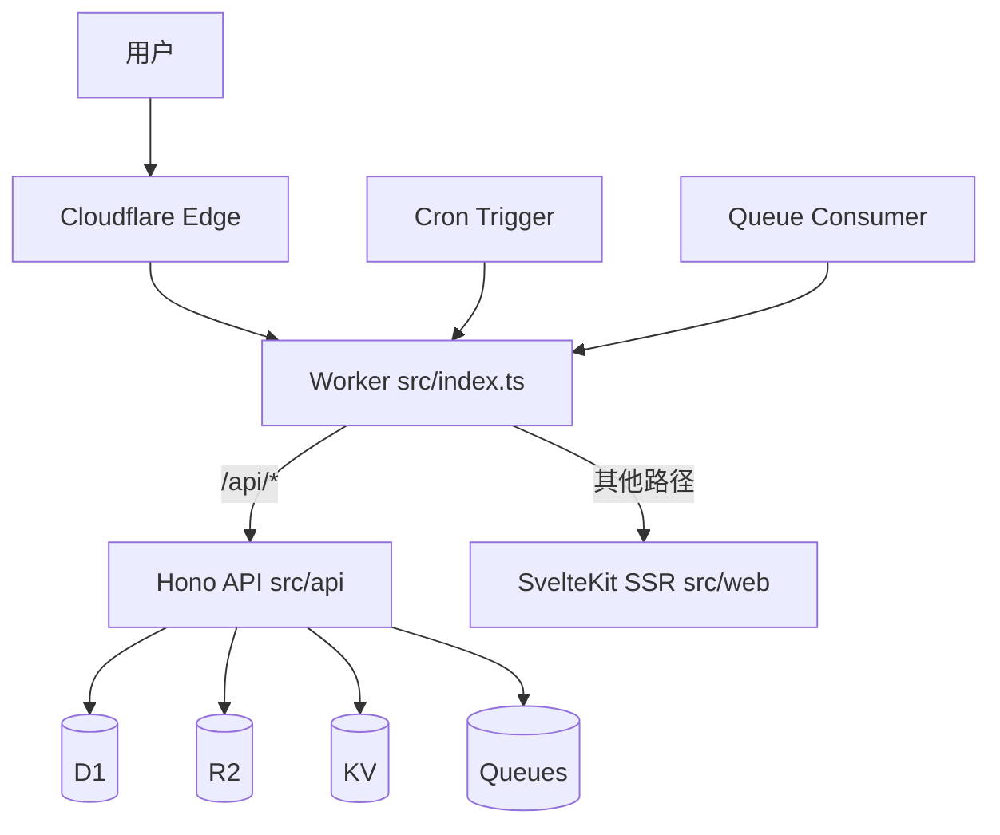

# 架构说明

## 设计理念

### 约定大于配置

不需要手写配置文件，只需要配置环境变量，scripts/prepare-cloudflare.mjs 自动生成配置。

### 一个 Worker 统一承载

API、SSR、Cron、Queue 都在一个 Worker 中，开发和部署路径一致。

### Cloudflare 全家桶优先

Workers、D1、R2、KV、Queues、Cron 一套打通，免费额度可跑通完整链路。

### 自动化优先

能自动化的就自动化，不需要手动操作。

## 整体架构



上图展示了完整的请求流程：
1. 用户发起 HTTP 请求 → Cloudflare 边缘网络
2. 边缘网络路由到 Worker
3. Worker 根据路径分发：`/api/*` → Hono，其他 → SvelteKit
4. Hono 中间件链处理认证、session、权限
5. Worker 调用 D1/R2/KV/Queue 等 Cloudflare 服务
6. 返回响应（D1 通过 bookmark 机制保证一致性）

### 请求分流

```
HTTP Request
  ├── /api/*      -> Hono API      (src/api/)
  └── other path  -> SvelteKit SSR (src/web/)

Cron Trigger       -> src/jobs/index.ts
Queue Consumer     -> src/consumers/index.ts
```

所有请求在 `src/index.ts` 统一入口，根据路径分发到不同的处理器。

### 为什么这样设计？

**一个 Worker 统一承载**：
- API、SSR、Cron、Queue 都在一个 Worker 中
- 开发和部署路径一致，调试成本低
- 不需要多个服务拆分，没有复杂胶水层

**约定大于配置**：
- 运行 `pnpm dev` 自动生成 wrangler.jsonc
- 自动创建 D1、R2、KV、Queues
- 自动执行 migration
- 不需要手写配置文件

## 目录结构

```
src/
  index.ts              # Worker 入口，分发 fetch/cron/queue
  api/
    index.ts            # API 路由注册
    auth/               # Better Auth 配置
    handler/            # API handlers
    middleware/         # 中间件
      auth.ts           # 认证中间件
      beta-gate.ts      # 内测码中间件
      d1-session.ts     # D1 session 中间件
      email-auth.ts     # 邮箱认证中间件
  web/
    routes/             # SvelteKit 页面
    lib/
      ui/               # UI 组件
      i18n/             # 国际化
  db/
    schema.ts           # Drizzle schema
    schema.auth.ts      # Better Auth schema
    migrations/         # 自动生成的迁移文件
  jobs/
    index.ts            # Cron handlers
  consumers/
    index.ts            # Queue handlers
  ai/
    chat/openai/        # Chat 客户端
    image/gemini/       # Image 客户端
    tts/gemini/         # TTS 客户端
  r2/
    index.ts            # R2 工具函数
  testing/
    bdd.ts              # BDD 风格测试工具
```

### 目录职责

**src/index.ts**：
- Worker 主入口
- 分发 fetch、cron、queue 请求
- 不写业务逻辑

**src/api/**：
- 后端 API 层
- handler/ 写具体的 API 逻辑
- middleware/ 写中间件（认证、内测码等）
- index.ts 注册路由

**src/web/**：
- 前端页面层
- routes/ 写页面
- lib/ui/ 写组件
- lib/i18n/ 写国际化文案

**src/db/**：
- 数据层
- schema.ts 定义表结构
- migrations/ 自动生成的迁移文件

**src/jobs/**：
- 定时任务
- 按 cron 表达式分发

**src/consumers/**：
- 队列消费
- 按 queue 名称分发

## scripts/prepare-cloudflare.mjs 自动化

### 工作流程

```
pnpm dev / pnpm deploy:cloudflare
  ↓
scripts/prepare-cloudflare.mjs
  ↓
1. 加载环境变量（.env.dev 或 .env.prod）
2. 解析 APP_DOMAIN，生成 APP_BASE_URL
3. 验证邮箱配置
4. remote 模式：
   - 获取 Wrangler token
   - 获取 Cloudflare account ID
   - 创建/检查 D1 数据库
   - 开启 D1 read replication
   - 创建/检查 Queues、R2、KV
5. 渲染 wrangler.jsonc
6. 生成 Drizzle migration
7. 执行 D1 migration apply
  ↓
wrangler dev / wrangler deploy
```

### 本地 vs 远程模式

**本地模式**（`node scripts/prepare-cloudflare.mjs --mode dev`）：
- 使用占位 UUID
- 不创建远程资源
- migration apply --local

**远程模式**（`node scripts/prepare-cloudflare.mjs --mode prod`）：
- 自动创建所有资源
- 开启 D1 read replication
- migration apply --remote

### 为什么需要 prepare-cloudflare？

**问题**：Cloudflare 资源需要手动创建和配置，非常繁琐。

**解决**：scripts/prepare-cloudflare.mjs 自动化一切：
- 不需要手写 wrangler.jsonc
- 不需要手动创建 D1、R2、KV、Queues
- 不需要手动执行 migration
- 只需要配置环境变量

## 中间件机制

### 执行顺序

```
Request
  ↓
d1SessionMiddleware      # 创建 D1 session
  ↓
authMiddleware           # 注入 userId
  ↓
betaGateMiddleware       # 内测码拦截
  ↓
emailAuthMiddleware      # 邮箱认证拦截
  ↓
handler                  # 业务逻辑
```

### 中间件职责

**d1SessionMiddleware**：
- 读取 `x-d1-bookmark` header 或 `d1_bookmark` cookie
- 创建 D1 session
- 注入 `db` 到 `ctx.variables`
- 响应时写回 bookmark

**authMiddleware**：
- 解析 Bearer Token
- 注入 `userId` 到 `ctx.variables`
- 不拦截请求（即使未登录也放行）

**betaGateMiddleware**：
- 如果 `BETA_CODE_ENABLED=true`，检查用户是否绑定内测码
- 未绑定则拦截请求

**emailAuthMiddleware**：
- 检查邮箱认证请求规则，例如禁止 OTP 登录、注册开关、域名白名单和冷却时间
- 拦截不符合规则的请求

## D1 Read Replication

### 机制

远程模式自动开启 D1 read replication，使用 D1 Sessions API。

**Bookmark 流程**：
```
Request
  ↓
读取 x-d1-bookmark header 或 d1_bookmark cookie
  ↓
创建 D1 session：env.DB.withSession(bookmark)
  ↓
执行 SQL 查询
  ↓
获取新 bookmark：session.getBookmark()
  ↓
写回 x-d1-bookmark header 和 d1_bookmark cookie
  ↓
Response
```

**默认值**：`first-primary`（保证正确性）

### 为什么需要 Read Replication？

**问题**：D1 数据库只有一个主节点，读写都在主节点，性能受限。

**解决**：开启 read replication 后，读请求会分发到全球的读副本，降低延迟。

**保证一致性**：通过 bookmark 机制，保证 monotonic reads、read your own writes、writes follow reads。

## 环境变量系统

### 加载顺序

```
.env.dev / .env.prod  (默认)
  ↓
.env  (覆盖)
  ↓
process.env  (最高优先级)
```

### 为什么这样设计？

**问题**：不同环境需要不同配置，但又不想每次都手动修改。

**解决**：
- `.env.dev` 本地开发配置
- `.env.prod` 生产环境配置
- `.env` 本地覆盖（不提交到 git）
- `process.env` CI/CD 环境变量

## 约定

### Queue Binding

队列名 `task-check` → Binding `Q_TASK_CHECK`

规则：`Q_<QUEUE_NAME_UPPER>`

### R2 文件路径

- 公共文件：`public/*`
- 私有文件：`private/<userId>/*`

### 测试文件

- 单元测试：`src/**/*.test.ts`
- E2E 测试：`e2e/**/*.test.ts`
