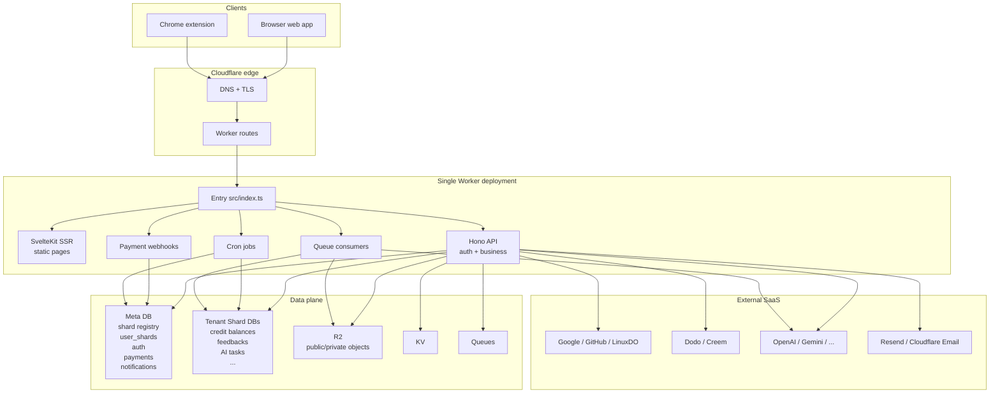

# 架构

## 设计原则

**单一 Worker 作为运行时容器。** API、SSR、Cron 和队列都运行在同一个 Worker 里。开发和部署走相同的路径，无需拆分服务，也无需额外的胶水层。

**约定优于配置。** 不手写 `wrangler.jsonc`。设置环境变量，`scripts/prepare-cloudflare.mjs` 自动生成配置、创建资源并应用迁移。

**优先使用 Cloudflare 技术栈。** Workers、D1、R2、KV、Queues 和 Cron 是一条集成路径。免费套餐可以跑通整个循环。

**自动化优先。** 任何环境下都不手动创建资源。`prepare-cloudflare.mjs` 负责本地和远程的资源供给。

## 系统概览



几点关键说明：

- 只有**一个 Worker 部署**。Web 页面、API、Webhook、Cron 和队列消费者都在同一个代码库里，一起发布。不需要运行独立服务。
- **边缘**是 Cloudflare 的全球网络。DNS 和 TLS 在那里终结，请求自动路由到最近的 Worker 实例。
- **客户端**是 Web 应用（浏览器）和 Chrome 扩展。它们共享 `src/frontend/lib/` 中的大部分前端代码。
- **外部 SaaS** 是第三方提供商。通过环境变量启用，只为你实际使用的部分付费。

## 请求流程

```
HTTP Request
  ├── /api/* -> Hono API (src/backend/api/)
  └── other  -> SvelteKit SSR (src/frontend/web/)

Cron Trigger    -> src/backend/jobs/index.ts
Queue Consumer  -> src/backend/consumers/index.ts
```

所有请求都从 `src/index.ts` 进入。对于 HTTP 请求，它检查路径：`/api/*` 走 Hono，其余走 SvelteKit。Cron 和队列是独立的入口点，但同属一个 Worker。

## API 层

API 在 `src/backend/api/index.ts` 中被拆分为四个路由组：

| 组 | 认证级别 | 用途 |
| --- | --- | --- |
| `publicApi` | 无 | 健康检查、认证登录、支付 Webhook、R2 公共读取 |
| `authOnlyApi` | 已登录 | 仅需身份验证的路由（如绑定内测码） |
| `userApi` | 已登录 + 内测门控 | 所有已认证的用户端点 |
| `adminApi` | 超级管理员 | 管理员操作 |

核心思路：公共路由完全跳过认证，用户路由运行完整中间件链（认证、内测门控、租户 DB），管理员路由用管理员认证替代普通认证。注册路由时选择对应的组即可。

## 数据架构

两层数据库，各自负责不同的所有权：

**Meta DB**（`META_DB`）：全局控制状态。整个产品共用一个数据库。存储分片注册表、用户到分片的映射、认证、支付、订阅、Webhook、通知等。通过 `ctx.get('metaDb')` 访问。

**租户分片 DB**：用户级别的运行时数据。按地区分片到多个 D1 数据库中。存储积分余额、积分交易、反馈、通知已读状态、AI 异步任务表等。通过 `ctx.get('tenantDb')` 访问。

为什么要拆分：Meta DB 是所有跨用户数据（支付、分片分配）的单一事实来源。租户分片按地区水平扩展，用户越多只需要增加分片。用户数据在其生命周期内始终存放在同一个分片里。

支持的分片地区：`wnam`、`enam`、`weur`、`eeur`、`apac`、`oc`。通过 `D1_SHARDS` 环境变量以 `region:count` 键值对配置。

新用户分配优先选择 Worker 所在大陆对应的分片，否则选择任意活跃分片：

```
AS -> apac | EU -> weur | OC -> oc | default -> apac
```

已有用户始终遵循其 `user_shards` 记录，即使迁移到其他地区也不会改变。这防止了数据碎片化。

## 读一致性

每个 D1 数据库有一个主节点。不开启读副本时，所有读写都打到主节点，在高负载下会限制延迟和吞吐量。

生产环境中，`prepare-cloudflare.mjs` 会自动启用读副本。此后，读取走全球副本节点（离用户更近），写入仍然走主节点。

这带来了一致性问题：用户写入后，后续读取可能命中尚未同步的副本。OPCStack 用 **bookmark** 来解决这个问题。每个 D1 会话返回一个表示某个一致时间点快照的 bookmark，它通过响应头和 Cookie 流转回客户端，客户端在下次请求时带上它。这实现了单调读（"读到自己写入的内容"），而无需分布式事务。

Meta DB 和租户分片 DB 各自维护独立的 bookmark 流，因为它们是拥有各自主节点的独立数据库。

## prepare-cloudflare 自动化

`scripts/prepare-cloudflare.mjs` 是资源供给的唯一入口：

```
pnpm dev / pnpm deploy:cloudflare
  -> load env
  -> generate wrangler.jsonc
  -> create D1, R2, KV, Queues, Turnstile (remote only)
  -> generate and apply migrations
  -> wrangler dev / wrangler deploy
```

本地模式使用占位 UUID 并在本地应用迁移。远程模式创建真实的 Cloudflare 资源，启用读副本，并远程应用迁移。

这是一个架构决策，而不只是便利性考量：基础设施由环境变量代码生成，而非在控制台手动配置。添加一个队列、一个分片或一个 Durable Object，改一个环境变量就够了，不需要手动操作。
