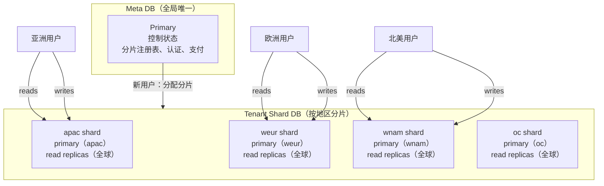

# 数据库

## 两个数据库

OPCStack 将数据分成两层。在写任何功能之前，这是最重要的一件事。

**Meta DB** 是整个产品的一个全局数据库。它存储所有跨用户的数据：分片注册表、用户到分片的映射、认证账户、支付、订阅、webhook、通知、内测码、兑换码、推广关系。

**Tenant Shard DB** 是按地区分片的多个数据库。每个数据库存储一个用户范围内的数据：积分余额、积分条目、积分交易、反馈、通知已读状态、AI 异步任务表。



每个分片在其所在地区有一个 **primary** 用于写入，在全球有 **read replicas** 用于读取。用户的写入始终到其分片的 primary，但读取可以命中靠近请求落点的副本。Meta DB 遵循相同模型：一个 primary，全球 read replicas。

如何决定新表放在哪里？问两个问题：

1. **这个数据是否只属于一个用户？** 如果是，放分片。随用户规模增长的用户范围数据（积分、反馈、AI 任务）都属于这里。原因在于规模：分片表每个数据库保持小体量，增长不会触碰单个 DB 的大小或吞吐上限。

2. **系统是否需要在不知道用户分片的情况下找到这行数据？** 如果是，放 Meta。最明显的信号是 webhook 或后台任务，它携带的只有 provider id（支付 id、OAuth subject），需要定位用户。这种查询必须命中单一全局索引。如果行是分片的，就必须对所有分片扇出才能找到。

第三个信号：跨用户 join 的行（推广邀请人/被邀请人、通知目标/发送者）属于 Meta，因为跨分片 join 不可行。

支付与积分的组合清楚说明了这种划分。`checkout_orders` 行是全局的：webhook 携带 provider 支付 id 而没有用户会话，因此必须在一个地方找到订单。它触发的 `credit_entries` 行是用户范围的：只属于一个用户，也只有那个用户的请求读取它。全局查询放 Meta，用户范围状态放分片。

为什么要这样划分？这种架构带来三个好处：

- **读取靠近用户。** 每个分片的 read replicas 全球分布，任何地方的读取都命中附近的副本，而不是跨越大洲到 primary。
- **写入靠近用户。** 用户的分片 primary 在其所在地区，写入不需要跨洲。亚洲的写入命中亚洲的 primary。
- **水平扩展。** 增加容量只需改变 `D1_SHARDS` 中的一个环境变量。新用户落到新分片上。扩展方式是添加分片，而不是重写查询或迁移一个巨大的数据库。

吞吐量也随之扩展：每个分片有自己的 primary，所以写吞吐随分片数量增长，而不是受限于一个数据库的上限。Meta 保持单一，因为它是小型控制状态，且跨用户查询（webhook 查找订单、分片分配）需要一个权威来源。

具体表归属：

| Meta DB | Tenant Shard DB |
| --- | --- |
| user、account、session（认证） | credit_balances |
| d1_shards、user_shards | credit_entries |
| checkout_orders、payment_transactions | credit_transactions |
| user_subscriptions、payment_webhook_events | feedbacks |
| notifications | notification_reads |
| beta_code、credit_redemption_codes | ai_image_tasks、ai_tts_tasks、ai_video_tasks |
| aff_referrals | |
| system_settings、payment_products | |
| ai_channels、oauth_grants、oauth_authorization_requests | |

`system_settings` 只有一行。每个配置域拥有一份 JSON 文档、独立版本和更新时间。读写时都会完整校验文档，非法数据直接失败。敏感字段只保存 AES-GCM 密文和 IV；根密钥 `CONFIG_ENCRYPTION_KEY` 由 `prepare-cloudflare` 首次生成并保存在 D1 之外。

## Schema 与迁移

Meta schema：`src/backend/db/schema.meta.ts`。认证相关表：`src/backend/db/schema.auth.ts`。Tenant shard schema：`src/backend/db/schema.shard.ts`。

用 Drizzle 定义表。整数时间戳单位为毫秒。编辑任何 schema 文件后，重启 `pnpm dev`。`prepare-cloudflare.mjs` 会生成 Drizzle 迁移并应用。Meta 迁移存放在 `src/backend/db/meta-migrations/`，shard 迁移存放在 `src/backend/db/shard-migrations/`。

你不需要手写迁移 SQL。编辑 schema，重启，迁移会自动生成。需要查看变更内容时，看这些目录即可。

## 请求中的读写

在认证用户路由中，两个数据库已挂载到 context：

- `ctx.get('metaDb')` 返回 Meta DB 的 Drizzle client。
- `ctx.get('tenantDb')` 返回当前用户分片 DB 的 Drizzle client。

普通处理器的读写方式：

```ts
import type { Context } from 'hono'
import type { ApiEnv } from '..'
import { eq } from 'drizzle-orm'
import { creditBalance } from '../../db/schema.shard'

export async function getBalanceHandler(ctx: Context<ApiEnv>): Promise<Response> {
	const userId = ctx.get('userId')
	const tenantDb = ctx.get('tenantDb')

	const row = await tenantDb.query.creditBalance.findFirst({
		where: eq(creditBalance.userId, userId)
	})

	return ctx.json({ balance: row?.balance ?? 0 })
}
```

两个 client 都是由 D1 session 支持的 Drizzle 实例，bookmark 一致性已自动处理。处理器代码中不需要手动传递 bookmark。

## 访问其他用户的数据

`ctx.get('tenantDb')` 只是当前用户的分片。需要写入其他用户的数据库时，例如管理员授予积分、队列 consumer 处理 AI 任务或推广奖励，使用 `openUserDb`：

```ts
import { createTenantShardAccess } from '../../db/shard-router'

const tenant = await createTenantShardAccess(
	ctx.get('metaDb'),
	ctx.env
).openUserDb(targetUserId)

const credits = new CreditsService(tenant.db)
await credits.grant({ userId: targetUserId, /* ... */ })
```

`openUserDb` 从 Meta DB 的 `user_shards` 解析目标用户的分片，然后打开该分片的 D1 binding。它不经过中间件链，所以没有绑定到请求的读取会话。用于一次性写入。如果请求写入当前用户的分片，继续使用 `ctx.get('tenantDb')` 以确保响应 tenant bookmark 覆盖此次写入。

## D1 没有真正的事务

这是影响 OPCStack 每条写入路径的约束。D1 不支持交互式事务。你无法开启一个事务，运行多条语句，失败时回滚。

D1 提供的替代方案是 batch。batch 在一次往返中发送多条预备语句，并原子性地应用它们。`src/backend/db/index.ts` 中的 `runRawD1Batch` 是这个辅助函数。所有积分授予和扣减都通过它进行。

积分授予流程说明了这种模式。一次授予必须原子地完成四件事：确保余额行存在、插入积分条目、增加余额、记录交易。任何一个失败，整个 batch 失败，不会留下半写状态。

```ts
await runRawD1Batch(this.db, [
	this.db.run(sql`
		INSERT INTO credit_balances (user_id, balance, updated_at)
		VALUES (${input.userId}, 0, ${nowMs})
		ON CONFLICT(user_id) DO NOTHING
	`),
	this.db.run(sql`
		INSERT INTO credit_entries (...)
		SELECT ... WHERE NOT EXISTS (...)
		ON CONFLICT(source_type, source_id) DO NOTHING
	`),
	this.db.run(sql`
		UPDATE credit_balances
		SET balance = balance + ${input.amount}, updated_at = ${nowMs}
		WHERE user_id = ${input.userId}
			AND EXISTS (SELECT 1 FROM credit_entries WHERE id = ${entryId})
	`),
	// ...
])
```

这段代码有两点需要注意。

第一，余额更新使用 SQL 算术，而不是读-改-写。用一条语句执行 `SET balance = balance + amount`。不要写 `const current = SELECT balance; db.update({ balance: current + amount })`。那是竞态条件。

第二，条件插入使用 `INSERT ... SELECT ... WHERE NOT EXISTS ... ON CONFLICT DO NOTHING`。这是一条原子语句。不要拆分成先 SELECT 检查，再 INSERT。并发请求可能在你的读和写之间插入，导致重复。

## 跨 DB 写入是 Saga

没有事务能跨越 Meta DB 和 Tenant Shard DB。当一个流程同时写入两者时，它是一个 saga：Meta DB 是持久的事实来源，Tenant Shard 写入是可恢复的幂等副作用。

支付积分授予是最清晰的例子。支付 webhook 到达时：

1. Webhook 处理器在 Meta DB 写入 `payment_transactions` 行。唯一键是 `(provider, provider_payment_id)`。webhook 重放时，插入被忽略。
2. 处理器查找已有的交易。如果找到，返回它。这使 Meta 步骤在 webhook 重放时幂等。
3. 如果需要授予积分，处理器打开用户的 shard DB 并以 `source_type: 'payment_transaction'` 和 `source_id: transaction.id` 调用 `credits.grant`。
4. 在租户分片内，`grant` 执行 batch 插入。`credit_entries` 表在 `(source_type, source_id)` 上有唯一索引。如果授予运行了两次，第二次插入被 `ON CONFLICT DO NOTHING` 忽略。

```
Webhook
  -> 在 Meta DB 插入 payment_transaction（通过 provider_payment_id 幂等）
  -> 打开用户分片
  -> 在分片中授予积分（通过 source_type + source_id 幂等）
```

如果进程在步骤 1 和步骤 3 之间崩溃，交易行存在但积分从未被授予。webhook 重试时，步骤 2 找到交易，步骤 3 首次授予积分。如果进程在步骤 3 之后崩溃，重试再次到达步骤 3，但唯一索引拒绝重复。

这就是为什么 Meta + Tenant 写入始终以 `source_type + source_id` 为键。永远不要在没有幂等键的情况下写入租户副作用。

## 新用户分片分配

新用户注册时，系统选择一个分片。分配优先使用 Worker 所在的大洲桶，然后回退到任何活跃分片中 `assigned_count` 最小的：

```
AS -> apac
EU -> weur
OC -> oc
默认 -> apac
```

已有用户永远不会移动分片。他们的 `user_shards` 行是不可变的。如果之后在 `D1_SHARDS` 中添加了更多分片，只有新用户才会落到上面。

分片地区通过 `.env.dev` 或 `.env.prod` 中的 `D1_SHARDS` 配置：

```
D1_SHARDS=apac:2;weur:1
```

这会创建两个 apac 分片和一个 weur 分片。`prepare-cloudflare.mjs` 会供给它们并以 `status: 'active'` 注册到 `d1_shards` 中。
