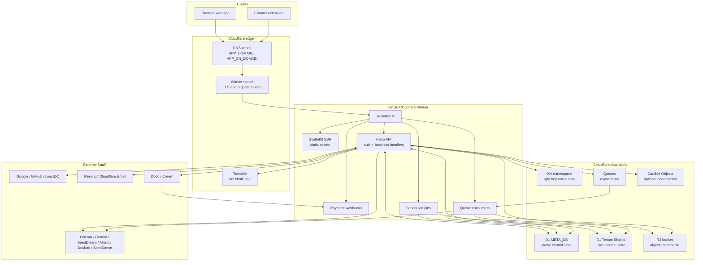

# 部署

OPCStack 只有一个运行时部署单元：一个 Cloudflare Worker。这个 Worker 承载 Web SSR、静态资源、JSON API、Better Auth 路由、支付 webhook、定时任务、队列消费者和 Cloudflare bindings。Chrome 扩展是独立的构建产物，调用同一个已部署的 origin。

部署是配置驱动的。`scripts/prepare-cloudflare.mjs` 读取 env 文件、供给或解析 Cloudflare 资源、生成 `wrangler.jsonc`、运行迁移、种入分片注册表、同步超级管理员，然后由 `wrangler deploy` 上传 Worker。

## 运行时概览



边界很简单：流量和平台事件进入同一个 Worker。持久产品状态存在 D1。二进制状态存在 R2。外部 SaaS provider 是集成，不是部署单元。

## 部署流程

生产部署命令：

```bash
pnpm deploy:cloudflare
```

该脚本展开为：

```bash
pnpm prepare:cloudflare:prod
CLOUDFLARE_API_TOKEN=$(cat .wrangler/cloudflare-api-token) wrangler types --config .wrangler/wrangler.types.jsonc --env-file .wrangler/runtime-secrets.env --strict-vars false
vite build
CLOUDFLARE_API_TOKEN=$(cat .wrangler/cloudflare-api-token) wrangler deploy --secrets-file .wrangler/runtime-secrets.env
```

仅 prepare 命令：

```bash
pnpm prepare:cloudflare:dev
pnpm prepare:cloudflare:prod
```

本地开发命令：

```bash
pnpm dev
```

`pnpm dev` 执行：

1. `svelte-kit sync`
2. `prepare:cloudflare:dev`
3. `wrangler types`
4. `wrangler dev --port 8787`
5. `vite dev --mode dev --port 5173 --strictPort`

## Prepare Cloudflare

`scripts/prepare-cloudflare.mjs` 是部署控制平面。它完成以下工作：

| 步骤 | Dev 模式 | Prod 模式 |
| --- | --- | --- |
| 加载 env | `.env.dev`、`.env.secret.dev`、`.env`、`process.env` | `.env.prod`、`.env.secret.prod`、`.env`、`process.env` |
| 解析 Cloudflare token | 不需要远端 token | 读取 `CLOUDFLARE_API_TOKEN` 或缓存 token |
| D1 | 使用本地占位 ID | 创建或解析 Meta DB 和 Tenant Shard DB |
| D1 read replication | 否 | 启用 read replication |
| Queues | 生成 bindings | 创建队列并生成 bindings |
| R2 | 仅在启用时生成 binding | 创建 bucket、CORS、tmp 生命周期、S3 token、图片转换 |
| KV | 本地占位命名空间 | 创建或解析 KV 命名空间 |
| Turnstile | 使用本地配置/测试行为 | 启用时创建或更新 widget |
| Config | 生成 `wrangler.jsonc` | 生成 `wrangler.jsonc` |
| Types config | 生成 `.wrangler/wrangler.types.jsonc` | 生成 `.wrangler/wrangler.types.jsonc` |
| Runtime secrets | 写入 `.wrangler/runtime-secrets.env` | 写入 `.wrangler/runtime-secrets.env` |
| Migrations | 生成并应用本地 D1 迁移 | 生成并应用远端 D1 迁移 |
| Seed state | upsert 分片注册表和超级管理员 | upsert 分片注册表和超级管理员 |

不要手动创建资源后称之为部署。如果 Worker 需要某个资源，通过 env 配置和 `prepare-cloudflare` 来表达它。

## 生成产物

生成的文件：

| 文件 | 用途 |
| --- | --- |
| `wrangler.jsonc` | Wrangler 使用的运行时 Worker 配置 |
| `.wrangler/wrangler.types.jsonc` | 含完整密钥 schema 的类型生成配置 |
| `.wrangler/runtime-secrets.env` | 传给 Wrangler 的运行时密钥 |
| `src/frontend/lib/config/client.generated.ts` | 公共前端和扩展配置 |
| D1 migrations | 由 Drizzle schema 生成 |

注意：不要读取或打印真实密钥文件或 token 缓存。密钥值归用户所有。

## Env 文件

公共配置：

| 文件 | 用途 |
| --- | --- |
| `.env.dev` | 本地公共默认值 |
| `.env.prod` | 生产公共默认值 |
| `.env` | 本地覆盖 |

密钥配置：

| 文件 | 用途 |
| --- | --- |
| `.env.secret.example` | 占位文档 |
| `.env.secret.dev` | 本地真实密钥 |
| `.env.secret.prod` | 生产真实密钥 |

加载顺序：

```text
.env.dev 或 .env.prod
  -> .env.secret.dev 或 .env.secret.prod
  -> .env
  -> process.env
```

即 `.env` 覆盖模式文件，shell 环境变量覆盖一切。

## Cloudflare Token

远端部署需要 Cloudflare API token。

Token 来源顺序：

1. `CLOUDFLARE_API_TOKEN` 环境变量
2. `.wrangler/cloudflare-api-token`
3. 交互式提示

在 CI 中必须设置 `CLOUDFLARE_API_TOKEN`，脚本不会提示输入。

`prepare-cloudflare` 会打印所需权限：

| 权限 |
| --- |
| API Tokens:Edit |
| Zone:Read |
| Zone Settings:Edit |
| DNS:Edit |
| Workers Scripts:Edit |
| Workers KV Storage:Edit |
| Workers Routes:Edit |
| Workers R2 Storage:Edit |
| D1:Edit |
| Queues:Edit |
| Turnstile:Edit |

Token 会与权限指纹一起缓存。如果所需权限发生变化，脚本会要求提供新 token。

## DNS 与域名

主域名：

```bash
APP_DOMAIN=example.com
```

`prepare-cloudflare` 为 `APP_DOMAIN` 生成 Worker 自定义域名路由。

生产环境中 `APP_DOMAIN` 用于：

- Worker 路由
- `APP_BASE_URL`
- 规范 URL
- OAuth 回调 base
- 支付 webhook base
- R2 CORS origin
- Turnstile 域名

可选的 CN 域名：

```bash
APP_CN_DOMAIN=cn.example.com
APP_CN_CNAME_TARGET=target.example.net
```

当设置 `APP_CN_DOMAIN` 时：

- `APP_CN_CNAME_TARGET` 为空时，Worker 获得第二个自定义域名路由
- R2 CORS 包含 CN origin
- Turnstile widget 包含 CN 域名

当在 prod 中同时设置 `APP_CN_DOMAIN` 和 `APP_CN_CNAME_TARGET` 时：

- `prepare-cloudflare` 为 `APP_CN_DOMAIN` 创建或更新一条非代理 DNS CNAME
- Worker 为 `APP_CN_DOMAIN` 使用普通 zone route，不使用自定义域名路由
- 它不选择加速目标
- `APP_CN_CNAME_TARGET` 必须来自你的 DNS 加速或路由服务商

不要将 `APP_CN_CNAME_TARGET` 指回 `APP_DOMAIN`，那通常只是循环或无效操作。

## D1 部署

Meta DB：

```text
<APP_NAME>-meta
```

Tenant Shard DB：

```text
<APP_NAME>-shard-<region>-<0000>
```

示例：

```bash
APP_NAME=opcstack
D1_SHARDS=apac:1;weur:1
```

创建或解析：

```text
opcstack-meta
opcstack-shard-apac-0000
opcstack-shard-weur-0000
```

生成的 bindings：

```text
META_DB
TENANT_DB_APAC_0000
TENANT_DB_WEUR_0000
```

支持的分片地区：

```text
wnam, enam, weur, eeur, apac, oc
```

`prepare-cloudflare` 运行 Drizzle generation 并应用迁移：

```bash
pnpm exec drizzle-kit generate --config drizzle.meta.config.ts
pnpm exec drizzle-kit generate --config drizzle.shard.config.ts
pnpm exec wrangler d1 migrations apply <APP_NAME>-meta --remote
pnpm exec wrangler d1 migrations apply <APP_NAME>-shard-apac-0000 --remote
```

然后它会在 Meta DB 中 upsert `d1_shards`。已有用户保留其 `user_shards` 映射。

## R2 部署

R2 由以下配置控制：

```bash
R2_ENABLED=true
R2_TMP_LIFECYCLE_RULES=tmp/public/:7;tmp/private/:1
```

在 prod 中启用时，`prepare-cloudflare`：

1. 创建或解析名为 `APP_NAME` 的 R2 bucket
2. 为 `APP_BASE_URL` 和可选的 `APP_CN_DOMAIN` 同步 CORS
3. 同步 tmp 生命周期规则
4. 创建或复用 R2 S3 token
5. 启用 Cloudflare Image Transformations
6. 添加 binding `R2`

有效的 tmp 生命周期前缀只有：

```text
tmp/public/
tmp/private/
```

运行时 R2 密钥：

| 密钥 | 用途 |
| --- | --- |
| `R2_ORIGIN_SIGNING_SECRET` | 签名 origin/读取 URL 行为 |
| `R2_SECRET_ACCESS_KEY` | R2 S3 兼容上传凭据 |

## 队列、Cron 与 Durable Objects

队列：

```bash
QUEUE_NAMES=image-generate;tts-generate;video-generate
QUEUE_MAX_CONCURRENCY=
```

Cron：

```bash
CRONS=*/10 * * * *
```

Durable Objects：

```bash
DO_NAMES=
```

`prepare-cloudflare` 从这些 env 值生成队列 producer、队列 consumer、cron trigger 和 Durable Object bindings/migrations。

Durable Object 名称必须匹配：

```text
^[a-z][a-z0-9-]*$
```

Binding 和类命名：

| 配置名 | Binding | Class |
| --- | --- | --- |
| `rate-limiter` | `DO_RATE_LIMITER` | `RateLimiterDO` |

只有在真正添加 Durable Object 实现时才创建 DO 类。

## 密钥

`wrangler.jsonc` 只包含已启用功能所需的密钥。

始终需要：

| 密钥 |
| --- |
| `BETTER_AUTH_SECRET` |

条件需要：

| 功能 | 密钥 |
| --- | --- |
| Admin API | 配置时需要 `ADMIN_API_TOKEN` |
| Turnstile | `TURNSTILE_SECRET_KEY` |
| Google OAuth | `GOOGLE_CLIENT_SECRET` |
| GitHub OAuth | `GITHUB_CLIENT_SECRET` |
| LinuxDO OAuth | `LINUXDO_CLIENT_SECRET` |
| Resend 邮件 | `EMAIL_RESEND_API_KEY` |
| R2 | `R2_ORIGIN_SIGNING_SECRET`、`R2_SECRET_ACCESS_KEY` |
| Dodo | `PAYMENT_DODO_API_KEY`、`PAYMENT_DODO_WEBHOOK_SECRET` |
| Creem | `PAYMENT_CREEM_API_KEY`、`PAYMENT_CREEM_WEBHOOK_SECRET` |
| AI providers | 配置时需要 provider API keys |
| AI fallback | 设置 fallback base URL 时需要 fallback API key |

`.wrangler/wrangler.types.jsonc` 可能包含完整密钥 schema，以保持生成的 `Env` 类型稳定。这不意味着每个密钥在运行时都是必需的。

## 外部服务

外部服务必须指向已部署的 Worker origin。

| 服务 | 所需配置 |
| --- | --- |
| Google OAuth | public env 中的 OAuth client id，secret env 中的密钥，使用 `APP_DOMAIN` 的回调 URL |
| GitHub OAuth | public env 中的 OAuth app id，secret env 中的密钥，使用 `APP_DOMAIN` 的回调 URL |
| LinuxDO OAuth | OAuth id 和密钥，使用 `APP_DOMAIN` 的回调 URL |
| Resend | API key 和 `SYSTEM_EMAIL` 的已验证发件人域名 |
| Cloudflare Email | 付费 Worker 方案和 `SEND_EMAIL` binding |
| Dodo | API key、webhook 密钥、产品 id、指向 Worker 的 webhook |
| Creem | API key、webhook 密钥、产品 id、指向 Worker 的 webhook |
| AI providers | secret env 中的 API keys，public env 中的 base URL 和模型名 |

如果某功能被禁用，不要配置假的生产凭据。保持功能开关为 false。

## 扩展构建

扩展不由 `pnpm deploy:cloudflare` 部署。

命令：

```bash
pnpm dev:extension
pnpm build:extension
```

两个命令都会先运行 `prepare-public`。扩展 host permissions 来自：

```bash
EXTENSION_HOST_PERMISSIONS=https://example.com/*
```

生产扩展构建中使用已部署的 `APP_DOMAIN`。

## 部署 Checklist

1. 设置 `.env.prod`
2. 将真实生产密钥放入 `.env.secret.prod` 或 CI secrets
3. 设置 `APP_DOMAIN`
4. 设置可选的 `APP_CN_DOMAIN` 和 `APP_CN_CNAME_TARGET`
5. 为已启用功能配置 OAuth 应用、支付 webhook、邮件发送者和 AI provider keys
6. 运行 `pnpm prepare:cloudflare:prod`
7. 检查生成的 `wrangler.jsonc`
8. 运行 `pnpm deploy:cloudflare`
9. 对已部署应用运行 `pnpm test:e2e:remote`

CI 应直接设置 `CLOUDFLARE_API_TOKEN`。本地部署可使用缓存 token。

## 常见错误

**手动编辑 `wrangler.jsonc`**

编辑 env 文件或 `wrangler.jsonc.tpl`。`wrangler.jsonc` 是生成的。

**使用逗号分隔的配置**

`QUEUE_NAMES`、`CRONS`、`D1_SHARDS` 及相关列表 env 使用分号。

**将密钥放入公共 env**

`.env.dev` 和 `.env.prod` 是公共配置。API key 应放在 secret env 或 CI secrets 中。

**在有用户后修改 `D1_SHARDS` 而没有迁移方案**

可以添加新分片，但已有用户遵循 `user_shards`。不要以为修改配置会迁移用户。

**期望远端 E2E 部署基础设施**

远端 E2E 验证已有部署。部署由 `prepare-cloudflare` 和 `wrangler deploy` 完成。

**忘记 CN 的副作用**

`APP_CN_DOMAIN` 影响 Worker 路由、R2 CORS 和 Turnstile 域名。设置 `APP_CN_CNAME_TARGET` 时，DNS 保留优选 CNAME，Worker 通过普通 zone route 接入。

**启用功能但不提供密钥**

配置验证会尽早失败。这是正确行为。禁用该功能或提供真实密钥。
