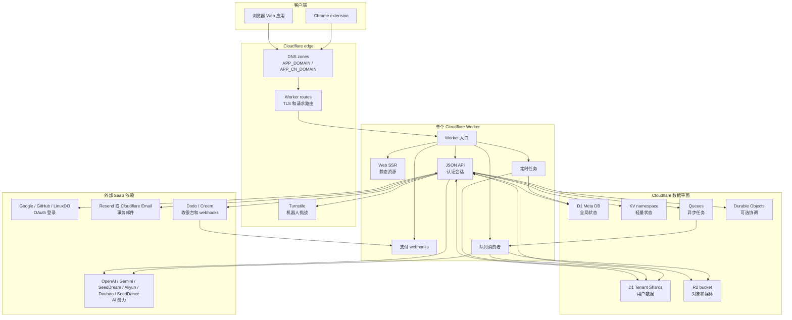
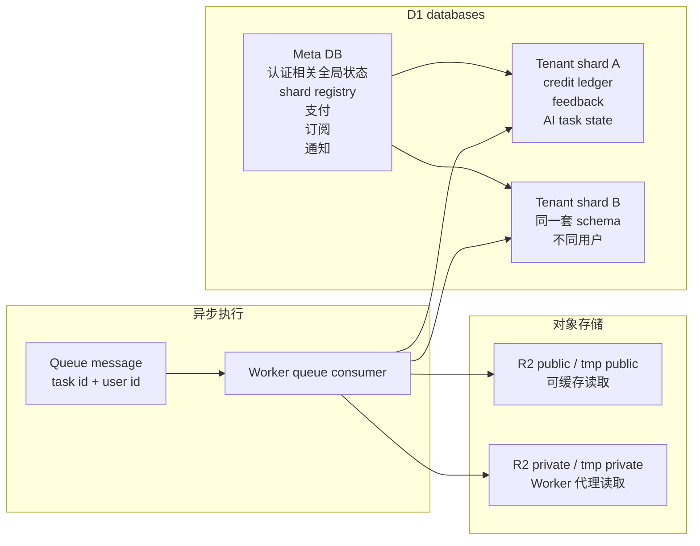
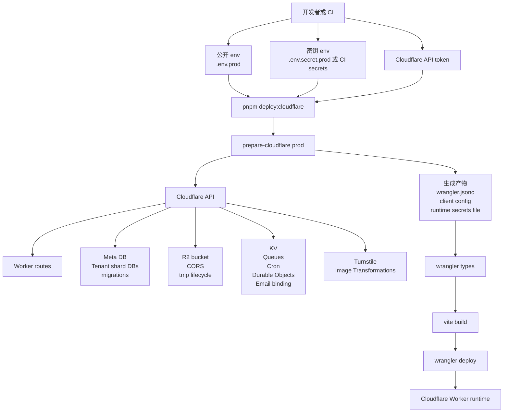
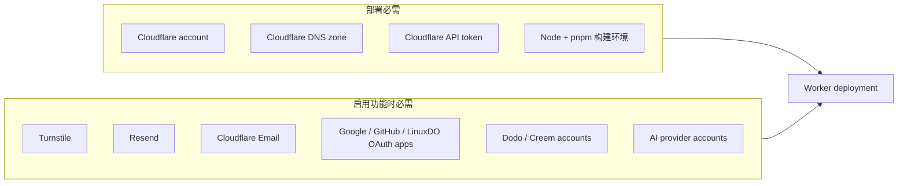

# 部署

OPC Stack 的运行时部署单元只有一个：Cloudflare Worker。这个 Worker 承载 Web SSR、JSON API、认证、支付 webhook、定时任务、队列消费者、静态资源和 Cloudflare bindings。Chrome extension 是单独打包的产物，运行时访问同一个线上 origin。

## 运行时总览

核心边界很简单：用户流量先进入 Cloudflare routes，再由一个 Worker 判断这是 Web、API、webhook、cron 还是 queue work。持久产品状态在 D1。二进制状态在 R2。外部 SaaS 是集成依赖，不是部署单元。

## 数据归属

Meta DB 是跨库流程的事实来源。Tenant shard 写入是幂等副作用。D1 没有跨库事务，所以架构使用可恢复状态，不假装存在原子性。

## 部署控制面

资源创建集中在 `prepare-cloudflare`。不要把手工创建的 Cloudflare 资源当成架构。如果资源属于产品运行时，它应该能从配置表达出来，并进入 Worker 部署产物。

## 外部依赖地图

回调 URL 和 DNS 记录属于外部系统：OAuth callback 使用线上 API origin，支付 webhook 回调 Worker，邮件服务商需要验证发信域名记录。`APP_CN_DOMAIN` 会添加第二个 Worker custom domain。`APP_CN_CNAME_TARGET` 可选创建或更新一条未代理的 CNAME，但优选目标必须来自你自己的网络决策。
