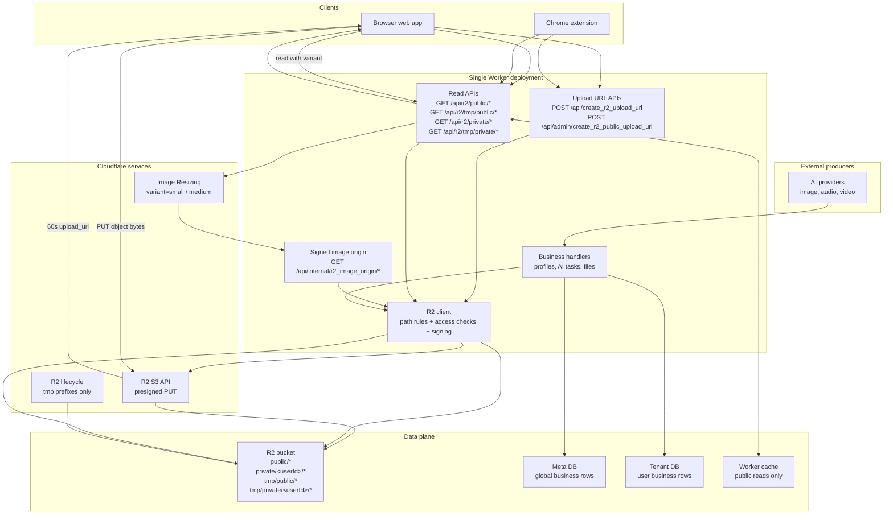

# 存储

OPCStack 使用 Cloudflare R2 存储对象字节。数据库存储业务行和 R2 对象键。Worker 负责上传签名、读取授权、缓存头、图片变体和生成媒体写入。

不要将 R2 当数据库用。将文件存入 R2，然后将键存入赋予该对象业务含义的 Meta DB 或 Tenant DB 行中。

## 存储架构



关键边界是 Worker。浏览器和扩展客户端只能通过短期预签名 URL 直接上传到 R2。读取仍通过 `/api/r2/*` 进行，以便 Worker 能够强制执行私有对象所有权并设置缓存头。

## 对象命名空间

R2 键使用四个命名空间：

| 命名空间 | 访问权限 | 生命周期 | 用途 |
| --- | --- | --- | --- |
| `public/*` | 任何人可读 | 持久 | 公共资源、公共生成输出 |
| `private/<userId>/*` | 仅所有者 | 持久 | 用户上传、私有生成输出 |
| `tmp/public/*` | 任何人可读 | 临时 | 公共预览文件和短期中间文件 |
| `tmp/private/<userId>/*` | 仅所有者 | 临时 | 私有上传暂存和任务中间文件 |

路径前缀是权限模型的一部分。除非存储模型本身发生变化，不要创建新的顶级前缀。

## 选择命名空间

当对象是有意公开且长期存在时，使用 `public/*`：产品图片、公共生成媒体或文档资源。

当恰好一个用户拥有该对象且需要长期保存时，使用 `private/<userId>/*`：头像上传、私有项目文件或私有 AI 结果。

只有在自动删除是正确行为时，才使用 `tmp/public/*` 或 `tmp/private/<userId>/*`。上传暂存、短期预览和中间 AI 文件适合这里。用户期望保留的内容不应放这里。

当对象属于某个业务行时，将 R2 键存储在该行上。用户拥有的行通常存在 Tenant DB 中。全局控制行、支付行和系统级记录存在 Meta DB 中。

## 用户上传流程

持久私有上传：

```typescript
const upload = await apiClient.createR2UploadUrl({
	is_tmp: false,
	path: 'avatars/me.png',
	content_type: file.type,
	size: file.size
})

await fetch(upload.upload_url, {
	method: 'PUT',
	headers: {
		'Content-Type': file.type
	},
	body: file
})
```

临时上传：

```typescript
const upload = await apiClient.createR2UploadUrl({
	is_tmp: true,
	path: 'drafts/input.png',
	content_type: file.type,
	size: file.size
})
```

管理员公共上传：

```typescript
const upload = await apiClient.createR2PublicUploadUrl({
	path: 'images/hero.png',
	content_type: file.type,
	size: file.size
})
```

上传 API 强制执行以下规则：

- 上传路径是相对路径，不能包含 `..`
- 上传 URL 60 秒后过期
- `content_type` 必须在 `R2_USER_UPLOAD_ALLOWED_CONTENT_TYPES` 中列出
- `size` 不能超过 `R2_USER_UPLOAD_MAX_BYTES`
- 用户上传始终是私有的
- 用户上传通过 `is_tmp` 选择 `private/<userId>/*` 或 `tmp/private/<userId>/*`
- 管理员公共上传写入 `public/*`

上传后，应用代码应将 `upload.key` 存储在相关业务行中。键是稳定的引用，返回的 `read_url` 只是方便使用的 URL。

## 服务端写入

服务端代码通过 `createR2Client` 写入。

```typescript
import { createR2Client } from '../../r2'

const r2 = createR2Client(ctx.env, ctx.get('userId'))
const object = await r2.put({
	dir: 'exports',
	filename: 'result.json',
	body: JSON.stringify(result),
	contentType: 'application/json'
})
```

公共输出传入 `isPublic: true`，临时输出传入 `isTmp: true`。

```typescript
const object = await r2.put({
	isPublic: true,
	dir: 'generated/images',
	filename: 'result.png',
	body: imageBytes,
	contentType: 'image/png'
})
```

保持业务写入的明确性：将对象写入 R2，然后将 `object.key` 存储在拥有它的 DB 行中。

## 读取流程与访问控制

对象通过 Worker 路由读取：

| 路由 | 访问权限 |
| --- | --- |
| `GET /api/r2/public/*` | 公开 |
| `GET /api/r2/tmp/public/*` | 公开 |
| `GET /api/r2/private/<userId>/*` | 仅当前用户 |
| `GET /api/r2/tmp/private/<userId>/*` | 仅当前用户 |

私有读取要求已认证用户与键中的 `<userId>` 匹配。请求其他用户的私有对象返回 `403`。

缓存行为与命名空间绑定：

| 命名空间 | 缓存行为 |
| --- | --- |
| `public/*` | 长期公共缓存 |
| `tmp/public/*` | 短期公共缓存 |
| `private/*` | `private, no-store` |
| `tmp/private/*` | `private, no-store` |

Worker 缓存仅用于公共读取路径。私有对象永远不会存储在 Worker 缓存中。

## 临时生命周期

临时删除通过 `R2_TMP_LIFECYCLE_RULES` 配置：

```env
R2_TMP_LIFECYCLE_RULES=tmp/public/:7;tmp/private/:1
```

有效前缀只有：

```text
tmp/public/
tmp/private/
```

不要为 `public/` 或 `private/` 配置生命周期规则。这两个命名空间按设计是持久的。

`prepare-cloudflare` 在 R2 启用时会验证规则并将其同步到 R2 存储桶。

## 图片变体

图片读取支持两种变体：

```text
?variant=small
?variant=medium
```

流程：

```text
/api/r2/...?...variant=small
  -> Worker 检查对象访问权限
  -> Worker 创建签名的内部 origin URL
  -> Cloudflare Image Resizing 获取 /api/internal/r2_image_origin/*
  -> Worker 验证 R2_ORIGIN_SIGNING_SECRET
  -> Worker 从 R2 流式传输原始对象
```

内部 origin 路由不是公共文件 API。它存在的目的是让 Cloudflare Image Resizing 可以获取授权的源对象，而无需暴露私有 R2 访问。

## 生成媒体

AI 生成的文件应存入 R2，而不是 D1。

在异步任务行中使用 R2 键：

- 任务行存储任务状态、provider ID 和结果对象键
- R2 存储图片、音频、视频或其他生成的字节
- 队列负载只携带任务 ID 和用户 ID

视频输出必须流式写入 R2。不要在上传前将视频输出转换为 `arrayBuffer` 或 base64。

## 配置

主要存储配置：

| 配置项 | 用途 |
| --- | --- |
| `R2_ENABLED` | 启用 R2 资源供给和 binding |
| `R2_USER_UPLOAD_ALLOWED_CONTENT_TYPES` | 分号分隔的上传 MIME 允许列表 |
| `R2_USER_UPLOAD_MAX_BYTES` | 用户最大上传大小 |
| `R2_TMP_LIFECYCLE_RULES` | 临时对象删除规则 |
| `R2_ORIGIN_SIGNING_SECRET` | 对内部图片 origin 读取进行签名 |
| `R2_SECRET_ACCESS_KEY` | R2 S3 写入 Token 的密钥部分 |

`prepare-cloudflare` 会创建存储桶、配置 Worker binding、准备 R2 S3 写入 Token、同步临时生命周期规则并写入生成的运行时配置。

## 常见错误

- 不要将私有用户文件放在 `public/*` 下
- 不要将文件字节存储在 D1 中
- 不要只在数据库中存储 `read_url`，要存储 R2 键
- 不要让前端代码自行发明 R2 前缀
- 不要对持久命名空间添加生命周期规则
- 不要绕过 `/api/r2/*` 进行私有读取
- 不要对生成的视频上传使用 base64 或 `arrayBuffer`
