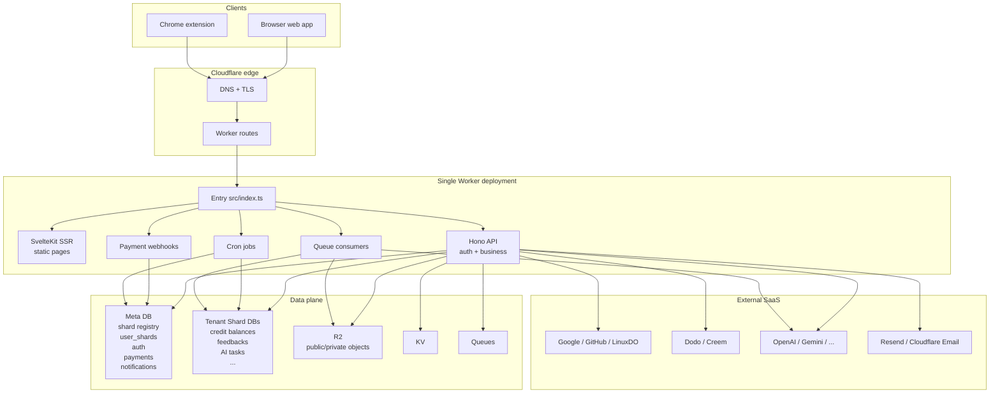

# Architecture

## Design Principles

**One Worker as the runtime container.** API, SSR, Cron, and Queue all run in one Worker. Development and deployment follow the same path. No service splitting, no extra glue layer.

**Convention over configuration.** No hand-written `wrangler.jsonc`. Set env vars, `scripts/prepare-cloudflare.mjs` generates config, creates resources, and applies migrations.

**Cloudflare stack first.** Workers, D1, R2, KV, Queues, and Cron are one integrated path. The free tier runs the full loop.

**Automation first.** No manual resource creation in any environment. `prepare-cloudflare.mjs` handles local and remote provisioning.

## System Overview



A few things to notice:

- There is only **one Worker deployment**. Web pages, API, webhooks, cron, and queue consumers all live in the same codebase and ship together. You do not run separate services.
- The **edge** is Cloudflare's global network. DNS and TLS terminate there, and the request is routed to the nearest Worker instance automatically.
- **Clients** are the web app (browser) and the Chrome extension. They share most of the frontend code in `src/frontend/lib/`.
- **External SaaS** are third-party providers. Configure singleton credentials in System settings and collection entities in their provider workspaces after the application starts.

## Request Flow

```
HTTP Request
  ├── /api/* -> Hono API (src/backend/api/)
  └── other  -> SvelteKit SSR (src/frontend/web/)

Cron Trigger    -> src/backend/jobs/index.ts
Queue Consumer  -> src/backend/consumers/index.ts
```

Everything enters from `src/index.ts`. For HTTP requests, it checks the path: `/api/*` goes to Hono, everything else goes to SvelteKit. Cron and queue are separate entry points but live in the same Worker.

## API Layer

The API is split into four route groups in `src/backend/api/index.ts`:

| Group | Auth level | Purpose |
| --- | --- | --- |
| `publicApi` | None | Health check, auth login, payment webhooks, R2 public reads |
| `authOnlyApi` | Session or scoped OAuth token | Routes that only need identity |
| `userApi` | Session or scoped OAuth token + beta gate | Authenticated user JSON endpoints |
| `adminApi` | Session or scoped OAuth token + D1 administrator role | Admin JSON endpoints |

Protected JSON routes declare one scope directly beside route registration. Browser sessions satisfy that route scope directly. OAuth access tokens must contain it. Admin routes additionally require the current user to retain the D1 administrator role. Browser-only streaming and object routes explicitly reject OAuth tokens.

Contracts and handlers are organized by business domain, such as credits, payment, notifications, and AI. The route groups above express access control only. User and administrator operations for the same domain stay in the same domain module.

## Data Architecture

Two database tiers with different ownership:

**Meta DB** (`META_DB`): global control state. One database for the whole product. Holds shard registry, user-to-shard mapping, dynamic system configuration, OAuth API access, auth, payments, AI Providers, subscriptions, webhooks, and notifications. Accessed via `ctx.get('metaDb')`.

**Tenant Shard DB**: user-scoped runtime data. Sharded across multiple D1 databases by region. Holds credit balances, credit transactions, feedbacks, notification reads, AI async task tables. Accessed via `ctx.get('tenantDb')`.

Why split: Meta DB is the single source of truth for anything cross-user (payments, shard assignment). Tenant shards scale horizontally by region, so more users just means more shards. A user's data lives in exactly one shard for its lifetime.

Supported shard regions: `wnam`, `enam`, `weur`, `eeur`, `apac`, `oc`. Configured via `D1_SHARDS` env var as `region:count` pairs.

New user assignment prefers the Worker's continent bucket, then any active shard:

```
AS -> apac | EU -> weur | OC -> oc | default -> apac
```

Existing users always follow their `user_shards` record, even if they move to a different region. This prevents data fragmentation.

## Read Consistency

D1 has one primary node per database. Without read replication, all reads and writes hit primary, which limits latency and throughput under load.

In production, `prepare-cloudflare.mjs` enables read replication automatically. After that, reads go to global replica nodes (closer to the user), while writes still go to primary.

The consistency problem this creates: after a user writes, a later read might hit a replica that has not caught up. OPCStack solves this with **bookmarks**. Each D1 session returns a bookmark that represents a consistent point-in-time snapshot. The bookmark flows through response headers and cookies back to the client, and the client sends it back on the next request. This gives monotonic reads ("read your own writes") without distributed transactions.

Meta DB and Tenant Shard DB each maintain independent bookmark flows, because they are separate databases with separate primaries.

## Dynamic Configuration Foundation

`system_settings` is the singleton source for dynamic product configuration. Its business domains have independent versions so the admin API can reject stale writes without coupling unrelated settings. `payment_products` and `ai_providers` are separate versioned collections.

Sensitive values are stored as AES-GCM ciphertext and IV pairs. `prepare-cloudflare` generates `CONFIG_ENCRYPTION_KEY` once and stores it in local generated secret state or Cloudflare Worker Secrets; it is never stored in D1 or replaced after D1 initialization. Every runtime business domain reads D1 as its only configuration source. There are no business ENV fallbacks.

## prepare-cloudflare Automation

`scripts/prepare-cloudflare.mjs` is the single entry point for provisioning:

```
pnpm dev / pnpm deploy:cloudflare
  -> load env
  -> generate wrangler.jsonc
  -> create D1, R2, KV, Queues, Turnstile (remote only)
  -> generate and apply migrations
  -> wrangler dev / wrangler deploy
```

Local mode uses placeholder UUIDs and applies migrations locally. Remote mode creates real Cloudflare resources, enables read replication, and applies migrations remotely.

This is an architectural decision, not just a convenience: fixed deployment topology is code-generated from env vars, while runtime business settings live in D1. Adding a queue, shard, or Durable Object changes fixed topology. Enabling a provider or changing product behavior does not.
