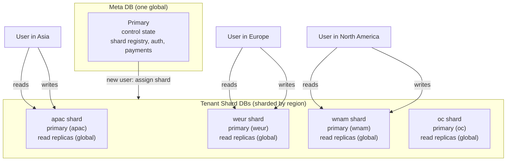

# Database

## Two Databases

OPCStack splits data into two tiers. This is the most important thing to understand before you write any feature.

**Meta DB** is one global database for the whole product. It holds everything cross-user: shard registry, user-to-shard mapping, dynamic system configuration, OAuth API access, auth accounts, payments, AI channels, subscriptions, webhooks, notifications, beta codes, redemption codes, affiliate referrals.

**Tenant Shard DB** is many databases sharded by region. Each holds data scoped to one user: credit balance, credit entries, credit transactions, feedbacks, notification reads, AI async task tables.



Each shard has one **primary** pinned to its region for writes, and **read replicas** distributed globally for reads. A user's writes always go to their shard's primary, but reads can hit a replica close to wherever the request lands. Meta DB follows the same model: one primary, global read replicas.

How do you decide where a new table goes? Ask two questions:

1. **Does this data belong to exactly one user?** If yes, it goes in the shard. Anything user-scoped that grows with the user base (credits, feedback, AI tasks) belongs here. The reason is scale: sharded tables stay small per database, so growth never hits a single DB's size or throughput limit.

2. **Does the system need to find this row without knowing the user's shard?** If yes, it goes in Meta. The clearest signal is a webhook or background job that arrives with only a provider id (a payment id, an OAuth subject) and must locate the user. That lookup has to hit a single global index. If the row were sharded, you would have to fan out across all shards to find it.

A third signal: rows that join across users (affiliate inviter / invitee, notification target / sender) belong in Meta because cross-shard joins are not possible.

The payment + credits pair illustrates the split cleanly. A `checkout_orders` row is global: the webhook arrives with a provider payment id and no user session, so it must find the order in one place. The `credit_entries` row it triggers is user-scoped: it belongs to one user and only that user's requests ever read it. Global lookup goes to Meta, user-scoped state goes to the shard.

Why split like this? Three benefits come out of this shape:

- **Reads are close to the user.** Every shard's read replicas are spread globally, so a read from anywhere hits a nearby replica, not the primary across the world.
- **Writes are close to the user.** A user's shard primary sits in their region, so writes do not have to cross continents. Writes from Asia hit an Asia primary.
- **Horizontal scale.** Adding capacity is one env var change in `D1_SHARDS`. New users land on new shards. You scale by adding shards, not by rewriting queries or migrating a giant database.

The throughput also scales: each shard has its own primary, so write throughput grows with the number of shards instead of capping at one database's limit. Meta stays single because it is small control state, and cross-user lookups (webhooks finding an order, shard assignment) need one authoritative source.

Concrete table ownership:

| Meta DB | Tenant Shard DB |
| --- | --- |
| user, account, session (auth) | credit_balances |
| d1_shards, user_shards | credit_entries |
| checkout_orders, payment_transactions | credit_transactions |
| user_subscriptions, payment_webhook_events | feedbacks |
| notifications | notification_reads |
| beta_code, credit_redemption_codes | ai_image_tasks, ai_tts_tasks, ai_video_tasks |
| aff_referrals | |
| system_settings, payment_products | |
| ai_channels, oauth_grants, oauth_authorization_requests | |

`system_settings` has exactly one row. Each configuration domain owns one JSON document, version, and update timestamp. Domain documents are fully validated on every read and write; invalid data fails instead of receiving runtime defaults. Sensitive fields store only AES-GCM ciphertext and IV pairs; `prepare-cloudflare` generates the root `CONFIG_ENCRYPTION_KEY` once and persists it outside D1.

## Schema and Migrations

Meta schema: `src/backend/db/schema.meta.ts`. Auth-related tables: `src/backend/db/schema.auth.ts`. Tenant shard schema: `src/backend/db/schema.shard.ts`.

Define tables with Drizzle. Integer timestamps are in milliseconds. After editing any schema file, restart `pnpm dev`. `prepare-cloudflare.mjs` generates Drizzle migrations and applies them. Meta migrations land in `src/backend/db/meta-migrations/`, shard migrations in `src/backend/db/shard-migrations/`.

You do not hand-write migration SQL. You edit the schema, restart, and the migration is generated. If you need to inspect what changed, look in those folders.

## Reads and Writes Inside a Request

In an authenticated user route, two databases are already attached to the context:

- `ctx.get('metaDb')` returns the Meta DB Drizzle client.
- `ctx.get('tenantDb')` returns the current user's shard DB Drizzle client.

A normal handler reads and writes like this:

```ts
import type { Context } from 'hono'
import type { ApiEnv } from '..'
import { eq } from 'drizzle-orm'
import { creditBalance } from '../../db/schema.shard'

export async function getBalanceHandler(ctx: Context<ApiEnv>): Promise<Response> {
	const userId = ctx.get('userId')
	const tenantDb = ctx.get('tenantDb')

	const row = await tenantDb.query.creditBalance.findFirst({
		where: eq(creditBalance.userId, userId)
	})

	return ctx.json({ balance: row?.balance ?? 0 })
}
```

Both clients are Drizzle instances backed by a D1 session, so bookmark consistency is handled for you. You do not pass bookmarks manually in handler code.

## Accessing Another User's Data

`ctx.get('tenantDb')` is only the current user's shard. When you need to write to a different user's database, such as an admin granting credits, a queue consumer processing an AI task, or an affiliate reward, use `openUserDb`:

```ts
import { createTenantShardAccess } from '../../db/shard-router'

const tenant = await createTenantShardAccess(
	ctx.get('metaDb'),
	ctx.env
).openUserDb(targetUserId)

const credits = new CreditsService(tenant.db)
await credits.grant({ userId: targetUserId, /* ... */ })
```

`openUserDb` resolves the target user's shard from `user_shards` in Meta DB, then opens that shard's D1 binding. It does not run through the middleware chain, so it does not have a read session tied to the request. Use it for one-shot writes. If your request writes to the current user's shard, keep using `ctx.get('tenantDb')` so the response tenant bookmark covers the write.

## D1 Has No Real Transactions

This is the constraint that shapes every write path in OPCStack. D1 does not support interactive transactions. You cannot open a transaction, run multiple statements, and roll them back if one fails.

What D1 gives you instead is batch. A batch sends multiple prepared statements in one round-trip and applies them atomically. `runRawD1Batch` in `src/backend/db/index.ts` is the helper for this. All credit grants and deductions go through it.

The credit grant flow illustrates the pattern. A grant must do four things atomically: ensure a balance row exists, insert a credit entry, add to the balance, and record the transaction. If any one fails, the whole batch fails and nothing is left half-written.

```ts
await runRawD1Batch(this.db, [
	this.db.run(sql`
		INSERT INTO credit_balances (user_id, balance, updated_at)
		VALUES (${input.userId}, 0, ${nowMs})
		ON CONFLICT(user_id) DO NOTHING
	`),
	this.db.run(sql`
		INSERT INTO credit_entries (...)
		SELECT ... WHERE NOT EXISTS (...)
		ON CONFLICT(source_type, source_id) DO NOTHING
	`),
	this.db.run(sql`
		UPDATE credit_balances
		SET balance = balance + ${input.amount}, updated_at = ${nowMs}
		WHERE user_id = ${input.userId}
			AND EXISTS (SELECT 1 FROM credit_entries WHERE id = ${entryId})
	`),
	// ...
])
```

Two things to notice in that snippet.

First, balance updates are SQL arithmetic, not read-modify-write. You do `SET balance = balance + amount` in one statement. Never write `const current = SELECT balance; db.update({ balance: current + amount })`. That is a race condition.

Second, conditional inserts use `INSERT ... SELECT ... WHERE NOT EXISTS ... ON CONFLICT DO NOTHING`. This is one statement, atomic. Do not split it into a SELECT to check, then an INSERT if absent. A concurrent request can insert between your read and your write, and you get a duplicate.

## Cross-DB Writes Are Sagas

There is no transaction that spans Meta DB and Tenant Shard DB. When a flow writes to both, it is a saga: Meta DB is the durable source of truth, and the Tenant Shard write is a resumable, idempotent side effect.

The payment credit grant is the clearest example. When a payment webhook arrives:

1. The webhook handler writes a `payment_transactions` row in Meta DB. The unique key is `(provider, provider_payment_id)`. If the webhook replays, the insert is ignored.
2. The handler looks up the existing transaction. If found, it returns it. This makes the Meta step idempotent on webhook replay.
3. If credits should be granted, the handler opens the user's shard DB and calls `credits.grant` with `source_type: 'payment_transaction'` and `source_id: transaction.id`.
4. Inside the tenant shard, `grant` does a batch insert. The `credit_entries` table has a unique index on `(source_type, source_id)`. If the grant runs twice, the second insert is ignored by `ON CONFLICT DO NOTHING`.

```
Webhook
  -> insert payment_transaction in Meta DB (idempotent by provider_payment_id)
  -> open user shard
  -> grant credits in shard (idempotent by source_type + source_id)
```

If the process crashes between step 1 and step 3, the transaction row exists but credits were never granted. When the webhook retries, step 2 finds the transaction, and step 3 grants credits for the first time. If the process crashes after step 3, the retry reaches step 3 again, but the unique index rejects the duplicate.

This is why Meta + Tenant writes are always keyed by `source_type + source_id`. Never write a tenant side effect without an idempotent key.

## New User Shard Assignment

When a new user signs up, the system picks a shard. The assignment prefers the Worker's continent bucket, then falls back to any active shard by least `assigned_count`:

```
AS -> apac
EU -> weur
OC -> oc
default -> apac
```

Existing users never move shards. Their `user_shards` row is immutable. If you later add more shards in `D1_SHARDS`, only new users land on them.

Shard regions are configured in `.env.dev` or `.env.prod` with `D1_SHARDS`:

```
D1_SHARDS=apac:2;weur:1
```

This creates two apac shards and one weur shard. `prepare-cloudflare.mjs` provisions them and registers them in `d1_shards` with `status: 'active'`.
