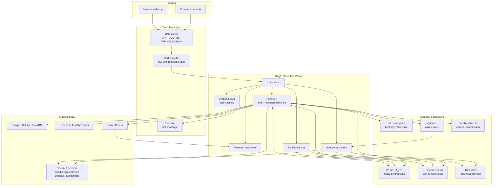

# Deployment

OPCStack has one runtime deployment unit: a Cloudflare Worker. The Worker owns web SSR, static assets, JSON APIs, Better Auth routes, payment webhooks, scheduled jobs, queue consumers, and Cloudflare bindings. The Chrome extension is a separate build artifact that calls the same deployed origin.

Deployment is config-driven. `scripts/prepare-cloudflare.mjs` reads env files, provisions or resolves Cloudflare resources, generates `wrangler.jsonc`, runs migrations, seeds shard registry, syncs the super admin, then `wrangler deploy` uploads the Worker.

## Runtime Overview



The boundary is simple: traffic and platform events enter one Worker. Durable product state lives in D1. Binary state lives in R2. External SaaS providers are integrations, not deployment units.

## Deployment Flow

Production deploy command:

```bash
pnpm deploy:cloudflare
```

That script expands to:

```bash
pnpm prepare:cloudflare:prod
CLOUDFLARE_API_TOKEN=$(cat .wrangler/cloudflare-api-token) wrangler types --config .wrangler/wrangler.types.jsonc --env-file .wrangler/runtime-secrets.env --strict-vars false
vite build
CLOUDFLARE_API_TOKEN=$(cat .wrangler/cloudflare-api-token) wrangler deploy --secrets-file .wrangler/runtime-secrets.env
```

Prepare-only commands:

```bash
pnpm prepare:cloudflare:dev
pnpm prepare:cloudflare:prod
```

Local dev command:

```bash
pnpm dev
```

`pnpm dev` runs:

1. `svelte-kit sync`
2. `prepare:cloudflare:dev`
3. `wrangler types`
4. `wrangler dev --port 8787`
5. `vite dev --mode dev --port 5173 --strictPort`

## Prepare Cloudflare

`scripts/prepare-cloudflare.mjs` is the deployment control plane. It does these jobs:

| Step | Dev mode | Prod mode |
| --- | --- | --- |
| Load env | `.env.dev`, `.env.secret.dev`, `.env`, `process.env` | `.env.prod`, `.env.secret.prod`, `.env`, `process.env` |
| Resolve Cloudflare token | No remote token needed | Reads `CLOUDFLARE_API_TOKEN` or cached token |
| D1 | Uses local placeholder IDs | Creates or resolves Meta DB and Tenant Shard DBs |
| D1 read replication | No | Enables read replication |
| Queues | Generates bindings | Creates queues and generates bindings |
| R2 | Generates binding only when enabled | Creates bucket, CORS, tmp lifecycle, image transformations |
| KV | Local placeholder namespace | Creates or resolves KV namespace |
| Turnstile | Uses local config/test behavior | Creates or updates widget when enabled |
| Config | Generates `wrangler.jsonc` | Generates `wrangler.jsonc` |
| Types config | Generates `.wrangler/wrangler.types.jsonc` | Generates `.wrangler/wrangler.types.jsonc` |
| Runtime secrets | Writes `.wrangler/runtime-secrets.env` | Writes `.wrangler/runtime-secrets.env` |
| Migrations | Generates and applies local D1 migrations | Generates and applies remote D1 migrations |
| Seed state | Upserts shard registry and super admin | Upserts shard registry and super admin |

Do not manually create resources and call that deployment. If the Worker needs a resource, make it expressible through env config and `prepare-cloudflare`.

## Generated Artifacts

Generated files:

| File | Purpose |
| --- | --- |
| `wrangler.jsonc` | Runtime Worker config used by Wrangler |
| `.wrangler/wrangler.types.jsonc` | Type-generation config with full secret schema |
| `.wrangler/runtime-secrets.env` | Runtime secrets passed to Wrangler |
| `src/frontend/lib/config/client.generated.ts` | Public frontend and extension config |
| D1 migrations | Generated from Drizzle schemas |

Agent rule: do not read or print real secret files or token caches. Secret values are user-owned.

## Env Files

Public config:

| File | Purpose |
| --- | --- |
| `.env.dev` | Local public defaults |
| `.env.prod` | Production public defaults |
| `.env` | Local override |

Secret config:

| File | Purpose |
| --- | --- |
| `.env.secret.example` | Placeholder documentation |
| `.env.secret.dev` | Local real secrets |
| `.env.secret.prod` | Production real secrets |

Load order:

```text
.env.dev or .env.prod
  -> .env.secret.dev or .env.secret.prod
  -> .env
  -> process.env
```

This means `.env` overrides mode files, and shell env overrides everything.

## Cloudflare Token

Remote deploy needs a Cloudflare API token.

Token source order:

1. `CLOUDFLARE_API_TOKEN` env var
2. `.wrangler/cloudflare-api-token`
3. Interactive prompt

In CI, `CLOUDFLARE_API_TOKEN` must be set. The script will not prompt.

Required permissions are printed by `prepare-cloudflare`:

| Permission |
| --- |
| API Tokens:Edit |
| Zone:Read |
| Zone Settings:Edit |
| DNS:Edit |
| Workers Scripts:Edit |
| Workers KV Storage:Edit |
| Workers Routes:Edit |
| Workers R2 Storage:Edit |
| D1:Edit |
| Queues:Edit |
| Turnstile:Edit |

The token is cached with a permission fingerprint. If required permissions change, the script asks for a new token.

## DNS and Domains

Primary domain:

```bash
APP_DOMAIN=example.com
```

`prepare-cloudflare` renders a Worker custom domain route for `APP_DOMAIN`.

Production uses `APP_DOMAIN` for:

- Worker route
- `APP_BASE_URL`
- canonical URLs
- OAuth callback base
- payment webhook base
- R2 CORS origin
- Turnstile domain

Optional China domain:

```bash
APP_CN_DOMAIN=cn.example.com
APP_CN_CNAME_TARGET=target.example.net
```

When `APP_CN_DOMAIN` is set:

- Worker gets a second custom domain route when `APP_CN_CNAME_TARGET` is empty
- R2 CORS includes the CN origin
- Turnstile widget includes the CN domain

When both `APP_CN_DOMAIN` and `APP_CN_CNAME_TARGET` are set in prod:

- `prepare-cloudflare` creates or updates one unproxied DNS CNAME for `APP_CN_DOMAIN`
- Worker gets a normal zone route for `APP_CN_DOMAIN`, not a custom domain route
- it does not choose the acceleration target
- `APP_CN_CNAME_TARGET` must come from your DNS acceleration or routing provider

Do not point `APP_CN_CNAME_TARGET` back to `APP_DOMAIN`. That is usually just a loop or no-op.

## D1 Deployment

Meta DB:

```text
<APP_NAME>-meta
```

Tenant Shard DBs:

```text
<APP_NAME>-shard-<region>-<0000>
```

Example:

```bash
APP_NAME=opcstack
D1_SHARDS=apac:1;weur:1
```

Creates or resolves:

```text
opcstack-meta
opcstack-shard-apac-0000
opcstack-shard-weur-0000
```

Generated bindings:

```text
META_DB
TENANT_DB_APAC_0000
TENANT_DB_WEUR_0000
```

Supported shard regions:

```text
wnam, enam, weur, eeur, apac, oc
```

`prepare-cloudflare` runs Drizzle generation and applies migrations:

```bash
pnpm exec drizzle-kit generate --config drizzle.meta.config.ts
pnpm exec drizzle-kit generate --config drizzle.shard.config.ts
pnpm exec wrangler d1 migrations apply <APP_NAME>-meta --remote
pnpm exec wrangler d1 migrations apply <APP_NAME>-shard-apac-0000 --remote
```

Then it upserts `d1_shards` in Meta DB. Existing users keep their `user_shards` mapping.

## R2 Deployment

R2 is controlled by:

```bash
R2_ENABLED=true
R2_TMP_LIFECYCLE_RULES=tmp/public/:7;tmp/private/:1
```

When enabled in prod, `prepare-cloudflare`:

1. Creates or resolves an R2 bucket named `APP_NAME`
2. Syncs CORS for `APP_BASE_URL` and optional `APP_CN_DOMAIN`
3. Syncs tmp lifecycle rules
4. Enables Cloudflare Image Transformations
5. Adds binding `R2`

Only these tmp prefixes are valid lifecycle targets:

```text
tmp/public/
tmp/private/
```

Runtime R2 secrets:

| Secret | Purpose |
| --- | --- |
| `R2_ORIGIN_SIGNING_SECRET` | Signed origin/read URL behavior |

## Queues, Cron, and Durable Objects

Queues:

```bash
QUEUE_NAMES=image-generate;tts-generate;video-generate
QUEUE_MAX_CONCURRENCY=
```

Cron:

```bash
CRONS=*/10 * * * *
```

Durable Objects:

```bash
DO_NAMES=
```

`prepare-cloudflare` generates queue producers, queue consumers, cron triggers, and Durable Object bindings/migrations from these env values.

Durable Object names must match:

```text
^[a-z][a-z0-9-]*$
```

Binding and class naming:

| Config name | Binding | Class |
| --- | --- | --- |
| `rate-limiter` | `DO_RATE_LIMITER` | `RateLimiterDO` |

Create DO classes only when you actually add a Durable Object implementation.

## Secrets

`wrangler.jsonc` includes only secrets required by enabled features.

Always required:

| Secret |
| --- |
| `BETTER_AUTH_SECRET` |

Conditionally required:

| Feature | Secrets |
| --- | --- |
| Admin API | `ADMIN_API_TOKEN` when configured |
| Turnstile | `TURNSTILE_SECRET_KEY` |
| Google OAuth | `GOOGLE_CLIENT_SECRET` |
| GitHub OAuth | `GITHUB_CLIENT_SECRET` |
| LinuxDO OAuth | `LINUXDO_CLIENT_SECRET` |
| Resend email | `EMAIL_RESEND_API_KEY` |
| R2 | `R2_ORIGIN_SIGNING_SECRET` |
| Dodo | `PAYMENT_DODO_API_KEY`, `PAYMENT_DODO_WEBHOOK_SECRET` |
| Creem | `PAYMENT_CREEM_API_KEY`, `PAYMENT_CREEM_WEBHOOK_SECRET` |
| AI providers | Provider API keys when configured |
| AI channels | API keys for discovered async channels |

`.wrangler/wrangler.types.jsonc` may include the full secret schema so generated `Env` stays stable. That does not mean every secret is required at runtime.

## External Services

External services must point back to the deployed Worker origin.

| Service | Required setup |
| --- | --- |
| Google OAuth | OAuth client id in public env, secret in secret env, callback URL using `APP_DOMAIN` |
| GitHub OAuth | OAuth app id in public env, secret in secret env, callback URL using `APP_DOMAIN` |
| LinuxDO OAuth | OAuth id and secret, callback URL using `APP_DOMAIN` |
| Resend | API key and verified sender domain for `SYSTEM_EMAIL` |
| Cloudflare Email | Paid Worker plan and `SEND_EMAIL` binding |
| Dodo | API key, webhook secret, product ids, webhook to Worker |
| Creem | API key, webhook secret, product ids, webhook to Worker |
| AI providers | API keys in secret env, base URLs and model names in public env |

If a feature is disabled, do not configure fake production credentials. Keep the feature switch false.

## Extension Build

The extension is not deployed by `pnpm deploy:cloudflare`.

Commands:

```bash
pnpm dev:extension
pnpm build:extension
```

Both commands run `prepare-public` first. Extension host permissions come from:

```bash
EXTENSION_HOST_PERMISSIONS=https://example.com/*
```

Use the deployed `APP_DOMAIN` in production extension builds.

## Deployment Checklist

1. Set `.env.prod`
2. Put real production secrets in `.env.secret.prod` or CI secrets
3. Set `APP_DOMAIN`
4. Set optional `APP_CN_DOMAIN` and `APP_CN_CNAME_TARGET`
5. Configure OAuth apps, payment webhooks, email sender, and AI provider keys for enabled features
6. Run `pnpm prepare:cloudflare:prod`
7. Check generated `wrangler.jsonc`
8. Run `pnpm deploy:cloudflare`
9. Run `pnpm test:e2e:remote` against the deployed app

CI should set `CLOUDFLARE_API_TOKEN` directly. Local deploy can use the cached token.

## Common Mistakes

**Editing `wrangler.jsonc` by hand**

Edit env files or `wrangler.jsonc.tpl`. `wrangler.jsonc` is generated.

**Using comma-separated config**

`QUEUE_NAMES`, `CRONS`, `D1_SHARDS`, and related list envs use semicolons.

**Putting secrets in public env**

`.env.dev` and `.env.prod` are public config. API keys belong in secret env or CI secrets.

**Changing `D1_SHARDS` after users exist without a migration plan**

New shards can be added, but existing users follow `user_shards`. Do not assume changing config moves users.

**Expecting remote E2E to deploy infrastructure**

Remote E2E verifies an existing deployment. Deployment is done by `prepare-cloudflare` and `wrangler deploy`.

**Forgetting CN side effects**

`APP_CN_DOMAIN` affects Worker routes, R2 CORS, and Turnstile domains. Treat it as a real second entrypoint.

**Leaving enabled features without secrets**

Config validation fails early. That is correct. Disable the feature or provide real secrets.
