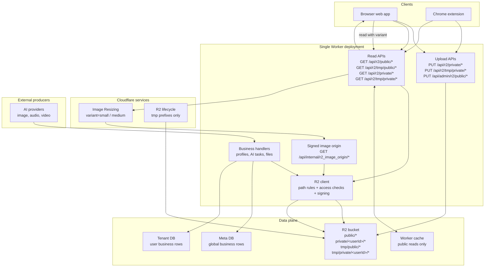

# Storage

OPCStack uses Cloudflare R2 for object bytes. The database stores business rows and R2 object keys. The Worker owns uploads, read authorization, cache headers, image variants, and generated media writes.

Do not treat R2 as a database. Store the file in R2, then store the key in the Meta DB or Tenant DB row that gives the object business meaning.

## Storage Architecture



The important boundary is the Worker. Browser and extension uploads go through Worker proxy routes so the Worker can enforce ownership, MIME allowlist, and upload size. Reads also go through `/api/r2/*` so the Worker can enforce private object ownership and set cache headers.

## Object Namespaces

R2 keys use four namespaces:

| Namespace | Access | Lifecycle | Use for |
| --- | --- | --- | --- |
| `public/*` | Anyone can read | Persistent | Public assets, public generated output |
| `private/<userId>/*` | Owner only | Persistent | User uploads, private generated output |
| `tmp/public/*` | Anyone can read | Temporary | Public preview files and short-lived intermediates |
| `tmp/private/<userId>/*` | Owner only | Temporary | Private upload staging and task intermediates |

The path prefix is part of the permission model. Do not create new top-level prefixes unless the storage model itself changes.

## Choosing A Namespace

Use `public/*` when the object is intentionally public and long-lived: product images, public generated media, or documentation assets.

Use `private/<userId>/*` when exactly one user owns the object and the object should remain available: avatar uploads, private project files, or private AI results.

Use `tmp/public/*` or `tmp/private/<userId>/*` only when automatic deletion is correct. Upload staging, short previews, and intermediate AI files fit here. Anything that a user expects to keep does not.

When the object belongs to a business row, store the R2 key on that row. User-owned rows normally live in the Tenant DB. Global control rows, payment rows, and system-wide records live in the Meta DB.

## User Upload Flow

Persistent private upload:

```typescript
const upload = await apiClient.uploadR2Object({
	key: `private/${userId}/avatars/me.png`,
	body: file,
	content_type: file.type
})
```

Temporary upload:

```typescript
const upload = await apiClient.uploadR2Object({
	key: `tmp/private/${userId}/drafts/input.png`,
	body: file,
	content_type: file.type
})
```

Admin public upload:

```typescript
const upload = await apiClient.uploadR2PublicObject({
	key: 'public/images/hero.png',
	body: file,
	content_type: file.type
})
```

The upload API enforces the real rules:

- Upload paths cannot contain `..`
- `Content-Length` is required and must not exceed the Storage domain `max_upload_bytes`
- `Content-Type` must be listed in the Storage domain `allowed_content_types`
- User uploads may only write `private/<userId>/*` or `tmp/private/<userId>/*`
- Admin public uploads write `public/*`

After upload, application code should store `upload.key` in the relevant business row. The key is the stable reference. The returned `read_url` is a convenience URL.

## Server Writes

Server-side code writes through `createR2Client`.

```typescript
import { createR2Client } from '../../r2'

const r2 = createR2Client(ctx.env, ctx.get('userId'))
const object = await r2.put({
	dir: 'exports',
	filename: 'result.json',
	body: JSON.stringify(result),
	contentType: 'application/json'
})
```

For public output, pass `isPublic: true`. For temporary output, pass `isTmp: true`.

```typescript
const object = await r2.put({
	isPublic: true,
	dir: 'generated/images',
	filename: 'result.png',
	body: imageBytes,
	contentType: 'image/png'
})
```

Keep the business write explicit: write the object to R2, then store `object.key` in the DB row that owns it.

## Read Flow And Access Control

Objects are read through Worker routes:

| Route | Access |
| --- | --- |
| `GET /api/r2/public/*` | Public |
| `GET /api/r2/tmp/public/*` | Public |
| `GET /api/r2/private/<userId>/*` | Current user only |
| `GET /api/r2/tmp/private/<userId>/*` | Current user only |

Private reads require the authenticated user to match the `<userId>` in the key. A request for another user's private object returns `403`.

Cache behavior is tied to the namespace:

| Namespace | Cache behavior |
| --- | --- |
| `public/*` | Long public cache |
| `tmp/public/*` | Short public cache |
| `private/*` | `private, no-store` |
| `tmp/private/*` | `private, no-store` |

Worker cache is used only for public read paths. Private objects are never stored in Worker cache.

## Temporary Lifecycle

Temporary deletion is configured with `R2_TMP_LIFECYCLE_RULES`:

```env
R2_TMP_LIFECYCLE_RULES=tmp/public/:7;tmp/private/:1
```

Only these prefixes are valid:

```text
tmp/public/
tmp/private/
```

Do not configure lifecycle rules for `public/` or `private/`. Those namespaces are persistent by design.

`prepare-cloudflare` validates the rules and syncs them to the R2 bucket when R2 is enabled.

## Image Variants

Image reads support two variants:

```text
?variant=small
?variant=medium
```

The flow is:

```text
/api/r2/...?...variant=small
  -> Worker checks object access
  -> Worker creates a signed internal origin URL
  -> Cloudflare Image Resizing fetches /api/internal/r2_image_origin/*
  -> Worker verifies R2_ORIGIN_SIGNING_SECRET
  -> Worker streams the original object from R2
```

The internal origin route is not a public file API. It exists so Cloudflare Image Resizing can fetch an authorized source object without exposing private R2 access.

## Generated Media

AI-generated files should end in R2, not in D1.

Use R2 keys in async task rows:

- Task row stores task state, provider IDs, and result object keys
- R2 stores image, audio, video, or other generated bytes
- Queue payloads carry only task ID and user ID

Video output must be streamed into R2. Do not convert video output to `arrayBuffer` or base64 before upload.

## Configuration

The main storage settings are:

| Key | Purpose |
| --- | --- |
| `R2_ENABLED` | Enables R2 provisioning and binding |
| Storage `allowed_content_types` | Upload MIME allowlist saved in Meta D1 |
| Storage `max_upload_bytes` | Max user upload size saved in Meta D1 |
| `R2_TMP_LIFECYCLE_RULES` | Temporary object deletion rules |
| `R2_ORIGIN_SIGNING_SECRET` | Signs internal image origin reads |

`prepare-cloudflare` creates the bucket, configures the Worker binding, syncs temporary lifecycle rules, and writes generated runtime config.

## Common Mistakes

- Do not put private user files under `public/*`
- Do not store file bytes in D1
- Do not store only `read_url` in the database; store the R2 key
- Do not let frontend code invent R2 prefixes
- Do not add lifecycle rules to persistent namespaces
- Do not bypass `/api/r2/*` for private reads
- Do not use base64 or `arrayBuffer` for generated video uploads
